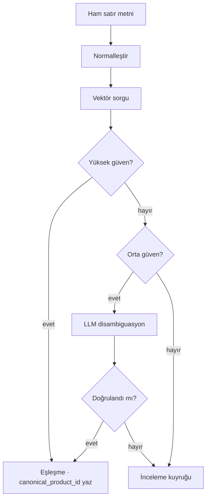

# Aşama 4 — Kanonik

## 2.7 Aşama 4 — Kanonik ürün eşleşmesi

Bu aşama, aynı ürünün farklı satıcı/fiş üzerinde farklı şekillerde yazıldığı durumları tek bir kanonik kimliğe indirir. Örnek:

- `COCA COLA 330ML KUTU`
- `C.COLA 33CL TENEKE`
- `COCA-COLA 0.33 L`
- `COKA 330 ML`

Dördü de aynı `canonical_product_id` değerine çözülür. Bu çözümleme, fiyat hafızasının ve B2B veri ürününün ön koşuludur.

### Yaklaşım

Kanonik çözümleme çok aşamalı *embedding* tabanlı bir çözücüdür; güven katmanlı disambiguasyon ve belirsiz durumlar için bir insan inceleme kuyruğu içerir.



Tam benzerlik eşikleri, *embedding* modeli ve disambiguasyon istemi iç operasyon katmanında yönetilir.

Çözülemeyen bir kalem null kanonik referans ile kaydedilir; o satır için bINT, kuyruktan kanonikleştirme tamamlandıktan sonra hesaplanır.

### Taksonomi yapısı

```
kategori > alt kategori > marka > ürün > varyant
```

Örnek:

```
İçecek > Gazlı İçecekler > Coca-Cola > Coca-Cola Klasik > 330 ml kutu
```

Her kanonik ürün normalleştirilmiş öznitelikler taşır: `size_value`, `size_unit`, `package_type`, `brand_id`, `is_private_label`, `barcode_gtin` (mevcut olduğunda).

### Soğuk başlangıç

Kanonik indeks açık ürün veri setlerinden, lisanslı katalog ortaklıklarından ve kapalı betadan tohumlanmış kullanıcı yüklemelerinden önyüklenir. İndeks, kanoniklik kuyruğu boşaltıldıkça organik olarak büyür.

### Bekleyen kanoniklik kuyruğu

Belirsiz kalemler bir inceleme kuyruğuna girer. İnceleyen (başlangıçta Yumo Yumo ekibi, sonra PoC kazanan topluluk havuzu) ya yeni bir kanonik ürün yaratır ya da ham metni mevcut bir ürüne eşler. Bu kuyruk, boru hattı ölçeklendikçe birincil maliyet kaldıracıdır — 08 bunu temel operasyonel risk olarak listeler.
