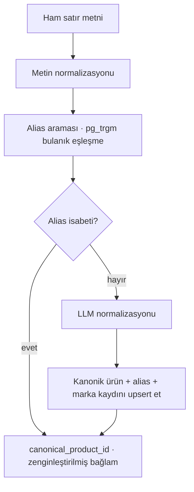

# Aşama 4 — Kanonik

## 2.7 Aşama 4 — Kanonik ürün eşleştirme

Bu aşama, aynı ürünün farklı yüzey biçimlerini tek bir kanonik kimliğe indirger. Örneğin:

- `COCA COLA 330ML KUTU`
- `C.COLA 33CL TENEKE`
- `COCA-COLA 0.33 L`
- `COKA 330 ML`

Dördü de aynı `canonical_product_id` değerine çözülür. Bu çözümleme, fiyat hafızası ve B2B veri ürünü için ön koşuldur.

### Yaklaşım

Kanonik çözümleme, eşzamanlı akış doğrulanmış önizlemeyi kullanıcıya döndürdükten sonra, arka plandaki post-process işçisinde **eşzamansız** çalışır. Bu, ürün çözümlemesini gecikmeye duyarlı yolun dışında tutar: kullanıcı fişini hemen görür; kanonik kimlikler kayda kısa süre sonra iliştirilir.

Çözümleyici, ham fiş satırı metnini kanonik ürünlere eşleyen bir alias tablosu üzerinde çalışır:


```mermaid
flowchart TD
    A[Ham satır metni] --> B[Metin normalizasyonu]
    B --> C[Alias araması · pg_trgm bulanık eşleşme]
    C --> D{Alias isabeti?}
    D -- evet --> E[canonical_product_id · zenginleştirilmiş bağlam]
    D -- hayır --> F[LLM normalizasyonu]
    F --> G[Kanonik ürün + alias + marka kaydını upsert et]
    G --> E
```

- **Bulanık alias araması** — normalleştirilmiş satır metni, daha önce öğrenilmiş fiş alias'larına karşı PostgreSQL trigram benzerliğiyle (`pg_trgm`) eşleştirilir. İsabet doğrudan kanonik ürüne çözülür. Bir satıcıda öğrenilen alias'lar, metin mağazaya özgü bir kısaltma değil de gerçek bir ürün adı gibi okunduğunda satıcılar arasında yeniden kullanılır; bu, farklı ürünlerin tek kanonik altında birleşmesini engeller.
- **LLM yedeği** — isabet olmadığında bir dil modeli ham metni marka, ürün ve boyut niteliklerine normalleştirir. Sonuç, yeni bir alias satırıyla birlikte yeni bir kanonik ürün olarak upsert edilir (veya mevcut birine eşlenir); böylece aynı yüzey biçimi bir sonraki sefer model çağrısı olmadan çözülür.

Benzerlik ayarları ve normalizasyon istemi iç operasyon katmanında yönetilir.

Çözülemeyen kalem, boş kanonik referansla kaydedilir; alias tablosu büyüdükçe çözümleme sonraki bir geçişte tamamlanabilir.

### Taksonomi yapısı

```
category > subcategory > brand > product > variant
```

Örnek:

```
Beverages > Carbonated Soft Drinks > Coca-Cola > Coca-Cola Classic > 330 ml can
```

Her kanonik ürün normalleştirilmiş nitelikler taşır: `size_value`, `size_unit`, `package_type`, `brand_id`, `is_private_label`, `barcode_gtin` (mevcutsa).

### Büyüme modeli

Kanonik indeks fiş trafiğinin kendisinden büyür: LLM ile normalleştirilen her satır bir kanonik ürün ve bir alias ekler; o yüzey biçiminin sonraki her tekrarı alias tablosundan model maliyeti olmadan çözülür. Belirsiz veya düşük kaliteli girdiler yönetici katalog araçlarıyla incelenir.
