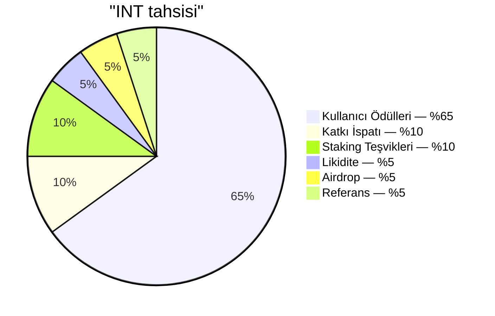

# Arz ve tahsis

## 4.16 Toplam arz

| Parametre | Değer |
|---|---|
| Token | INT |
| Standart | SPL (Solana) |
| Ondalık | 6 |
| Toplam arz | 99.000.000.000 |
| Genesis sonrası mint | Yok — mint yetkisi kapatılır |

Tüm 99 milyar INT, genesis'te bir kez hazineye basılır, ardından mint yetkisi kapatılır. Bundan sonra hiç INT oluşturulamaz. Dağıtım, yeni bir mint değil, hazineden denetlenmiş dağıtıcı (4.15) üzerinden yapılan bir transferdir.

## 4.17 Tahsis tablosu

| Ray | Pay | Token | Amaç |
|---|---:|---:|---|
| Kullanıcı Ödülleri | %65 | 64.350.000.000 | Doğrulanmış Harcama İspatı katkısı için birincil teşvik |
| Katkı İspatı | %10 | 9.900.000.000 | Çekirdek ekip, yükleniciler ve dış katkıcılara etki ağırlıklı dağıtım (4.11) |
| Staking Teşvikleri | %10 | 9.900.000.000 | INT kilitleyen uzun vadeli sahiplere ödül (4.6) |
| Likidite | %5 | 4.950.000.000 | TGE'de zincir üstü piyasaları besler; topluluk yönetimli derinlik için rezerv |
| Airdrop | %5 | 4.950.000.000 | Birden fazla dönem boyunca katılım tabanlı pazarlama dağıtımları |
| Referans | %5 | 4.950.000.000 | Davetliler doğrulama dönüm noktalarını tamamladığında olay güdümlü açılışlar |
| **Toplam** | **%100** | **99.000.000.000** | |

Altı ray, arzın yüzde yüzünü kapsar. Bu haritanın dışında ayrı bir ekip tahsisi yoktur. Kurucu ekip ve tüm katkıcılar, dış katılımcılara uygulanan aynı etki ağırlıklı mantık altında Katkı İspatı rayından (4.11) kazanır.

## 4.18 Ray sorumlulukları

- **Kullanıcı Ödülleri** — protokolün birincil çıkış akışı. Emisyon eğrisi (4.19) tarafından yönetilir ve günlük tavanlarla (4.22) ölçülür. Bütçe: 15 yıllık emisyon ufku boyunca 64,35 milyar INT.
- **Katkı İspatı** — hakediş süreli, rubrik puanlı periyodik dağıtımlar (4.13). Ekip teşviklerini ölçülebilir iş çıktısıyla hizalar.
- **Staking Teşvikleri** — 5 yıllık ufukta serbest bırakılır. Kademe ağırlıklı birikim 4.6'da açıklanır.
- **Likidite** — 1 milyar INT, TGE'de likidite başlatma havuzu aracılığıyla piyasayı besler (LP 12 ay kilitli). 3,95 milyar topluluk yönetimli dağıtımlar için rezervde tutulur.
- **Airdrop** — tek seferde değil, yıllara yayılan birden fazla dönem boyunca, katılım tabanlı pazarlama dağıtımları olarak serbest bırakılır. Her dağıtım, zamanlaması sürpriz ama ispatlanabilir niteliktedir: alıcı kümesi, tokenler hareket etmeden önce zincire taahhüt edilir. Dağıtım oranlaması operasyon katmanında yönetilir.
- **Referans** — olay güdümlü: başarılı bir davet, davet edilen kullanıcı anlamlı bir katkı eşiğini aştığında davet eden kullanıcıya bir birim açılış tetikler. Eşik koşulları üretimde kalibre edilir ve yayınlanmaz.
