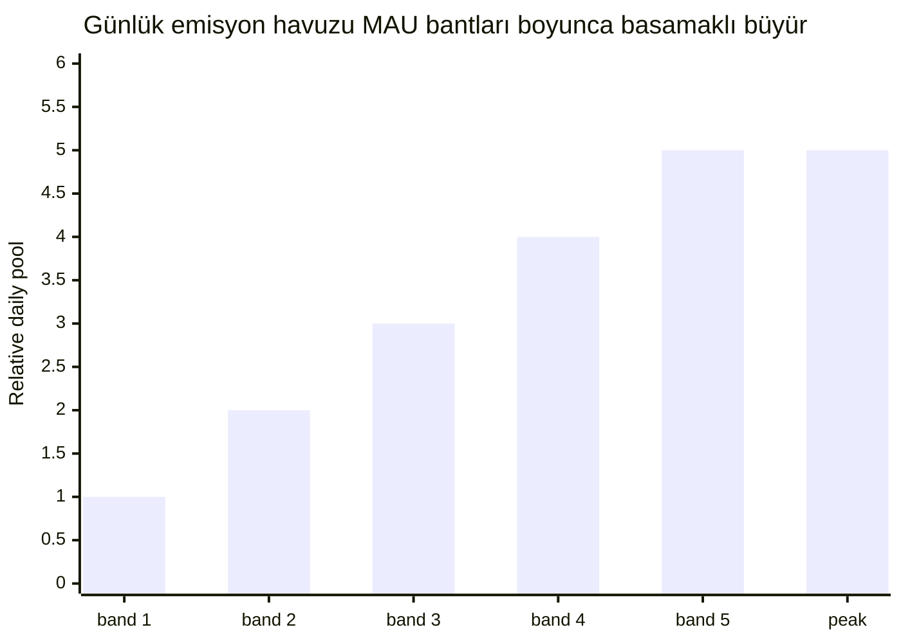

# Emisyon takvimi ve açılışlar

## 4.19 Kullanıcı Ödülleri emisyon eğrisi

Kullanıcı Ödülleri rayı (64,35 milyar INT) 15 yıllık bir ufukta serbest bırakılır. Günlük emisyon, aylık aktif kullanıcı (MAU) sayısıyla ölçeklenen basamaklı bir fonksiyonla ölçülür.

Günlük emisyon havuzu MAU bantları boyunca basamaklı olarak büyür (en küçük erken aşama bandından bir tepe banda kadar); böylece havuz sürekli değil, aktif kullanıcı tabanı büyüdükçe genişler. MAU bant sınırları ve bant başına günlük havuz değerleri üretimde kalibre edilir ve yayınlanmaz.

Tepe banttan sonra ek MAU büyümesi, toplam emisyonu artırmak yerine kullanıcı başına katkı yoğunluğunu yükseltir. Basamaklı yapı, aktivite bir bant sınırı yakınında salındığında uçurum etkilerini önler. Kullanıcı Ödülleri bütçesi (64,35 milyar INT) 15 yıllık emisyon ufku için boyutlandırılmıştır; erken aşama bantları tepenin çok altında emisyon ürettiğinden etkin ufuk daha da uzar.

## 4.20 Raya göre açılış takvimi

| Ray | Açılış mekanizması | Zamanlama |
|---|---|---|
| **Kullanıcı Ödülleri (%65)** | Emisyon eğrisi (4.19) → zincir dışı bINT birikimi → haftalık mutabakat → dağıtıcıdan talep (4.4) | 15 yıl boyunca sürekli |
| **Likidite (%5)** | Başlangıç: TGE'de tamamen serbest. Rezerv: topluluk yönetimli | TGE + yönetilen takvim |
| **Airdrop (%5)** | Periyodik, katılım tabanlı pazarlama dağıtımları | Yıllara yayılan birden fazla dönem |
| **Referans (%5)** | Başarılı davet başına olay güdümlü | Sürekli |
| **Staking (%10)** | Staking etkinleştiğinde staking ödül havuzuna serbest bırakılır (4.6) | İleriki faz, 5 yıllık ufukta |
| **Katkı İspatı (%10)** | Hakediş süreli periyodik etki puanlı dağıtımlar (4.13) | Alıcı başına çok yıllık hakediş |

### Kesinleşmiş açılış parametreleri

- **Likidite** — 1.000.000.000 INT, TGE'de borsa çiftlerini beslemek için tamamen likit. LP pozisyonu 12 ay kilitli. Kalan 3.950.000.000 INT rezervde tutulur.
- **Airdrop** — tek bir etkinlikte değil, yıllara yayılan birden fazla dönem boyunca, katılım tabanlı pazarlama dağıtımları olarak serbest bırakılır. Her dağıtım, zamanlaması sürpriz ama ispatlanabilir niteliktedir: alıcı kümesi, tokenler hareket etmeden önce zincire taahhüt edilir. Her pay, haftalık kullanıcı ödülü mutabakatından ayrı, kendine ait bir dağıtıcı üzerinden hakediş kilidi olmadan tam olarak talep edilir. Dağıtım oranlaması katılımla ölçeklenir ve operasyon katmanında yönetilir.
- **Referans** — uygun bir davet bir birim açılış tetikler; uygunluk eşiği üretimde kalibre edilir ve yayınlanmaz. Zamana bağlı hakediş yoktur.

### Tasarım alanı kalemleri (parametreler TGE'de yayınlanacaktır)

Aşağıdaki kalemler aktif token tasarımı çalışmasının parçasıdır. Yapılar burada açıklanır; belirli parametreler kesinleştiğinde yayınlanacaktır.

- **Kullanıcı Ödülleri emisyon eğrisi şekli.** Yukarıdaki basamaklı bantlar günlük tavanı belirler. Bantlar arası tam geçiş davranışı ve erken büyüme dönemindeki rampa takvimi, gözlemlenen kullanıcı büyümesi verisine göre kalibre edilir.
- **Katkı İspatı dağıtım kadansı.** Periyodik anlık görüntülerde katkı metriklerine (doğrulanmış Harcama İspatı hacmi ve kalitesi, sıralama tablosu konumu) bağlıdır. Uçurum ve hakediş süreleri politikadır ve dağıtım başına belgelenir.
- **Staking havuzu serbest bırakma takvimi.** Uzun vadeli sahipleri platform geliriyle hizalamak için gerçek getiri mimarisiyle birlikte tasarlanmıştır.

## 4.21 TGE dolaşımdaki arz tahmini

Token Üretim Etkinliğinde dolaşımdaki arz, başlangıç likiditesiyle beslenir:

| Kaynak | Miktar (INT) | Notlar |
|---|---:|---|
| Başlangıç likiditesi | 1.000.000.000 | TGE'de tamamen likit |
| **TGE dolaşımdaki** | **~1.000.000.000** | Toplam arzın ~%1,01'i |

Kalan ~%98,99'luk arz; emisyon takvimleri, hakediş kontratları, staking havuzları, yönetilen rezervler ve çok dönemli airdrop programı arasında kilitlidir. Airdrop dağıtımları, TGE'de değil, yıllar içinde katılım tabanlı pazarlama etkinlikleri olarak kademeli biçimde dolaşıma girer. Bu düşük başlangıç dolaşımı, protokolün arz genişlemesini gerçek katkıya bağlı kademeli bir şekilde yürütme tercihini yansıtır.
