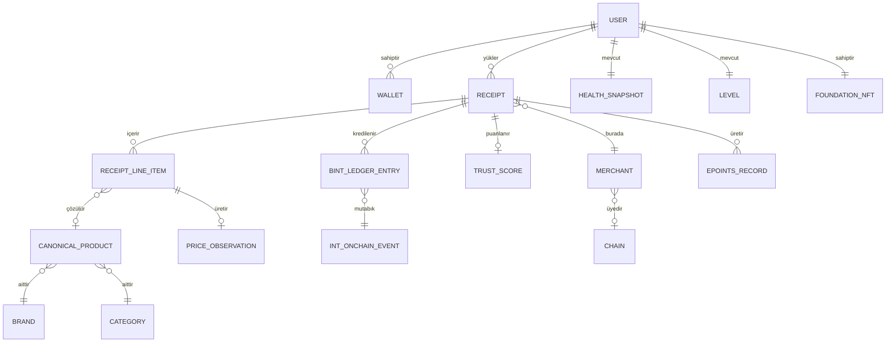

# Çekirdek varlıklar

## 5.2 Çekirdek varlıklar

Çoklukla ilgili kurallar önemlidir: **bir fişin birçok kalemi vardır**, **bir kalem en fazla bir kanonik ürüne çözülür** (veya bekleyen kuyruğa düşerse hiçbirine), **bir fiş en fazla bir güven puanı yayar** (yeniden puanlanabilir; her yeni sürüm bir öncekini geçersiz kılar).

---
