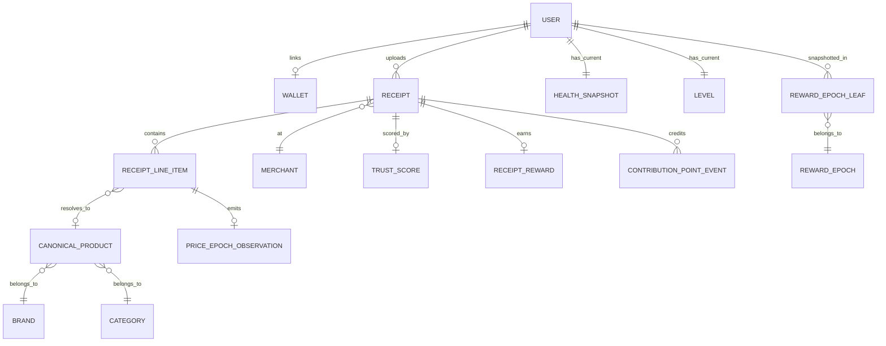

# Çekirdek varlıklar

## 5.2 Çekirdek varlıklar

```mermaid
erDiagram
    USER ||--o| WALLET : links
    USER ||--o{ RECEIPT : uploads
    USER ||--|| HEALTH_SNAPSHOT : has_current
    USER ||--|| LEVEL : has_current
    RECEIPT ||--o{ RECEIPT_LINE_ITEM : contains
    RECEIPT }o--|| MERCHANT : at
    RECEIPT_LINE_ITEM }o--o| CANONICAL_PRODUCT : resolves_to
    RECEIPT_LINE_ITEM ||--o| PRICE_EPOCH_OBSERVATION : emits
    RECEIPT ||--o| TRUST_SCORE : scored_by
    RECEIPT ||--o| RECEIPT_REWARD : earns
    RECEIPT ||--o{ CONTRIBUTION_POINT_EVENT : credits
    USER ||--o{ REWARD_EPOCH_LEAF : snapshotted_in
    REWARD_EPOCH_LEAF }o--|| REWARD_EPOCH : belongs_to

    CANONICAL_PRODUCT }o--|| BRAND : belongs_to
    CANONICAL_PRODUCT }o--|| CATEGORY : belongs_to
```

Çoklukla ilgili kurallar önemlidir: **bir fişin birçok kalemi vardır**, **bir kalem en fazla bir kanonik ürüne çözülür** (veya bekleyen kuyruğa düşerse hiçbirine), **bir fiş en fazla bir güven puanı yayar** (yeniden puanlanabilir; her yeni sürüm bir öncekini geçersiz kılar). Ödül muhasebesi, yalnız-ekleme `contribution_point_events` satırları ve epoch başına anlık görüntü yaprakları (5.7) üzerinden akar; fiyat defteri kimliksiz gözlem satırları alır (5.6).

---
