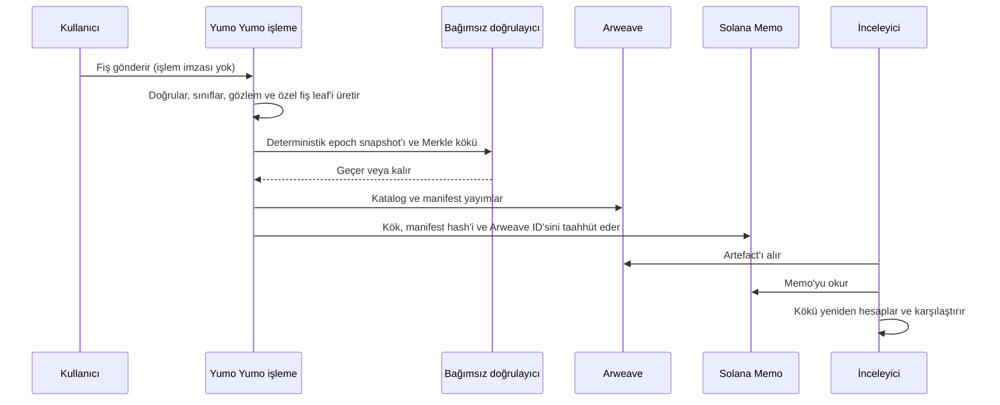

# Web3 altyapısı: doğrulanabilir açık veri ve programlanabilir settlement

## 6.1 Mühendislik problemi

Yumo Yumo aynı anda üç kısıtı yönetmek zorundadır:

- Fiş görselleri ve hane harcama geçmişi özeldir; yayından önce bazen düzeltilmeleri gerekir.
- Açık fiyat verisi, bir inceleyici Yumo Yumo uygulamasını veya API’sini kullanmasa da yayından sonra incelenebilir kalmalıdır.
- Ödül tahsisi yeniden üretilebilir ve kullanıcıdan token claim’i imzalaması istenmeden önce fonlanmış olmalıdır.

Her şeyi zincire koymak ilk kısıtı ihlal eder: fiş verisini açığa çıkarır, rutin işlem için kullanıcıya maliyet yükler ve düzeltmeyi pratik olmaktan çıkarır. Her şeyi uygulama veritabanında tutmak ikinci kısıtı ihlal eder: inceleyicinin aynı sonucu Yumo Yumo’nun sunmaya devam edeceğine güvenmesi gerekir. Web3 tasarımı, bu üç kısıttan hiçbirini zayıflatmadan her işi uygun katmana verir.

```mermaid
flowchart TB
  R[Özel fiş ve hane verisi] --> P[Zincir dışı işleme<br/>OCR · doğrulama · canonical eşleme · uygunluk]
  P -->|kimliksiz gözlemler| A[Arweave açık artefact<br/>katalog · manifest · doğrulama tarifi]
  P -->|özel fiş parmak izi| M[Fiyat Merkle kökü]
  A --> M
  M --> S[Solana Memo<br/>epoch · kök · manifest hash · Arweave ID]
  P -->|uygun bINT defter kayıtları| V[Bağımsız doğrulayıcı]
  V --> D[Jito distributor kökü]
  D --> T[Squads onaylı fonlama]
  T --> C[Cüzdan imzalı INT claim]
  S --> X[Bağımsız inceleyici]
  D --> X
```



Açık veri yolu ile token settlement yolu fiş görselinde değil, doğrulayıcıda buluşur. Ham fişler Arweave’e veya Solana’ya girmez.

## 6.2 Neden bu üç katman

| Tasarım kararı | Gerekçe | Doğrulanabilir çıktı |
|---|---|---|
| Fiş işlemeyi zincir dışında tutmak | Gizlilik, düzeltilebilirlik ve yüklemede cüzdan/ücret gerekmemesi | Yayından önce özel kaynak kayıtları ve deterministik epoch snapshot’ı |
| Fiyat artefact’larını Arweave’de yayımlamak | İnceleyici, Yumo Yumo altyapısı olmadan veri setini ve yöntemi alabilir | Değişmez işlem kimliği, manifest, katalog ve doğrulama tarifi |
| Kompakt kimlikleri Solana’ya bağlamak | Kısa nihai kayıt sürümü, veri seti hash’ini, kökü ve yayın kimliğini bağlar | SPL Memo işlemi ve açık zaman/sıra |
| INT’i distributor ile settlement etmek | Claim’ler yayımlanmış kök ve önceden fonlanmış vault ile sınırlıdır | Distributor hesabı, fonlama işlemi, claim durumu ve clawback kaydı |

Bu nedenle Solana yürütme ve yetki katmanıdır. Arweave açık artefact katmanıdır. Uygulama veritabanı özel işleme katmanı olarak kalır. Hiçbiri diğerinin yerine geçiyor diye sunulmaz.

### Neden Solana, neden Arweave

Seçim, tek bir ağın her iş yükü için en iyi olduğu iddiasıyla değil, operasyonel gereksinimlerle başlar. Yumo Yumo; tam ve yeniden üretilebilir bir epoch’u taşıyan açık kayda, cüzdanın kendi tahsisini doğrulayıp claim edebildiği ekonomik settlement yoluna, hazine hareketi için onay izine ve uygulamanın dışında da çalışabilen doğrulama yoluna ihtiyaç duyar. Bu gereksinimler büyük ve değişmez artefact’lar ile küçük, durum tutan işlemler arasında doğal bir ayrım oluşturur.

| Gereksinim | Solana’nın yürütme rolüne uygunluğu | Arweave’in yayın rolüne uygunluğu |
|---|---|---|
| Açık inceleme | RPC üzerinden okunan işlem ve hesap durumu; taahhüt, fonlama, onay ve claim sonucunu görünür kılar | İçerik-adresli artefact’lar katalog, manifest, şartname ve proof materyalini açar |
| Ekonomik settlement | Cüzdan yönlendirmeli claim, token hesapları, distributor durumu ve multisig onayı işlem düzeyinde settlement izi oluşturur | Tam epoch, kataloğun tamamını işlem verisine koymadan hesaplama ve inceleme için erişilebilir kalır |
| Sürüm bütünlüğü | Kompakt taahhüt epoch kimliğini, kökü, manifest digest’ini ve işlem sırasını bağlar | Arweave kaydı yayımlanmış veri setinin ve doğrulama tarifinin byte kimliğini taşır |
| Bağımsız erişim | İnceleyici kendi RPC sağlayıcısını seçerek ilgili durumu doğrudan okuyabilir | İnceleyici kendi gateway’ini seçebilir veya artefact’ların yerel aynasını tutabilir |

Solana, durum geçişi gerektiren kısım için seçilir: yayımlanmış tahsisin settlement’ı, cüzdan tarafından yetkilendirilen claim, hazine onay kanıtı ve mühürlenmiş epoch’a zaman sıralı taahhüt. Tasarım zincir üstü yükü kompakt tutar: kökler, digest’ler, kimlikler, yetki durumu, fonlama referansları ve claim durumu. Böylece doğrudan doğrulama yolu korunurken fiş işleme ve katalog ölçeğindeki veri işlem payload’ının dışında kalır. Mevcut plan, yayımlanmış Solana protokol bileşenlerini kullanır; somut mainnet instance’ları release etkinleştiğinde release envanterinde tanımlanır.

Arweave, kalıcı ve alınabilir yayın gerektiren kısım için seçilir: tam fiyat kataloğu, manifest, canonicalisation kuralları ve doğrulayıcının kökü yeniden kurmak için kullandığı materyal. Klasik obje depolama aynı dosyaları dağıtabilir; sürekliliği ve erişim politikası operatör hesabına bağlı kalır. İçerik-adresli eşler arası dağıtım byte’ları tanımlar; uzun dönem erişim ise yayıncının seçtiği saklama düzenine bağlıdır. Arweave, yayın artefact’ına kendi işlem kimliğini verir ve bu kimliği Solana taahhüdüne bağlamayı mümkün kılar.

Birlikte kullanıldıklarında tek sağlayıcının beyanı yerine çapraz kontrol oluştururlar. Doğrulayıcı seçtiği gateway’den Arweave artefact’ını alır, manifest digest’i ve Merkle kökünü yeniden hesaplar, ardından seçtiği RPC sağlayıcısından ilgili Solana işlemini veya hesabını okur. İki kayıt epoch ve kök üzerinde aynı sonucu vermelidir. Açık dosya biçimi taşınabilirdir: bağımsız bir ekip artefact’ları aynalayabilir, ağacı yeniden kurabilir ve Yumo Yumo altyapısını kullanmadan taahhüdü doğrulayabilir. İki sistemin birlikte seçilmesinin nedeni budur: Arweave yayın ölçeğindeki kanıtı, Solana ise bu kanıtın ekonomik ve yetkisel sonucunu taşır.

## 6.3 Fişten açık ve kontrol edilebilir kayda



İnceleyicinin ayrıcalıklı endpoint’e ihtiyacı yoktur. Fiyat manifesti ürün, mağaza, konum, tarih ve birim fiyat gözlemlerini içerir; fiş görselleri, fiş kimlikleri, cüzdan adresleri, kullanıcı hesapları, OCR çıktısı veya güven sinyallerini içermez. Açık/özel alan sınırı 06.2’de tanımlıdır.

Cüzdanla bağlı bir fiş için sahip, `keccak256("price-receipt:v1|receipt_id|content_hash|wallet")` özel parmak izini yeniden hesaplayabilir, inclusion proof alabilir ve sonucu Memo ile karşılaştırabilir. Nonce içeren ayrı cüzdan imzası cüzdanın güncel kontrolünü gösterir. Bu, fişin mühürlü epoch’a dahil olduğunun kanıtıdır; bankanın veya mağazanın ödemeyi tamamladığının bağımsız kanıtı değildir.

## 6.4 Doğrulanmış katkıdan INT claim’ine

Token yolu açık fiyat ağacını bilinçli olarak yeniden kullanmaz. bINT zincir dışı muhasebe kredisidir. Epoch sınırında uygun kayıtlar bağımsız kontrol edilir, Jito uyumlu SHA-256 dağıtım ağacına dönüştürülür ve kaydedilmiş leaf setine karşı doğrulanır. Ancak bundan sonra distributor yapılandırılabilir ve hazine Squads onayıyla fonlanabilir.

```text
uygun bINT kayıtları → bağımsız doğrulayıcı → Jito kökü → distributor vault fonlama
→ kullanıcı claim imzalar → INT vault'tan aktarılır → alınmamış bakiye yapılandırılmış clawback'i izler
```

Bu iki pratik koruma sağlar: uygulama ekranda görünen bINT bakiyesini değiştirerek INT claim’i oluşturamaz; kullanıcı fiş yüklemek veya zincir dışı birikim için işlem imzalamaz. Kullanıcı yalnız isteğe bağlı sahiplik kanıtını veya INT claim’ini imzalar.

## 6.5 Kanıt, olgunluk ve release koşulları

| Yüzey | Repodaki kanıt | Açıklanması gereken release durumu |
|---|---|---|
| Fiyat defteri | Yeniden kurulabilir manifest, Merkle tanımı, yayın betiği, açık Memo doğrulama tarifi ve açık kaynak doğrulayıcı | Solana mainnet’te canlı (Arweave artefact’larıyla); kamu dizini https://yumoyumo.com/ledger; bağımsız doğrulama https://github.com/Yumo-Yumo-Inc/price-ledger-verifier |
| Jito dağıtım ağacı | Clean-room TypeScript ağaç oluşturucu; iki Jito CLI fixture ağacına karşı byte-exact test | Devnet’te prova edildi; her mainnet distributor kendi adresi, kökü, fonlama işlemi ve doğrulama kaydını gerektirir |
| Hazine kontrolü | Root, treasury ve clawback için betikler ve görev ayrımı | Mainnet multisig adresleri, üyeler, eşik ve release onayları etkinleştirmeden önce yayımlanmalı |
| INT mint | Açık mint-authority-close kapısı olan mainnet runbook | Mainnet mint adresi ve yetki durumu yayımlanmadan aktif denmemeli |

Bu ayrım bilinçlidir. Prova edilmiş akış uygulama kanıtıdır; karşılık gelen mainnet instance’ın zaten var olduğu iddiası değildir.

## 6.6 Doğrulanabilenler ve güven sınırı

| İnceleyicinin doğrulayabildiği | Süreç kanıtı üzerinden değerlendirmesi gereken |
|---|---|
| Yayımlanmış manifestin taahhüt edilmiş hash ve Merkle köküyle eşleştiği | OCR doğruluğu, canonical eşleme ve fraud incelemesi |
| Verilen fiş parmak izinin fiyat epoch’una dahil olduğu | Bir mağaza veya bankanın ödemeyi tamamladığı |
| Claim proof’unun distributor köküyle eşleştiği ve vault’un fonlandığı | bINT oluşturmakta kullanılan özel uygunluk girdileri |
| Tamamlanmış zincir üstü işlemin açık iz bıraktığı | Dış bağımlılığın sürekli erişilebilir kalacağı |

Gateway gecikmesi, RPC kesintisi, proof uyumsuzluğu, reddedilen claim, başarısız doğrulama ve alınmamış fon clawback’i ayrı operasyonel durumlardır. Protokol bunları engellediğini iddia etmez; yayımlanmış artefact, kök, işlem ve release kaydıyla teşhis edilebilir kılar.

## 6.7 İnceleme yolu

Teknik inceleyici kamu defter dizininden başlayabilir ([https://yumoyumo.com/ledger](https://yumoyumo.com/ledger)): mühürlü bir epoch’u açar, Solana Memo ve Arweave artefact bağlantılarını izler, ardından açık kaynak doğrulayıcıyla ([https://github.com/Yumo-Yumo-Inc/price-ledger-verifier](https://github.com/Yumo-Yumo-Inc/price-ledger-verifier)) `npx tsx src/verify.ts <epoch>` çalıştırarak kökü yeniden hesaplar. Yumo Yumo hesabı veya veritabanı gerekmez. Ödül inceleyicisi kaydedilmiş leaf seti, Jito ağaç biçimi, distributor hesabı, fonlama işlemi ve claim durumuyla dağıtım sınırını yeniden üretir. Uygulama biçimleri, program kimlikleri, release durumu gereklilikleri ve hata yönetimi [Protokol ayrıntıları ve operasyonel sınırlar](02-protocol-details.md) sayfasındadır.

Web3 katmanının amacı fiş işlemeyi blockchaine taşımak değildir; yayımlanmış veriyi ve token settlement’ını, kalıcı veya ekonomik sonuç doğurduğu noktalarda bağımsız incelemeye açmaktır.

---
