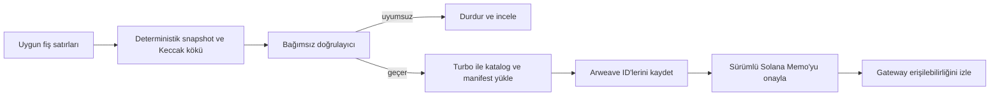
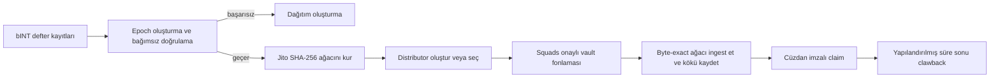

# Web3 protokol ayrıntıları ve operasyonel sınırlar

## 6.8 Tasarım tercihleri

Sistem, özel işleme, açık kanıt ve token yürütmesini; maliyet, gizlilik ve düzeltme özellikleri farklı olduğu için ayırır.

| Katman | Neden kullanılır | Ne için kullanılmaz |
|---|---|---|
| Uygulama veritabanı | Özel fiş işleme, uygunluk ve yayından önce operasyonel düzeltme | Mühürlü artefact’ların açık kaynak doğruluğu |
| Arweave | Yumo Yumo olmadan alınabilen açık, içerik-adresli fiyat artefact’ları ve doğrulama materyali | Fiş görselleri, özel fiş satırları veya değişebilir operasyonel durum |
| Solana | Token hesapları, multisig kontrollü vault hareketi, claim durumu ve kompakt taahhütler | Fiş saklama, OCR yürütme veya fiş başına token mint |

Bu ayrım bilinçlidir. Her fişi zincirde saklamak veriyi açığa çıkarır, işlem maliyeti doğurur ve düzeltmeyi zorlaştırır. Yayımlanmış kanıtı yalnız uygulama veritabanında tutmak ise yayını Yumo Yumo’nun varlığına bağımlı kılar. Bu yüzden sistem sınırlı bir açık artefact’ı Arweave’de yayımlar ve kesin kimliğini Solana’da mühürler.

## 6.9 Release envanteri ve aktivasyon koşulları

Bu teknik kâğıt, sistem için planlanan entegrasyon yüzeylerini tarif eder. Bir mainnet release’i etkinleştirildiğinde, somut ağ, adresler, paket sürümleri, yetki durumu ve release kanıtı için kaynak kayıt release envanteri olur. Envanter release ile birlikte yayımlanır ve deployment’a özgü adresleri içerir.

| Yüzey | Aktivasyondan önce release kaydında bulunması gerekenler |
|---|---|
| INT mutabakatı | Ağ, INT mint adresi, yetki durumu, yetkilendirilmiş arz işlemi ve release sürümü |
| Ödül dağıtımı | Distributor adresi, Merkle kökü, claim süresi, clawback alıcısı, fonlama işlemi ve ağaç şartnamesi sürümü |
| Hazine yönetişimi | Multisig adresi, üye kümesi, onay eşiği ve teklif veya onay kaydı |
| Açık fiyat mühürleme | Sealer adresi, Solana işlemi, Arweave manifest ID’si ve fiyat kataloğu ID’si |

Her release kaydı ayrıca bağımlılık sürümlerini, ilgili audit veya inceleme referanslarını, RPC politikasını ve güvenlik bildirim kanalını içerir. Böylece inceleyiciler ve kullanıcılar canlı yapılandırmayı tek bir sürümlü kayıttan doğrulayabilir.

## 6.10 İki Merkle sistemi

| Özellik | Açık fiyat defteri | INT distributor |
|---|---|---|
| Amaç | Yeniden üretilebilir açık gözlemleri ve okunamayan fiş parmak izlerini taahhüt etmek | Kesin token claim’lerini yetkilendirmek |
| Hash | Keccak-256 | SHA-256 |
| Leaf | Açık gözlem satırının hash’i; fiş leaf’i özel ön görüntüye sahiptir | `hashv(claimant, unlocked_u64_le, locked_u64_le)`, sonra alan ayrımlı leaf hash |
| Sıralama ve tek leaf | Leaf’ler hash’e göre sıralanır; tek leaf değişmeden taşınır | Girdi sırası deterministiktir; hash çiftleri sıralanır; tek node kopyalanır |
| Doğrulama hedefi | Solana Memo’daki manifest hash’i ve kök | Distributor hesap kökü ve claim instruction |

Ağaçlar birbirinin yerine asla kullanılmamalıdır. Fiyat inclusion proof’u INT claim edemez; distributor proof’u ise fişi açığa çıkarmaz veya doğrulamaz.

## 6.11 Durum geçişleri

### Fiyat yayını

Geri alınamaz sınır Memo onayıdır. Doğrulayıcı hatası yeniden kurmaya izin verir; Turbo’nun kabul ettiği ancak gateway’in henüz sunmadığı upload erişilebilirlik izlemesi gerektirir; mühürlü epoch değiştirilemez, sonraki yayınla düzeltilir.

### Ödül dağıtımı

Hiçbir taraf hem kaynak uygunluk verisini değiştirmemeli hem de farklı bir distributor’ı tek başına fonlayamamalıdır. Doğrulayıcı, kök kurulumu ve hazine fonlaması ayrı operasyonel kontrollerdir.

## 6.12 Yeniden üretilebilirlik ve audit izi

Bağımsız inceleyici, uygulama erişimi olmadan açık fiyat epoch’unu doğrulayabilir:

1. Memo’yu açık sealer adresinden veya Arweave etiketlerinden bulur.
2. Manifest’i Arweave işlem kimliğiyle alır.
3. Manifest gövdesini Memo’daki manifest hash’ine karşı kontrol eder.
4. Yayımlanmış tanımla gözlem ve fiş leaf’lerini yeniden hesaplar.
5. Bunları Merkle köküne katlar ve Memo ile karşılaştırır.
6. İsteğe bağlı olarak katalogyu alır ve hash’ini manifest’e karşı doğrular.

Ödül için eşdeğer inceleme, kaydedilmiş dağıtım leaf setini, Jito ağaç tanımını, distributor hesabını, fonlama işlemini ve claim durumunu kullanır. Açıklanmış tahsisin kök ve fonlanmış vault ile tutarlı olduğunu doğrular; özel uygunluk girdilerinin doğruluğunu bağımsız olarak kanıtlamaz.

## 6.13 Yetki ve hata açıklaması

Yetki geleceğe dair vaat olarak değil release durumu olarak açıklanır. Mainnet instance’ı ve multisig adresleri yayımlanana kadar teknik metin instance’ın provision edilmediğini söylemelidir. Mainnet yetki devri, token mint closure ve distributor fonlaması ayrı runbook kapıları olan, geri alınamaz veya yüksek etkili işlemlerdir.

Gateway erişilememesi, RPC kesintisi, reddedilen claim, proof uyumsuzluğu, başarısız doğrulama ve alınmamış fon clawback’i ayrı gözlemlenebilir durumlar olmalıdır. Sistem Web3’ün bu olayları önlediğini iddia etmez; incelemek için yeterli kanıt kaydeder.

## 6.14 Epoch yaşam döngüsü: fişten sürümlü açık kayda

Epoch, hareketli bir veritabanı görünümü değil, sınırları belirlenmiş bir yayın aralığıdır. Amacı her yayımlanmış veri kümesine sabit bir girdi sınırı ve sabit bir doğrulama hedefi vermektir. Epoch kimliği; açılış ve kapanış zamanları; dahil etme politikası; kaynak şema, kanonikleştirme ve doğrulayıcı sürümleri manifest’e yazılır. Böylece daha sonraki bir inceleme, kapanıştan önce dahil edilen gözlem ile kapanıştan sonra kabul edilen gözlemi açıkça ayırır.

Yaşam döngüsü yedi aşamadan oluşur. İlk aşamada fiş satırları ve fiyat gözlemleri özel işleme kuyruğuna girer; doğrulama, mükerrer ayıklama, mağaza eşleme, birim normalizasyonu ve uygunluk kararları burada uygulanır. İkinci aşamada epoch oluşturucu, ilan edilmiş kapanış saati ve politika koşullarını sağlayan kayıtları seçer. Üçüncü aşama değişmez snapshot’tır: her açık gözlem tanımlı alan sırası ve encoding ile serileştirilir; uygun her fiş, görseli veya ham içeriği yerine gizliliği koruyan bir parmak iziyle temsil edilir. Dördüncü aşamada bağımsız doğrulayıcı aynı dondurulmuş girdiden snapshot’ı yeniden kurar; kayıt sayısını, byte digest’lerini, leaf sayısını, kökleri ve manifest alanlarını karşılaştırır.

Eşleşen doğrulayıcı sonucu yayına geçiş kapısıdır. Oluşturucu ardından fiyat kataloğunu, gerektiğinde fiş-parmak-izi kümesini, manifest’i ve inclusion-proof materyalini üretir. Manifest dosya adlarını, SHA-256 digest’lerini, Merkle algoritmalarını, kök değerlerini, epoch sınırını ve kullanılan yazılım/şartname sürümlerini taşır. Artefact’lar Arweave’e yüklenir. Birden fazla gateway’den alınan byte’lar beklentiyle eşleştikten sonra kompakt bir Solana taahhüdü epoch kimliğini, manifest digest’ini, kökü ve format sürümünü bağlar. Ortaya çıkan kimlikler, o epoch’un release kanıtının parçasıdır.

Son aşama izleme ve düzeltmedir. Gateway okuması, manifest digest kontrolü, proof doğrulaması ve claim sonuçları birbirinden bağımsız sinyaller olarak izlenir. Bir düzeltme, etkilenen epoch’a referans veren sonraki bir epoch veya açık bir düzeltme kaydı üretir; önceki artefact karşılaştırma için yerinde kalır. Bu sıra, fiyat değişimini, ingestion hatasını veya politika güncellemesini tarihsel sonucu sessizce değiştiren bir işlem yerine audit edilebilir olaya dönüştürür.

## 6.15 Merkle kurulumu ve proof biçimi

İki ağacın güvenlik sınırları farklıdır; bu nedenle biçimleri birbirinden bağımsız sürümlenir. Açık fiyat ağacı, üçüncü bir tarafın yeniden üretebileceği kayıtlara taahhüt verir. Her açık leaf alan etiketiyle başlar ve ardından gözlemin kanonik byte gösterimi gelir. Kanonik gösterim alan listesini, UTF-8 encoding’i, tarih biçimini, ondalık ölçeği, para birimi kodunu, mağaza/konum kimliklerini ve satır sonu kuralını tanımlar. Aynı byte’ları kullanan doğrulayıcı aynı leaf hash’ine ulaşır. Manifest leaf sıralama kuralını, çift-hash kuralını, tek leaf kuralını, kök encoding’ini ve tam ağaç şartnamesi sürümünü kaydeder.

Fiş-parmak-izi yolu özel bir preimage ekler. Fiş sahibi, parmak izini yeniden hesaplamak için gereken yerel değerleri saklar; fiş görselini, banka bilgisini, hesap bilgisini veya cüzdan ilişkisini yayımlamadan inclusion proof alabilir ya da üretebilir. Proof; sibling hash’leri, sol/sağ konumlarını, epoch kimliğini ve şartname sürümünü içerir. Sahip, yerelde hesaplanan leaf’ten başlayarak her sibling’i açıklanan sırada katlar ve son kökü manifest ile Solana taahhüdündeki kökle karşılaştırır. Sonuç, belirli bir mühürlü epoch’a dahil oluşu gösterir ve fişin içeriğini açık kataloğa taşımaz.

INT dağıtım ağacı ise ayrı bir claim yetkilendirme yapısıdır. Leaf, talep sahibinin public key’ini ve kilitsiz/kilitli tahsis değerlerini tanımlı byte sırası ile alan ayırıcısında kodlar. Dağıtım manifest’i tahsis epoch’unu, kökü, claim açılış ve kapanış zamanlarını, fonlama işlemini ve clawback hedefini sabitler. Claimant leaf ve proof’u yerelde kontrol eder; ardından kendi cüzdanından claim instruction’ını gönderir. Distributor durumu claim sonucunu kaydeder. Yayınlanan kökte bir tahsisin bulunduğunu denetlemek için uygulama oturumu gerekmez.

## 6.16 Bağımsız sorgu ve geliştirici yöntemleri

Açık doğrulama yolu ayrıcalıklı bir Yumo Yumo endpoint’ine bağlı kalmamalıdır. Kullanıcı, araştırmacı veya geliştirici epoch index’inden ya da bilinen Arweave manifest ID’sinden başlar; kendi seçtiği gateway üzerinden manifest’i alır ve digest’ini Solana taahhüdüyle karşılaştırır. Manifest’in adını verdiği kataloğu çekebilir, dosya digest’lerini yerelde hesaplayabilir, ağacı yeniden kurabilir ve kökü kıyaslayabilir. Kendi fişi söz konusu olduğunda özel preimage yalnız yerel doğrulayıcıya verilir; dönen sibling path ile inclusion kontrol edilir. Cüzdanlar claim durumunu kullanıcının veya doğrulayıcının seçtiği Solana RPC endpoint’inden doğrudan sorgular.

Protokol bu adımları taşınabilir kılan veri sözleşmelerini yayımlar. Aşağıdaki yöntemler komut satırı doğrulayıcısı, cüzdan eklentisi, araştırma not defteri veya bağımsız explorer için tasarlanır; mülkiyetli bir API yerine artefact işlemlerini açıklar:

| Yöntem | Girdiler | Çıktı | Bağımsız kontrol |
|---|---|---|---|
| `getEpoch(epoch_id)` | Epoch kimliği | Manifest ID, kök, format ve yayın zamanı | Manifest digest’i zincir taahhüdüyle eşleşir |
| `getCatalogue(manifest_id)` | Manifest ID | Byte-exact açık katalog | Dosya digest’i manifest’le eşleşir |
| `buildPriceRoot(catalogue, spec)` | Katalog byte’ları ve ağaç şartnamesi | Leaf sayısı ve fiyat kökü | Kök manifest’le eşleşir |
| `proveReceipt(receipt_preimage, epoch_id)` | Yerelde tutulan preimage ve epoch | Leaf ve sibling path | Katlanmış path yayımlanmış fiş köküne ulaşır |
| `getDistribution(epoch_id)` | Tahsis epoch’u | Kök, claim süresi, fonlama referansı ve format | Kök ve fonlama kaydı release kanıtıyla eşleşir |
| `verifyAllocation(wallet, allocation, proof)` | Cüzdan anahtarı, tutarlar ve proof | Yerel geçerli/geçersiz sonucu | Kök dağıtım kaydıyla eşleşir |

Referans uygulamalar ağ erişimini değiştirilebilir tutar: çağıran taraf herhangi bir Arweave gateway kullanabilir, artefact’ların yerel aynasını tutabilir ve kendi Solana RPC sağlayıcısını seçebilir. Doğrulayıcı gateway veya RPC kaynağını, alma zamanını, beklenen/gözlenen digest’leri, şartname sürümünü ve her başarısız karşılaştırmayı raporlar. Bu çıktı başka bir tarafın aynı incelemeyi yeniden üretmesine yeter.

## 6.17 Açık harcama kanıtı ve inceleme kapsamı

Harcama kanıtı, kişinin alışverişini açıkça ifşa etmekten daha dar bir kavramdır. Açık katman, onaylanmış gözlemin veya fiş parmak izinin mühürlü epoch’un parçası olduğunu ve artefact kümesinin byte düzeyinde tanımlanabilir kaldığını gösterir. Özel katman, ilgili kullanıcının kendi parmak izini yeniden hesaplayacağı bilgiyi korur. Bu ayrım, kişisel fiş içeriğini açık kataloğun dışında tutarken yayın bütünlüğünün açık denetimini mümkün kılar.

Grant incelemesinde sorulması gereken sorular operasyoneldir: Hangi epoch yayımlandı? Hangi şartname onu üretti? Hangi artefact byte’larını taşıyor? Hangi taahhüt bu artefact’ı tanımlıyor? İlgili hazine hareketini hangi yetki onayladı? Hangi dağıtım kökü claim’leri yetkilendiriyor ve hangi fonlama işlemi bu claim’leri ödenebilir yaptı? Mainnet release’i etkinleştiğinde release envanteri ve epoch manifest’leri bu soruları kimlikler ve sürümlü kayıtlarla yanıtlar. O ana kadar bunlar deployment kriterleri ve test edilebilir artefact formatlarıdır.

---
