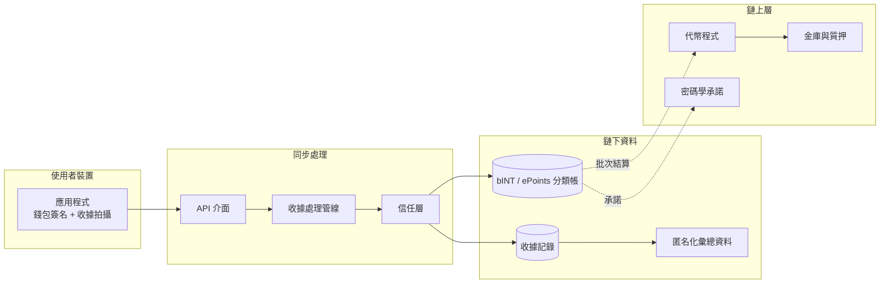

# 高階系統圖

## 1.1 高階系統圖

```mermaid
flowchart LR
    subgraph Client["使用者裝置"]
        A["應用程式<br/>錢包簽名 + 收據拍攝"]
    end

    subgraph Processing["同步處理"]
        B["API 介面"]
        C["收據處理管線"]
        D["信任層"]
    end

    subgraph Data["鏈下資料"]
        E[("收據記錄")]
        F[("bINT / ePoints 分類帳")]
        G["匿名化彙總資料"]
    end

    subgraph Chain["鏈上層"]
        H["代幣程式"]
        I["金庫與質押"]
        J["密碼學承諾"]
    end

    A --> B --> C --> D
    D --> E
    D --> F
    E --> G
    F -. "批次結算" .-> H
    F -. "承諾" .-> J
    H --> I
```

此圖展示公開的架構邊界：面向使用者的預覽為同步流程；bINT 與 ePoints 的會計資料先寫入分類帳，再由結算工作者（settlement workers）批次結算至鏈上層。本圖聚焦於協議元件與資料流動。
