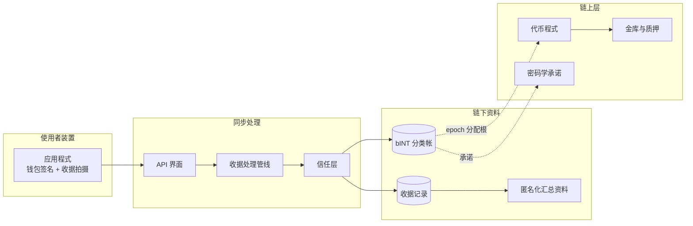

# 高阶系统图

## 1.1 高阶系统图

```mermaid
flowchart LR
    subgraph Client["使用者装置"]
        A["应用程式<br/>钱包签名 + 收据拍摄"]
    end

    subgraph Processing["同步处理"]
        B["API 界面"]
        C["收据处理管线"]
        D["信任层"]
    end

    subgraph Data["链下资料"]
        E[("收据记录")]
        F[("bINT 分类帐")]
        G["匿名化汇总资料"]
    end

    subgraph Chain["链上层"]
        H["代币程式"]
        I["金库与质押"]
        J["密码学承诺"]
    end

    A --> B --> C --> D
    D --> E
    D --> F
    E --> G
    F -. "epoch 分配根" .-> H
    F -. "承诺" .-> J
    H --> I
```

此图展示公开的架构边界：面向使用者的预览为同步流程，而 bINT 会计保持在链下。结算工作者将由符合条件的 bINT 记帐推导出的 INT 分配根提交至链上层。本图聚焦于协议元件与资料流动。
