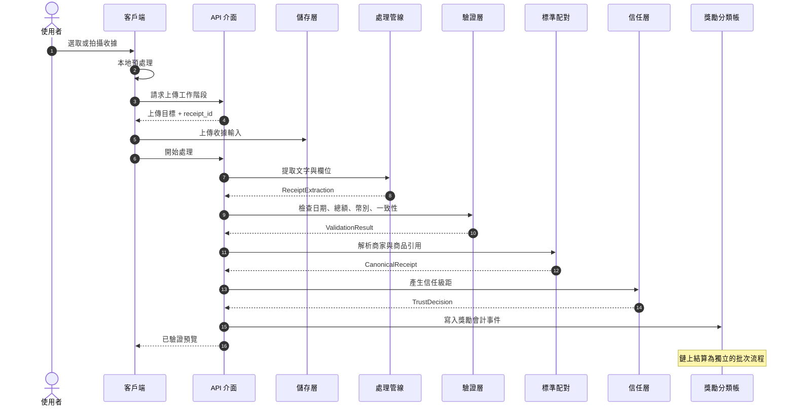

# 02 — 收據處理管線

收據處理管線將使用者提交的收據圖片或 PDF 發票轉換為結構化的收據記錄。公開契約為階段順序與每個階段的輸入/輸出型別；供應商選擇、提示詞細節、門檻值與備援規則則保留於營運文件中。

管線分離兩項輸出：向使用者顯示的已驗證預覽，以及寫入獎勵分類帳的會計事件。這使使用者體驗與鏈上結算彼此獨立。

## 2.1 設計目標

| 目標 | 技術影響 |
|---|---|
| 低延遲 | 面向使用者的預覽於同步流程中產生 |
| 型別化階段交接 | 每個階段輸出與綱要綁定的結果供下一階段使用 |
| 可重新執行 | 階段輸出記錄為事件；失敗作業可使用相同輸入重試 |
| 品質分離 | 低信心度收據可從獎勵會計中分離或轉入審查 |
| 隱私 | 原始收據內容於鏈下資料層處理；資料產品衍生自匿名化層 |

## 2.2 管線概覽

各階段透過型別化事件而非共享可變狀態連接。這使流程可觀測，並允許歷史重新處理。
