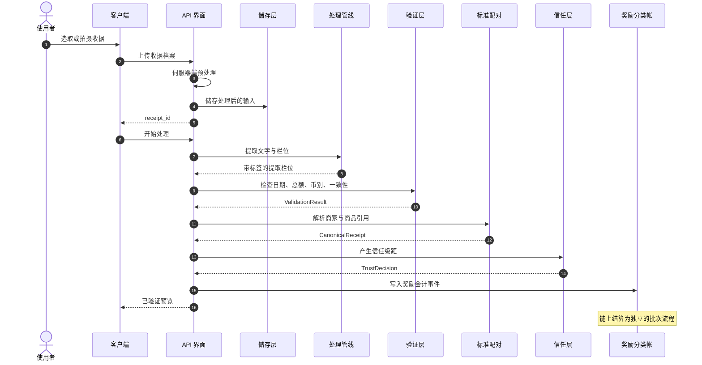

# 02 — 收据处理管线

收据处理管线将使用者提交的收据图片或 PDF 发票转换为结构化的收据记录。公开契约为阶段顺序与每个阶段的输入/输出型别；供应商选择、提示词细节、门槛值与备援规则则保留于营运文件中。

管线分离两项输出：向使用者显示的已验证预览，以及写入奖励分类帐的会计事件。这使使用者体验与链上结算彼此独立。

## 2.1 设计目标

| 目标 | 技术影响 |
|---|---|
| 低延迟 | 面向使用者的预览于同步流程中产生 |
| 型别化阶段交接 | 每个阶段输出与纲要绑定的结果供下一阶段使用 |
| 可重新执行 | 阶段输出记录为事件；失败作业可使用相同输入重试 |
| 品质分离 | 低信心度收据可从奖励会计中分离或转入审查 |
| 隐私 | 原始收据内容于链下资料层处理；资料产品衍生自匿名化层 |

## 2.2 管线概览

```mermaid
sequenceDiagram
    autonumber
    actor U as 使用者
    participant C as 客户端
    participant API as API 界面
    participant S as 储存层
    participant P as 处理管线
    participant V as 验证层
    participant M as 标准配对
    participant T as 信任层
    participant L as 奖励分类帐

    U->>C: 选取或拍摄收据
    C->>API: 上传收据档案
    API->>API: 伺服器端预处理
    API->>S: 储存处理后的输入
    API-->>C: receipt_id
    C->>API: 开始处理
    API->>P: 提取文字与栏位
    P-->>API: 带标签的提取栏位
    API->>V: 检查日期、总额、币别、一致性
    V-->>API: ValidationResult
    API->>M: 解析商家与商品引用
    M-->>API: CanonicalReceipt
    API->>T: 产生信任级距
    T-->>API: TrustDecision
    API->>L: 写入奖励会计事件
    API-->>C: 已验证预览
    Note over L: 链上结算为独立的批次流程
```

各阶段透过型别化事件而非共享可变状态连接。这使流程可观测，并允许历史重新处理。
