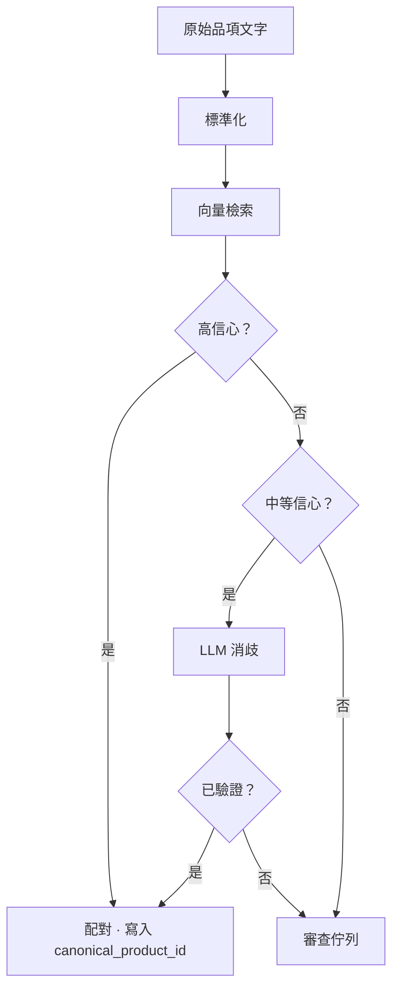

# 階段 4 — 標準化

## 2.7 階段 4 — 標準商品配對

本階段將同一商品的不同表面形式收斂為單一的標準識別碼。例如：

- `COCA COLA 330ML KUTU`
- `C.COLA 33CL TENEKE`
- `COCA-COLA 0.33 L`
- `COKA 330 ML`

以上四者全部解析至相同的 `canonical_product_id`。此解析是價格記憶與 B2B 資料產品的前提條件。

### 方法

標準解析是一個多階段嵌入型解析器，具備信心分層消歧與針對模糊案例的人工審查佇列。



確切的相似度門檻、嵌入模型與消歧提示詞由內部營運層管理。

未解析的品項會以空標準引用記錄。該品項的 bINT 於佇列標準化後計算。

### 分類結構

```
category > subcategory > brand > product > variant
```

範例：

```
Beverages > Carbonated Soft Drinks > Coca-Cola > Coca-Cola Classic > 330 ml can
```

每個標準商品攜帶標準化屬性：`size_value`、`size_unit`、`package_type`、`brand_id`、`is_private_label`、`barcode_gtin`（若有）。

### 冷啟動

標準索引從開放商品資料集、授權目錄合作夥伴，以及封閉測試期的種子使用者上傳資料啟動。索引隨標準化佇列的消化而有機成長。

### 待標準化佇列

模糊品項進入審查佇列。審查者（最初為 Yumo Yumo 團隊，日後為賺取 PoC 的社群池）會建立新標準商品或將原始文字對應至既有商品。此佇列是管線規模擴展時的主要成本槓桿之一 — 08 將其列為核心營運風險。

---
