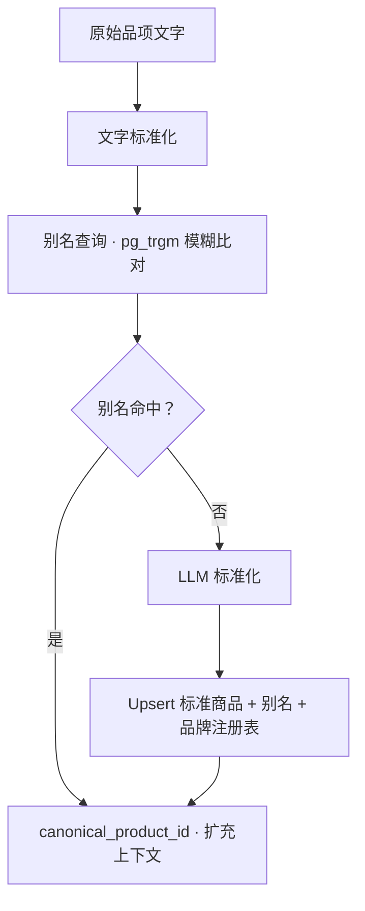

# 阶段 4 — 标准化

## 2.7 阶段 4 — 标准商品配对

本阶段将同一商品的不同表面形式收敛为单一的标准识别码。例如：

- `COCA COLA 330ML KUTU`
- `C.COLA 33CL TENEKE`
- `COCA-COLA 0.33 L`
- `COKA 330 ML`

以上四者全部解析至相同的 `canonical_product_id`。此解析是价格记忆与 B2B 资料产品的前提条件。

### 方法

标准解析在背景后处理工作者中**非同步**执行，此时同步流程已将已验证的预览回传给使用者。这使商品解析离开延迟敏感路径：使用者立即看到收据，标准识别码稍后附加到记录上。

解析器基于一张别名表运作，该表将原始收据行文字对应至标准商品：


```mermaid
flowchart TD
    A[原始品项文字] --> B[文字标准化]
    B --> C[别名查询 · pg_trgm 模糊比对]
    C --> D{别名命中？}
    D -- 是 --> E[canonical_product_id · 扩充上下文]
    D -- 否 --> F[LLM 标准化]
    F --> G[Upsert 标准商品 + 别名 + 品牌注册表]
    G --> E
```

- **模糊别名查询** — 标准化后的行文字使用 PostgreSQL trigram 相似度（`pg_trgm`）与先前学习到的收据别名比对。命中即直接解析至标准商品。只有当文字读起来像真实商品名称而非商店私有缩写时，在某商家学习到的别名才会跨商家重用，这可避免不同商品并入同一个标准商品。
- **LLM 备援** — 未命中时，语言模型将原始文字标准化为品牌、商品与规格属性。结果以新标准商品的形式 upsert（或对应至既有商品），并同时写入一笔新的别名列，使同一表面形式下次无需模型呼叫即可解析。

相似度设定与标准化提示词由内部营运层管理。

未解析的品项会以空标准引用记录；随著别名表成长，解析可在之后的轮次完成。

### 分类结构

```
category > subcategory > brand > product > variant
```

范例：

```
Beverages > Carbonated Soft Drinks > Coca-Cola > Coca-Cola Classic > 330 ml can
```

每个标准商品携带标准化属性：`size_value`、`size_unit`、`package_type`、`brand_id`、`is_private_label`、`barcode_gtin`（若有）。

### 成长模型

标准索引由收据流量本身成长：每一条经 LLM 标准化的行都会新增一个标准商品与一个别名，此后该表面形式的每次重复都从别名表解析，无需模型成本。模糊或低品质的条目透过管理端目录工具审查。
