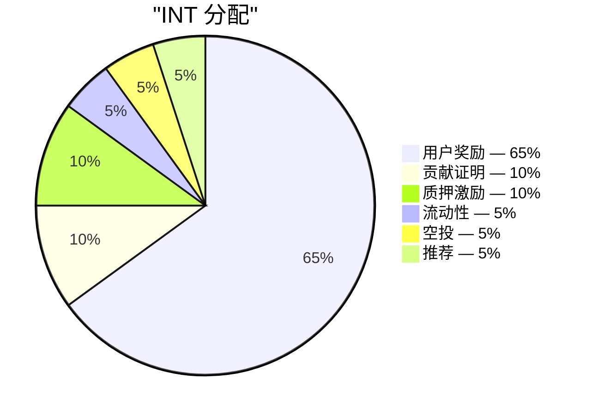

# 供应量与分配

## 4.16 总供应量

| 参数 | 值 |
|---|---|
| 代币 | INT |
| 标准 | SPL (Solana) |
| 精度 | 6 |
| 总供应量 | 99,000,000,000 |
| 创世后可铸造 | 无 —— 铸造权限已关闭 |

全部 990 亿 INT 在创世时一次性铸造进金库，随后铸造权限关闭。此后无法再创造任何 INT。分发是通过经审计的分发器（4.15）从金库转账，而非新增铸造。

## 4.17 分配表

| 轨道 | 份额 | 代币数量 | 用途 |
|---|---:|---:|---|
| 用户奖励 | 65% | 64,350,000,000 | 已验证的费用证明贡献的主要激励 |
| 贡献证明 | 10% | 9,900,000,000 | 基于影响力加权分配给核心团队、承包商和外部贡献者（4.11） |
| 质押激励 | 10% | 9,900,000,000 | 对锁定 INT 的长期持有者的奖励（4.6） |
| 流动性 | 5% | 4,950,000,000 | 在 TGE 时为链上市场注入种子流动性；为社区治理的深度提供储备 |
| 空投 | 5% | 4,950,000,000 | 跨多个周期的基于参与的营销分发 |
| 推荐 | 5% | 4,950,000,000 | 事件驱动解锁，当被邀请者完成验证里程碑时触发 |
| **总计** | **100%** | **99,000,000,000** | |

六条轨道占总供应量的百分之百。此分配图之外不存在单独的团队分配。创始团队和所有贡献者通过贡献证明轨道（4.11）获取收益，遵循与外部参与者相同的影响力加权逻辑。

## 4.18 轨道职责

- **用户奖励** — 协议的主要流出通道。由发行曲线（4.19）治理，并受每日上限（4.22）计量。预算：64.35 billion INT，分布于 15 年发行周期。
- **贡献证明** — 定期的、基于评分标准的分配，附带归属期（4.13）。将团队激励与可衡量的工作产出对齐。
- **质押激励** — 在 5 年周期内释放。等级加权累积描述于 4.6。
- **流动性** — 1 billion INT 在 TGE 时通过流动性引导池注入种子流动性（LP 锁定 12 个月）。3.95 billion INT 作为储备，用于社区治理的部署。
- **空投** — 作为基于参与的营销分发，跨数年分布于多个周期（而非一次性发放）。每次分发的时机出人意料，但可透明验证：接收者集合在代币转移之前承诺在链上。分发规模在营运层治理。
- **推荐** — 事件驱动：当被邀请者跨越一个有意义的贡献门槛后，一次成功的邀请触发向推荐用户解锁一个单位。门槛条件在生产环境中校准，不予公布。
