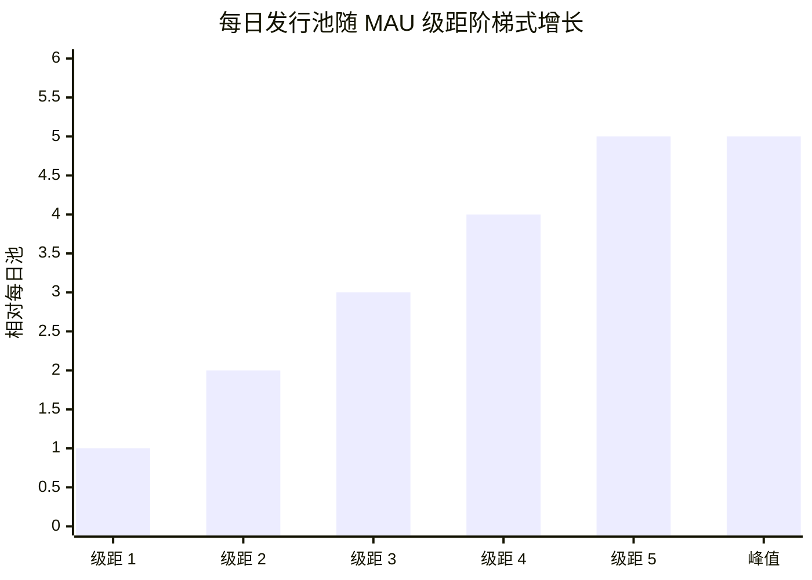

# 发行时间表与解锁

## 4.19 用户奖励发行曲线

用户奖励轨道（64.35 billion INT）在 15 年周期内释放。每日发行由一个阶梯函数计量，该函数随月活跃用户（MAU）缩放。

每日发行池随 MAU 级距阶梯式增长（从最小的早期级距直至峰值级距），因此发行池随活跃用户群的增长而扩张，而非连续增长。MAU 级距边界以及各级距的每日池数值在生产环境中校准，不予公布。

达到峰值级距后，额外的 MAU 增长提高每位用户的贡献密度，而非增加总发行量。阶梯形状避免了活跃度在级距边界附近振荡时的断崖效应。用户奖励预算（64.35 billion INT）按 15 年的发行周期设定规模；早期级距的发行量远低于峰值，从而进一步延长了有效周期。

## 4.20 按轨道的解锁时间表

| 轨道 | 解锁机制 | 时间安排 |
|---|---|---|
| **用户奖励（65%）** | 发行曲线（4.19）→ 链下 bINT 累积 → 每周结算 → 从分发器领取（4.4） | 15 年内持续进行 |
| **流动性（5%）** | 初始：TGE 时完全解锁。储备：社区治理 | TGE + 治理时间表 |
| **空投（5%）** | 周期性、基于参与的营销分发 | 跨数年的多个周期 |
| **推荐（5%）** | 每次成功邀请触发事件驱动 | 持续进行 |
| **质押（10%）** | 质押激活后释放至质押奖励池（4.6） | 后续阶段，按 5 年周期 |
| **贡献证明（10%）** | 定期影响力评分分配，附带归属期（4.13） | 每位接收者多年归属 |

### 已确定的解锁参数

- **流动性** — 1,000,000,000 INT 在 TGE 时完全流通，用于为交易对注入种子流动性。LP 头寸锁定 12 个月。剩余 3,950,000,000 INT 作为储备持有。
- **空投** — 作为基于参与的营销分发，跨数年分布于多个周期释放，而非单一事件。每次分发的时机出人意料，但可透明验证：接收者集合在代币转移之前承诺在链上。每份额度在领取时一次性全额发放，无归属期锁定，通过一个独立于每周用户奖励结算的专用分发器进行。分发规模随参与度缩放，并在营运层治理。
- **推荐** — 一次合格邀请触发一个单位解锁；合格门槛在生产环境中校准，不予公布。无基于时间的归属。

### 设计空间项目（参数将在 TGE 时公布）

以下项目属于活跃的代币设计工作。此处描述其形态；具体参数将在最终确定后公布。

- **用户奖励发行曲线形态。** 上述阶梯级距设定每日上限。级距之间的确切过渡行为和早期增长阶段的递增时间表根据观察到的用户增长数据进行校准。
- **贡献证明分配节奏。** 与定期快照时的贡献指标（已验证费用证明的数量和质量、排行榜排名）挂钩。锁定期和归属期作为政策记录于每次分配中。
- **质押池释放时间表。** 结合实际收益架构设计，以使长期持有者的利益与平台收入对齐。

## 4.21 TGE 流通供应量估算

在代币生成事件时，流通供应量由初始流动性注入种子：

| 来源 | 数量（INT） | 备注 |
|---|---:|---|
| 初始流动性 | 1,000,000,000 | TGE 时完全流通 |
| **TGE 流通量** | **~1,000,000,000** | 约占总供应量的 1.01% |

剩余约 98.99% 的供应量锁定于发行时间表、归属合约、质押池、受治理的储备以及多周期空投计划中。空投分发作为基于参与的营销事件，在数年内逐步进入流通，而非在 TGE 时进入。较低的初始流通量反映了协议的设计偏好：渐进式供应扩张，与实际贡献挂钩。
