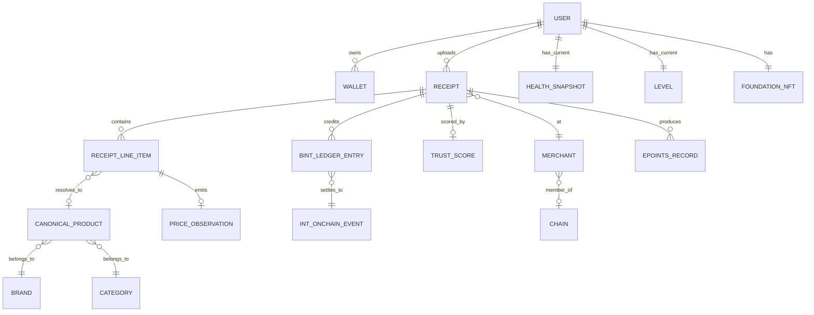

# 核心實體

## 5.2 核心實體

```mermaid
erDiagram
    USER ||--o{ WALLET : owns
    USER ||--o{ RECEIPT : uploads
    USER ||--|| HEALTH_SNAPSHOT : has_current
    USER ||--|| LEVEL : has_current
    RECEIPT ||--o{ RECEIPT_LINE_ITEM : contains
    RECEIPT }o--|| MERCHANT : at
    RECEIPT_LINE_ITEM }o--o| CANONICAL_PRODUCT : resolves_to
    RECEIPT_LINE_ITEM ||--o| PRICE_OBSERVATION : emits
    RECEIPT ||--o| TRUST_SCORE : scored_by
    RECEIPT ||--o{ BINT_LEDGER_ENTRY : credits
    BINT_LEDGER_ENTRY }o--|| INT_ONCHAIN_EVENT : settles_to
    RECEIPT ||--o{ EPOINTS_RECORD : produces
    USER ||--|| FOUNDATION_NFT : has

    CANONICAL_PRODUCT }o--|| BRAND : belongs_to
    CANONICAL_PRODUCT }o--|| CATEGORY : belongs_to
    MERCHANT }o--o| CHAIN : member_of
```

基數很重要：**一張收據有多個品項**、**一個品項最多解析至一個標準商品**（若落入待處理佇列則無）、**一張收據最多發出一個信任分數**（可重新評分，但每個版本取代前一個）。

---
