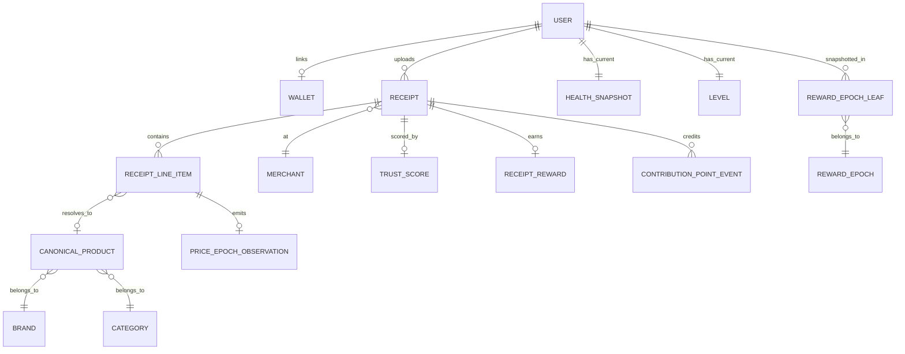

# 核心实体

## 5.2 核心实体

```mermaid
erDiagram
    USER ||--o| WALLET : links
    USER ||--o{ RECEIPT : uploads
    USER ||--|| HEALTH_SNAPSHOT : has_current
    USER ||--|| LEVEL : has_current
    RECEIPT ||--o{ RECEIPT_LINE_ITEM : contains
    RECEIPT }o--|| MERCHANT : at
    RECEIPT_LINE_ITEM }o--o| CANONICAL_PRODUCT : resolves_to
    RECEIPT_LINE_ITEM ||--o| PRICE_EPOCH_OBSERVATION : emits
    RECEIPT ||--o| TRUST_SCORE : scored_by
    RECEIPT ||--o| RECEIPT_REWARD : earns
    RECEIPT ||--o{ CONTRIBUTION_POINT_EVENT : credits
    USER ||--o{ REWARD_EPOCH_LEAF : snapshotted_in
    REWARD_EPOCH_LEAF }o--|| REWARD_EPOCH : belongs_to

    CANONICAL_PRODUCT }o--|| BRAND : belongs_to
    CANONICAL_PRODUCT }o--|| CATEGORY : belongs_to
```

基数很重要：**一张收据有多个品项**、**一个品项最多解析至一个标准商品**（若落入待处理队列则无）、**一张收据最多发出一个信任分数**（可重新评分，但每个版本取代前一个）。奖励会计通过只追加的 `contribution_point_events` 行与按 epoch 的快照叶（5.7）流转；价格账本接收不含身份的观测行（5.6）。

---
