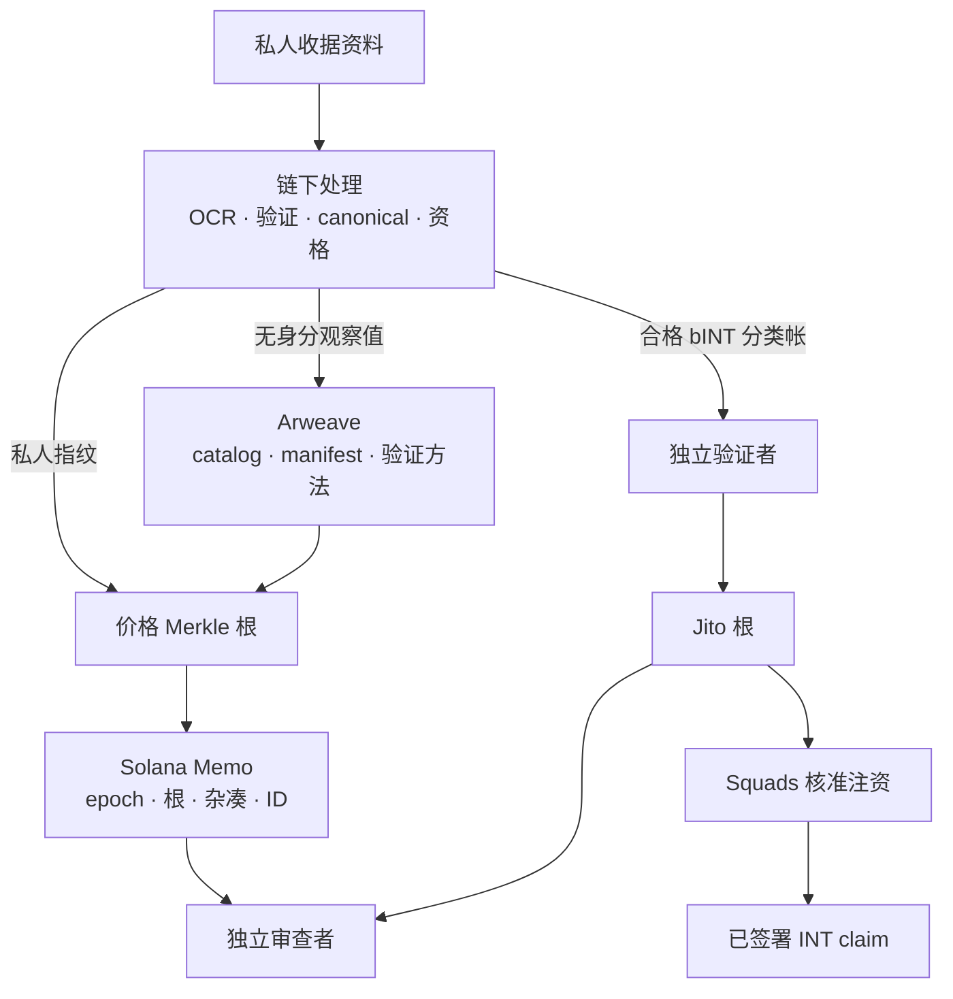

# Web3 基础设施：可验证的公开资料与可程式化结算

## 6.1 工程问题

Yumo Yumo 必须同时保持收据私密、让价格可在不使用 API 时被审查，以及在要求使用者签署 claim 前先为分配注资。把一切放到链上会暴露资料、为日常处理增加费用并使更正困难；把一切放在中央资料库则要求审查者相信 Yumo Yumo 永远提供相同结果。

公开资料与 settlement 路径在验证者处相遇，而非收据影像。原始收据不会进入 Arweave 或 Solana。

## 6.2 为何使用三层

| 决策 | 原因 | 可验证输出 |
|---|---|---|
| 链下私人处理 | 隐私、可更正性，以及上传时不需 wallet/手续费 | 发布前具决定性的 snapshot |
| 在 Arweave 发布价格 artefact | 不依赖 Yumo Yumo 基础设施即可取得资料集与方法 | ID、manifest、catalog 和验证方法 |
| 在 Solana 提交精简身分 | 绑定版本、根、杂凑与发布 ID | 有时间顺序的公开 Memo |
| 经 distributor 结算 INT | claim 受公开根与已注资 vault 限制 | distributor、funding、claim 与 clawback |

Solana 是执行与权限层，Arweave 是公开 artefact 层，应用资料库保留作私人处理层。

### 为何选择 Solana 与 Arweave

选择始于操作要求，而非任何单一网路适合所有工作负载的主张。Yumo Yumo 需要承载完整且可重现 epoch 的 public record、让 wallet 验证并 claim 自身 allocation 的 settlement path、treasury movement 的 approval trail，以及脱离应用程式仍可运作的 verification path。这些要求自然区分大型不可变 artefact 与具 state 的精简 transaction。

| 要求 | Solana 的执行角色 | Arweave 的发布角色 |
|---|---|---|
| 公开审查 | 经 RPC 读取的 accounts 与 transactions 显示 commitments、funding、approvals 和 claims | Content-addressed artefacts 提供 catalogue、manifest、specification 与 proof material |
| Economic settlement | Wallet-directed claims、token accounts、distributor state 与 multisig approval | 完整 epoch 可用于计算，catalogue 无须进入 transaction data |
| Version integrity | Compact commitment 绑定 epoch ID、root、manifest digest 与 transaction order | Transaction ID 识别 dataset 的 byte-version 与 verification recipe |
| Independent access | Reviewer 可自行选择 RPC provider | Reviewer 可自行选择 gateway 或保存 local mirror |

Solana 用于 state transitions：已发布 allocation 的 settlement、wallet-authorised claim、treasury approval evidence，以及 sealed epoch 的时间排序 commitment。On-chain payload 维持精简，只包含 roots、digests、identifiers、authority state、funding references 与 claim state。计划采用 published Solana protocol components；release registry 在 release 启用时才列出具体 mainnet instances。

Arweave 用于 durable publication：完整 price catalogue、manifest、canonicalisation rules 与 rebuild root 所需 material。Conventional object storage 可传送相同档案，但 continuity 与 access policy 系于 operator account。Content-addressed distribution 识别 bytes，long-term availability 取决于 retention arrangement。Arweave 为 artefact 提供自己的 transaction ID，可与 Solana commitment 连结。

组合使用形成 cross-check。Verifier 从选定的 Arweave gateway 取得 artefact、重算 digest 与 Merkle root，再透过选定 RPC 读取 Solana transaction 或 account；两份 records 必须在 epoch 与 root 上一致。独立团队可以 mirror artefacts、rebuild tree 并 verify commitment，无须使用 Yumo Yumo infrastructure。Arweave 承载 publication-scale evidence；Solana 承载该 evidence 的 economic 和 authority consequences。

## 6.3 从收据到可检查记录

使用者提交收据时不需签署交易。系统建立 observation 与私人 leaf、生成具决定性的 snapshot 和根；独立验证者通过或停止发布。通过后才在 Arweave 发布 catalog/manifest，并以 Solana Memo 提交根、杂凑和 ID。审查者可下载 artefact、读取 Memo 并重算根。

Manifest 包含商品、商店、地点、日期和单位价格，但不包含收据影像、收据 ID、wallet、帐户、OCR 或信任讯号。持有人可重算 `keccak256("price-receipt:v1|receipt_id|content_hash|wallet")`、使用 inclusion proof 并与 Memo 比较。链下 nonce 签名证明目前控制 wallet。这证明纳入，而非银行或商家完成付款。

## 6.4 从已验证贡献到 INT claim

bINT 是链下会计额度。合格记录经验证后转为不同于价格树的 Jito SHA-256 树，然后才设定 distributor 并经 Squads 为 vault 注资。

`合格 bINT → verifier → Jito 根 → 已注资 vault → 已签署 claim → INT 转移 → clawback`

应用无法仅改变显示余额就建立 claim；使用者也不需为提交收据或累积 bINT 签名。

## 6.5 证据、成熟度与界限

| 面向 | 证据 | 必须披露的状态 |
|---|---|---|
| 价格分类帐 | 可重建 manifest、规格、script、Memo 验证方法与开源 verifier | 已在 Solana mainnet 运行并搭配 Arweave artefact；公开索引 https://yumoyumo.com/ledger；独立验证 https://github.com/Yumo-Yumo-Inc/price-ledger-verifier |
| Jito 树 | Clean-room builder 与两个 CLI fixture 的 byte-exact 测试 | 已 devnet 演练；每个 mainnet distributor 需其 address/root/funding/record |
| Treasury/INT | 角色分离 runbook 与 mint-close gate | 在发布 addresses、threshold 和 authority 前不可称 mainnet active |

审查者可验证 manifest hash/root、leaf 纳入以及 proof/distributor/vault 一致性；OCR、fraud、matching 与私人资格需从流程证据评估。Gateway 延迟、RPC 中断、proof 不符、claim 被拒和 clawback 都是可观测状态；Web3 不宣称防止它们。

价格分类帐的公开入口：https://yumoyumo.com/ledger；开源 verifier：https://github.com/Yumo-Yumo-Inc/price-ledger-verifier（`npx tsx src/verify.ts <epoch>`）。详情见[协议细节与营运边界](02-protocol-details.md)。

---
