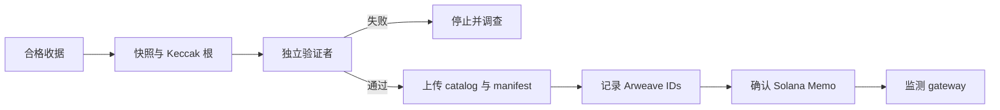
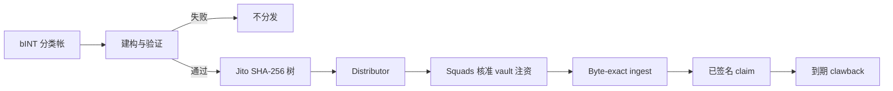

# Web3 协议细节与营运边界

## 6.8 设计选择

系统将私人处理、公开证据与代币执行分开，因为它们的成本、隐私与更正特性不同。

| 层 | 用途 | 不用于 |
|---|---|---|
| 应用资料库 | 私人处理、资格判定及发布前更正 | 封存 artefact 的公开来源 |
| Arweave | 可在没有 Yumo Yumo 下取得的公开价格 artefact 与验证资料 | 收据影像、私人明细或可变的营运状态 |
| Solana | token account、multisig 控制的 vault 移动、claim 状态与精简承诺 | 储存收据、执行 OCR 或逐张收据 mint |

将每张收据写入链上会暴露资料、增加成本且难以更正；只在资料库保存全部证据则使发布依赖 Yumo Yumo。因此系统在 Arweave 发布有限的公开 artefact，并在 Solana 锚定其精确身分。

## 6.9 Release registry 与启用准则

本文件描述系统规划的整合面。mainnet release 启用后，其 release registry 会成为具体网路、地址、套件版本、authority 状态与 release 证据的来源。该登录会随 release 发布，并提供该部署的具体地址。

| 整合面 | 启用前必须写入 release record 的资料 |
|---|---|
| INT 结算 | 网路、INT mint 地址、authority 状态、经授权的 supply 交易与 release 版本 |
| 奖励分配 | distributor 地址、Merkle root、claim 期间、clawback 接收方、资金交易与树规格版本 |
| Treasury 治理 | multisig 地址、成员集合、核准门槛与提案或核准记录 |
| 公开价格封存 | sealer 地址、Solana 交易、Arweave manifest ID 与价格目录 ID |

每笔 release record 也包括 dependency 版本、适用的 audit 或 review 参考、RPC 政策与安全回报管道。审查者与使用者可从同一份版本化记录验证目前启用的设定。

## 6.10 两种 Merkle 系统

| 性质 | 价格分类帐 | INT distributor |
|---|---|---|
| 目标 | 承诺公开观察值及不透明指纹 | 授权精确的 token claims |
| 杂凑 | Keccak-256 | SHA-256 |
| Leaf | 已发布行的杂凑；收据 leaf 有私人前像 | `hashv(claimant, unlocked_u64_le, locked_u64_le)`，再做域分离 leaf hash |
| 顺序 / 奇数 | 依杂凑排序；奇数 leaf 原样移动 | 输入顺序具决定性；hash pair 排序；奇数 node 复制 |
| 验证目标 | Memo 中的杂凑与根 | distributor 帐户根与 claim instruction |

两者不可互换：价格 proof 不能领取 INT，distributor proof 不验证收据。

## 6.11 状态转换

Memo 确认是不可逆边界。验证失败可重建；Turbo 已接受但 gateway 尚未提供的上传需要监测；封存 epoch 以后续发布修正，而非修改。

Verifier、根设定与金库注资是分离控制；任何一方都不应同时变更资格并单独资助另一个 distributor。

## 6.12 可重现性、权限与失败

验证公开 epoch 时，先寻找 Memo，依 Arweave ID 取得 manifest，将本文比对 manifest hash，重算 leaves 和根，再将根与 Memo 比较；catalog 可依 manifest 的杂凑验证。不需要 Yumo Yumo API 或资料库。

奖励审查使用已记录 leaves、Jito 规格、distributor 帐户、注资交易与 claim 状态。它可证明 allocation、根与 vault 一致，但不能自行证明私人资格输入正确。

权限应描述为 release 状态，而非未来承诺。在 mainnet instance 与 multisig 地址发布前，文件必须说明尚未 provisioned。gateway 不可用、RPC 中断、claim 被拒、proof 不符、验证失败与 clawback 都是可观测状态。Web3 不会防止这些事件，但会留下调查所需的证据。

## 6.13 Epoch 生命周期与发布边界

Epoch 是有明确边界的发布期间，不是随资料库变动的即时视图。每一个已发布资料集都需要固定的输入边界与固定的验证目标。Manifest 会记录 epoch identifier、开始与结束时间、inclusion policy、source schema 版本、canonicalisation 版本及 verifier 版本。因此，后续审查可区分截止时间前纳入的 observation 与截止时间后才接受的记录。

流程有七个阶段。第一，receipt line 和 price observation 进入私有处理伫列，依序执行 validation、deduplication、merchant matching、unit normalisation 与 eligibility 判定。第二，builder 选取符合已发布 cut-off 和 policy 的记录。第三，建立 immutable snapshot：每项公开 observation 均依指定的栏位顺序与 encoding 序列化；每张符合资格的 receipt 以保护隐私的 fingerprint 表示，而不是影像或原始内容。第四，independent verifier 从同一份 frozen input 重建 snapshot，比对 record count、byte digest、leaf count、root 与 manifest fields。

验证结果一致后才进入发布。Builder 产生 price catalogue、必要时的 receipt-fingerprint set、manifest 与 inclusion-proof material。Manifest 列出档名、各档案的 SHA-256 digest、Merkle algorithm、root 值、epoch 边界及 software/specification 版本。Artefacts 上传 Arweave；当不只一个 gateway 取回预期 bytes，compact Solana commitment 即连结 epoch identifier、manifest digest、root 和 format version。这些 identifiers 构成该 epoch 的 release evidence。

最后阶段是 monitoring 与 correction。Gateway 读取、manifest digest 检查、proof verification 与 claim 结果均作为独立信号追踪。修正会建立 successor epoch，或建立明确引用受影响 epoch 的 correction record；旧 artefact 保留供比较。这让价格、ingestion 或 policy 的修正成为可稽核事件，而不是对历史结果的静默重写。

## 6.14 Merkle 建构、收据 proof 与隐私边界

两种树具有不同的 security boundary，所以格式分别 versioned。公开 price tree 对第三方能重现的 records 作出 commitment。每个 public leaf 由 domain label 开始，后接 observation 的 canonical byte representation。此 representation 规定 field list、UTF-8 encoding、date format、decimal scale、currency code、merchant/location identifiers 及 newline convention。Manifest 固定 leaf ordering rule、pair-hash rule、odd-leaf rule、root encoding 及确切 tree-specification version；使用同样 bytes 的 verifier 会得到相同 leaf hash。

Receipt fingerprint path 加入 private preimage。Receipt 所有人在本机保存可重算 fingerprint 的值，并可取得或建立 inclusion proof，而无须公开 receipt image、bank data、account 或 wallet 关联。Proof 包含 sibling hashes、left/right position、epoch identifier 与 specification version。所有人从本机计算的 leaf 开始，依已发布顺序合并每个 sibling，再把最终 root 与 manifest 及 Solana commitment 的 root 比对。结果证明收据加入特定 sealed epoch，同时让收据内容留在 public catalogue 之外。

INT distribution tree 是独立的 claim authorisation structure。其 leaf 用文件规定的 byte order 与 domain separator 编码 claimant public key 和 unlocked/locked allocation 值。Distribution manifest 固定 allocation epoch、root、claim 开始与结束时间、funding transaction 及 clawback destination。Claimant 先在本机验证 leaf 和 proof，再从自己的 wallet 发送 claim instruction。Distributor state 记录 claim 结果；使用者可直接确认 allocation 是否被已发布 root 包含。

## 6.15 独立使用者与开发者方法

公开验证路径使用 artefacts，并由验证者选择资料提供者。使用者、研究者或开发者可从 epoch index 或已知 Arweave manifest ID 开始，透过自行选择的 gateway 取得 manifest，并把它的 digest 与 Solana commitment 比对。接著下载 manifest 指定的 catalogue，在本机计算 file digest、重建 tree 并比较 root。涉及自己的 receipt 时，preimage 只交给 local verifier，再以 sibling path 检查 inclusion。Wallet 可透过使用者选择的 Solana RPC endpoint 查询 claim state。

| Method | Inputs | Output | Independent check |
|---|---|---|---|
| `getEpoch(epoch_id)` | epoch identifier | Manifest ID、root、format、time | manifest digest 与 commitment 相符 |
| `getCatalogue(manifest_id)` | Manifest ID | byte-exact public catalogue | file digest 与 manifest 相符 |
| `buildPriceRoot(catalogue, spec)` | catalogue bytes 与 spec | leaf count、price root | root 与 manifest 相符 |
| `proveReceipt(receipt_preimage, epoch_id)` | local preimage、epoch | leaf、sibling path | folded path 到达 receipt root |
| `getDistribution(epoch_id)` | allocation epoch | root、claim window、funding ref | record 与 release evidence 相符 |
| `verifyAllocation(wallet, allocation, proof)` | wallet、amounts、proof | local valid/invalid result | root 与 distribution record 相符 |

Reference implementation 应让 network access 可替换：验证者可使用任意 Arweave gateway、保留 artefacts 的 local mirror，并选择自己的 Solana RPC provider。Verifier 输出 gateway/RPC source、retrieval time、expected 和 observed digests、specification version 以及每一项 failed comparison；其他开发者据此即可重现同一个调查。

Proof of expense 的范围明确。Public layer 证明 approved observation 或 receipt fingerprint 属于 sealed epoch，并证明 artefact set 仍可在 bytes 层级识别。Private layer 保留相关使用者重算自身 fingerprint 所需的资讯。Grant committee 可以据此提出具体问题：发布的是哪个 epoch、哪个 specification 产生它、哪个 artefact 承载 bytes、哪个 commitment 识别 artefact、哪个 authority 核准 treasury movement，以及哪个 root 和 funding transaction 令 claims 可支付。Mainnet release 启用后，release registry 与 epoch manifests 会以版本化记录回答这些问题。

## 6.16 Artefact contract 与独立 verifier 建置

Verifier 使用的每种档案都有可识别版本的 schema。Manifest 是入口，必须列出 `epoch_id`、`publication_time`、`catalogue_id`、catalogue digest、price root、适用时的 receipt root、hash algorithm、canonicalisation version 和 tree version。Distribution record 采同样原则，另加入 allocation epoch、distribution root、claim window、funding reference、clawback receiver 与 format version。这份 contract 让开发者依明确 field order 和 byte rules 建置工具，而不是把网页呈现结果当作资料来源。

独立工具可以依固定顺序执行：取得 manifest bytes、验证已发布 digest、取得 catalogue bytes、依 schema version parse、将 fields 再序列化为 canonical bytes、hash leaves、fold tree，最后比对 root。出现差异时，工具输出档名、line offset、使用的 calculation、expected value 与 observed value，让差异可被另一方重现。开发者可以建立显示 epoch history 的 explorer、从多个 gateway 比较可用性的 local mirror，或在送出 claim 前验证 allocation 的 wallet helper；每一个 implementation 都应显示 specification version 与读取来源。

这种公开方式赋予 transparency 实际含义：审查者可取得同一组 artefacts、套用同一组 rules 并自行验证已发布结果。Application 对 receipt intake 和 privacy 仍有重要职责，而已发布资料的验证能力分布在使用者、研究者和独立开发者之间。

---
