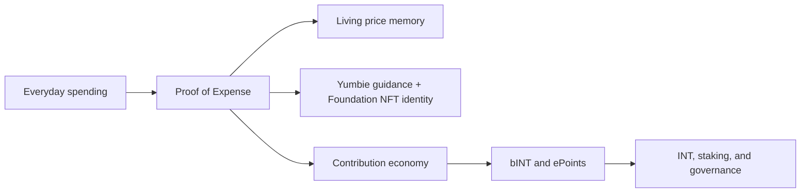

# [EN] Yumo Yumo Whitepaper

> **Superseded.** The Vision Paper manifesto now lives at `/vision`. Tokenomics content has moved to Technical Paper §04. Do not edit files in this directory; make changes in `content/technical-paper/` instead.

## Opening

Yumo Yumo builds a personal financial operating system that reads money through the rhythm of life itself. A quick grocery stop, an approaching bill, a household routine, a silently rising product price, a travel preparation cycle, and the small repeated choices of everyday life all become structured signals inside the system. Yumo brings those signals together through Proof of Expense, living price memory, Yumbie guidance, and an open contribution economy.

This creates value in two directions at once. On one side, the user sees personal financial history with richer context; products, merchants, timing, basket composition, and recurring patterns become visible in one living layer. On the other side, the same flow becomes economic participation; a user who produces trusted data can see the value of that contribution through the bINT and INT architecture. Product experience and economic coordination grow on the same backbone.

Yumbie is the visible guide of that backbone. It turns financial memory into warm, understandable, well-timed direction. It highlights which increase matters, which shopping pattern connects to household rhythm, and which opportunity is useful on that day. The center of the document therefore becomes a living relationship with personal finance.

The Web3 layer adds a longer-lasting rail to this story. Selected export packages can travel with the user, economic rules become easier to inspect, contribution history connects to on-chain coordination, and price memory gains continuity beyond the limits of one company database. Receipt images begin on the user’s device and may pass through short-lived encrypted system processing during verification; the long-lived system works with structured and anonymized derivatives. The user can remove system-side personal data, export structured history, and verify selected summaries against an on-chain ownership trace.

Most personal finance products today classify transactions, produce monthly summaries, and surface savings goals. Yumo Yumo aims at a wider surface. The price journey of the same product across months, the recurring needs of the same household, the gradual shift between merchants, the pressure of an approaching bill, the quiet drifts inside a basket, and the data production that can turn into a contribution economy come together inside one system. This whitepaper therefore opens both the application experience and the operating logic of a new financial infrastructure in the same arc.

This framing brings the public reader and the investor into the same document. On the public side, it makes user value, product surfaces, and price memory visible. On the investor side, it explains the open economy, parameter transparency, contribution quality, data ownership, and why Web3 rails offer a stronger foundation. The thesis of Yumo Yumo is to take everyday spending data out of being merely a tracked history and turn it into a living financial layer.

## Company and Mission

Yumo Yumo is developed by Yumo Yumo Inc., a Delaware corporation in the United States. The company's mission is to turn everyday proofs of spending into user-owned, understandable, and portable financial memory, then connect the anonymised price and basket signals that emerge from that memory to an open contribution economy.

Yumo Yumo's vision is to begin in emerging markets and grow personal finance beyond static reports into a global financial operating system built on verifiable spending data, Yumbie guidance, and long-lived Web3 rails.

This whitepaper moves in eight flows. It first establishes the new category thesis. It then opens the Proof of Expense engine and price memory, followed by Yumbie, product surfaces, the contribution economy, token design, what Web3 adds, data ownership, and the long-term thesis. The goal is to show felt user value and investor-grade mechanism clarity inside one coherent whole.
