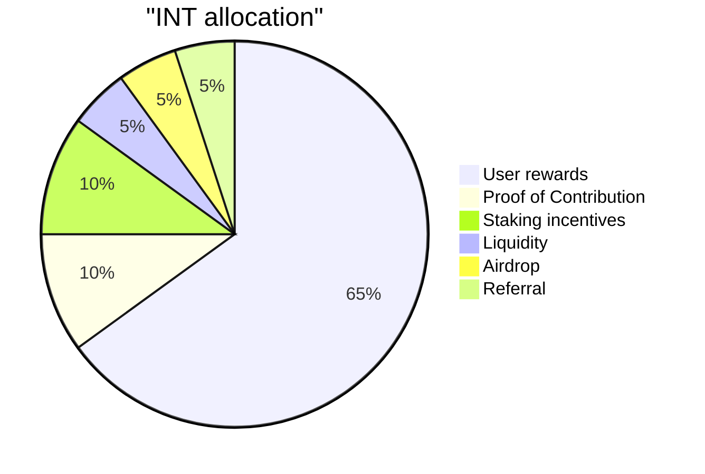
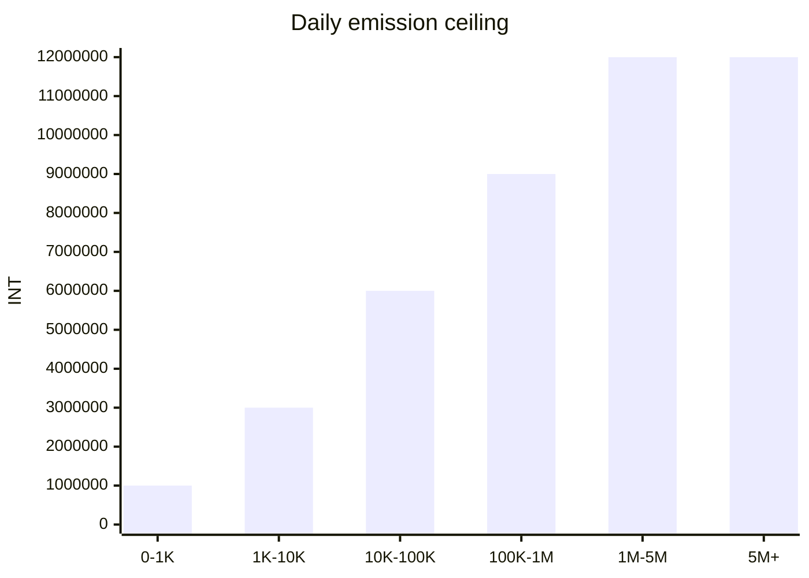
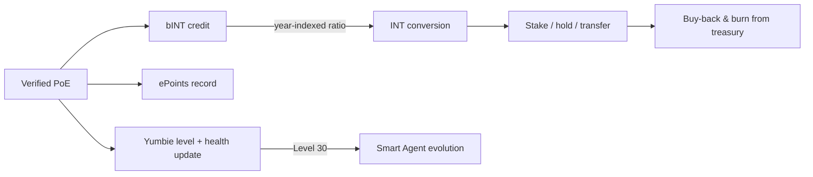

# Contribution Economy and Token Design

Yumo Yumo's economic backbone builds a layered bridge between everyday use and open coordination. Proof of Expense, merchant verification, product improvements, and community tasks first settle into the bINT layer. That layer makes the quality, trust, and continuity of contribution visible. The INT layer carries broader economic coordination, staking, and the governance surfaces that mature over time. Alongside these, ePoints record the dollar-denominated hidden-cost footprint of each verified receipt, and the Foundation NFT — Yumbie — anchors the user's portable digital identity inside the system.

This separation matters because contribution, value, and identity move through distinct gates. A user who adds value to the system first accumulates bINT. Time, holding behavior, and trust shape how that balance moves into INT. Each verified receipt also writes an ePoints record that captures the dollar measure of hidden cost surfaced. The user's Yumbie carries the visible history of that journey. The result is an economy that rewards steady, credible participation while keeping value aligned with long-range contribution.

## Token layers

| Layer | Form | Transferable | Purpose |
| --- | --- | --- | --- |
| **INT** | On-chain SPL token | Yes | Economic coordination, staking, ecosystem incentives |
| **bINT** | On-chain, soulbound (frozen ATA) | No — converts to INT on user action | Contribution accounting; the soft layer between work and reward |
| **ePoints** | On-chain, soulbound (frozen ATA) | No | USD-denominated record of hidden cost surfaced per verified receipt |
| **Foundation NFT (Yumbie)** | Token-2022 NonTransferable | No | Persistent digital identity; visual companion that evolves with the user |

bINT and ePoints capture two different signals from the same receipt. bINT measures contribution intensity inside the Yumo economy. ePoints measure the dollar value of hidden-cost insight returned to the user. They never overwrite each other and they convert through distinct logic.

## INT distribution

Total INT supply is capped at 99 billion. The six rails add up to one hundred percent of supply, with no separate team allocation outside this map. Sixty-five percent is reserved for user rewards. Ten percent feeds the Proof of Contribution rail, where the **core team and outside contributors** earn through the work they complete and the impact they create — the team has no independent allocation and earns through the same contribution logic that powers user participation. Ten percent supports staking incentives that strengthen long-term participation. The remaining share is distributed across liquidity, airdrop, and referral flows.

| Core metric | Value |
| --- | --- |
| Total INT supply | 99,000,000,000 |
| Decimals | 6 |
| User reward horizon | 15 years |
| Peak daily emission pool | 12,000,000 INT |
| Year 1 base conversion ratio | 1 bINT = 5 INT |
| Year 10 base conversion ratio | 1 bINT = 1 INT |
| Per-user bINT daily ceiling | 1,000 bINT (effective cap scales with level and health) |
| Staking incentive horizon | 5 years |
| Team reward rail | Through Proof of Contribution, based on work impact |

## User rewards emission

The User Rewards rail runs on smart-contract-fixed parameters. As monthly active usage grows, the daily pool expands in steps and reaches a peak value of 12 million INT. The conversion curve moves downward over time; early contribution begins with a higher base ratio, and later years move into a more balanced distribution shape. At the current stage, these parameters provide a transparent and predictable economic backbone. As governance matures, community processes can take a larger role in future adjustments.

The base conversion curve moves downward over time. It begins with `1 bINT = 5 INT` in year one, reaches `1 bINT = 1 INT` by year ten, and carries long-range contribution into a more balanced economic frame.

A per-user daily bINT ceiling protects the system from concentration and spam. The hard ceiling sits at 1,000 bINT per user per day. The effective cap any individual user reaches is a function of their level (cumulative contribution) and health score (recent contribution quality). New users start far below the ceiling; sustained, high-quality contributors approach it over time. This structure weakens spam pressure because contribution becomes more valuable when quality, trust, and time move together.

## Staking design

Staking incentives are released over a five-year horizon. INT holders may lock their tokens into one of six lock tiers, with longer locks earning proportionally higher rewards.

| Lock period | APR weight | Indicative APR |
| --- | --- | --- |
| 7 days | 1.0× | ~35% |
| 14 days | 1.5× | ~50% |
| 21 days | 2.0× | ~70% |
| 30 days | 2.5× | ~85% |
| 60 days | 4.0× | ~140% |
| 90 days | 6.0× | ~210% |

APR figures scale with the total amount staked across the network and are not fixed promises. Rewards accrue continuously and can be claimed at any time without unlocking the principal. Principal becomes withdrawable only after the chosen lock period expires. Staking launches one week after the Token Generation Event so the initial price discovery window completes before the demand side activates.

## Liquidity

Five percent of total supply is reserved for on-chain liquidity. The allocation is split into two layers that serve different roles.

| Layer | Amount | Role |
| --- | --- | --- |
| **Initial liquidity** | 1,000,000,000 INT | Seeds the public on-chain market at TGE through a single-sided liquidity bootstrapping pool. The LP position is locked for 12 months. |
| **Reserve liquidity** | 3,950,000,000 INT | Held in reserve for community-governed deployments. May be activated to extend price discovery upward when the live pool's INT balance falls below a defined threshold, or to support market depth during volatility. |

This split keeps the launch market lean enough for genuine price discovery while preserving a defensive reserve that can be deployed by community decision in later stages.

## Buy-back and burn

Treasury inflows from the data-product business and operational surplus fund an INT buy-back-and-burn rail. The first version of this mechanism operates manually through a multi-signature wallet with a 24–48 hour timelock and a public dashboard that shows reserves and burn history. Subsequent versions transition decision-making to community governance once the staking and identity surfaces mature. In every version, executed burns are final and on-chain; no token re-minting follows.

## Foundation NFT — Yumbie

Each user receives a Foundation NFT — Yumbie — after their first verified Proof of Expense and wallet connection. The NFT is minted at gas cost only and is non-transferable. It is the user's persistent identity inside Yumo and carries the visible record of their journey through level, mood, and history.

When the user reaches Level 30, the Yumbie evolves from its Foundation form into a Smart Agent. The Foundation form takes the recognizable yellow-receipt shape that signals the entry of contribution. The Smart Agent form takes a more formal, letterhead-style presentation that signals established standing inside the system. The evolution is one-way; the underlying NFT remains the same on-chain asset.

## Pre-TGE accounting

Before the Token Generation Event, the platform tracks contribution through cPoints, a closed-system reputation measure. cPoints exist only in the pre-TGE phase. They inform initial airdrop and onboarding weights at TGE and are then deprecated. From TGE onward, the bINT and ePoints layers replace the role of cPoints, with stronger contribution semantics and on-chain accounting.

## How the layers connect

Each verified receipt simultaneously writes contribution to bINT, hidden-cost insight to ePoints, and identity progression to the user's Yumbie. Conversion from bINT to INT moves value from the contribution layer to the economic layer at a ratio that favors early participation and balances over time. Staking returns value to long-term holders. Treasury-managed buy-back-and-burn closes the loop by tying real platform revenue back to token scarcity.

This structure weakens spam pressure because contribution becomes more valuable when quality, trust, and time move together. It favors strong users and steady contributors because the network grows through historically valuable participation instead of superficial volume. Token design therefore stays inseparable from the product thesis; it is the economic expression of Yumo's memory, price, and guidance engine.
