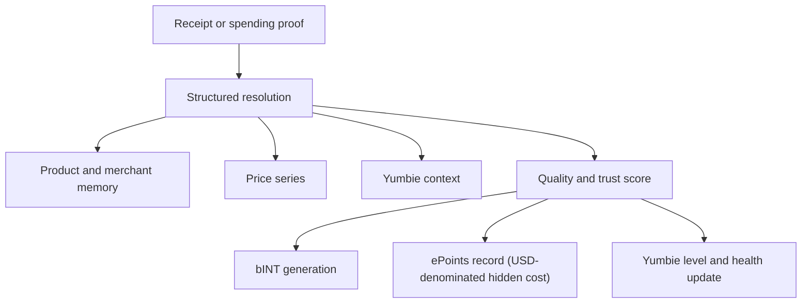

# Proof of Expense and Price Memory

Proof of Expense is the main engine of Yumo Yumo. When a receipt or another spending proof enters the system, it does far more than create a record. It opens new layers for personal memory, price series, guidance context, and contribution economics at the same time. That is why Proof of Expense acts as the core structure that feeds both the user side and the open economy side of the product.

At the first stage, a record is resolved into merchant, time, total amount, line items, basket composition, and surrounding context signals. That resolution gives the user a clean memory layer to return to later. As the same product or the same merchant appears again over time, the system extends price memory, sharpens basket patterns, and improves Yumbie’s ability to prioritize what matters. The same record also travels through quality and trust layers before it contributes to bINT production, which gives it economic meaning.

The power of Proof of Expense comes from turning a single receipt into multiple outputs. Product memory shows which items repeat. Merchant memory reveals preference patterns. Time stamps open the rhythm of daily life. Price series show the direction of change. The result becomes a richer answer to what was paid for, when, in which conditions, and how that cost has moved over time.

The quality layer is decisive here. Readability, consistency between totals and line items, the natural fit between merchant and time, recurrence patterns, and broader trust signals are evaluated together. A stronger record contributes more value to memory, to price series, and to the economic rail. That lets the network privilege durable contribution over short-lived volume.

Price memory is one of the clearest user-side gains of Proof of Expense. As a user brings the same products or services into the system over months, a personal archive of price movement appears. That archive shows how a product differs from one merchant to another, when a category accelerates in price, which items remain more stable, and where basket pressure becomes concentrated. Over time that visibility creates the foundation for broader comparison surfaces and community-built price maps.

| What one record creates | User-side effect | Network-side effect |
| --- | --- | --- |
| Structured receipt memory | Meaningful return to past behavior | Higher data quality |
| Product and merchant time series | Easier tracking of price change | Stronger collective price memory |
| Yumbie context | Better-timed guidance | Better personalization |
| Contribution signal (bINT) | Soft credit toward INT conversion | Open economy growth |
| Hidden-cost record (ePoints) | USD-denominated trace of spending pressure | Future weight in token distributions |
| Identity progression | Yumbie level and health move forward | Stronger long-range contributor base |

Imagine a household buying milk, coffee, and diapers from the same grocery chain for three months. The system appends new line items while also noticing the rise in diaper prices, measuring the effect of a merchant switch on coffee, strengthening basket-level co-purchase patterns, and reading household rhythm with greater accuracy. The user receives better guidance, while the network grows through cleaner and more historically valuable data.
