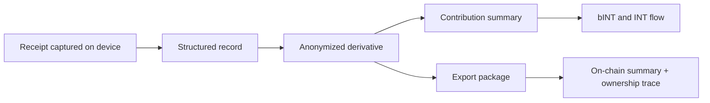

# What Web3 Adds

Yumo Yumo’s Web3 approach creates value well beyond reward distribution. Its deepest contribution is moving financial memory, user ownership, and economic rules onto rails that are more durable and easier to inspect. As spending memory grows, the product becomes more valuable to the user; the Web3 layer strengthens the portability of that value, the endurance of contribution history, and the open economic surface that grows around it.

In closed points systems, contribution remains trapped inside the application boundary. In Yumo’s approach, selected export packages can move with the user, contribution history can connect to more visible economic rules, and price memory can live inside a longer-term coordination space. That shift changes how the system is perceived by both users and the broader community; it feels less like a private reward machine and more like a durable financial rail.

Solana fits the practical needs of that vision. High-frequency interactions, user-friendly costs, and a mature ecosystem support bINT production, INT coordination, staking, and later governance flows. The visible user experience stays light and familiar while the on-chain layer quietly carries continuity underneath it.

Web3 also matters because it gives price memory a stronger long-term form. When the same products and services are recorded over years, the resulting series become more than a personal archive. They can travel with the user in selected export packages, carry an ownership trace through on-chain summaries, and gain meaning across broader economic surfaces. Price memory therefore becomes a portable economic memory rather than a history that ends at the edge of one app account.

| What open rails enable | User effect | Network effect |
| --- | --- | --- |
| Portable contribution history | Data can move with the user | Economic rules become more visible |
| Selected on-chain summaries and commitments | Ownership trace becomes stronger | Open economy becomes more durable |
| Governance that expands over time | Users gain a larger role in decisions | Parameters mature with the community |
| Persistent price memory | Long-range financial clarity | Stronger collective data infrastructure |

That is why Yumo uses Web3 as one of the core rails that strengthen ownership, price memory, and economic continuity. The chain layer remains quiet in the visible experience while carrying the long-term weight of the system.
