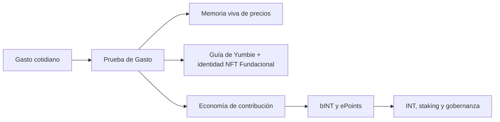

# [ES] Yumo Yumo Whitepaper

> **Superseded.** The Vision Paper manifesto now lives at `/vision`. Tokenomics content has moved to Technical Paper §04. Do not edit files in this directory; make changes in `content/technical-paper/` instead.

## Apertura

Yumo Yumo construye un sistema operativo financiero personal que lee el dinero dentro del ritmo de la vida cotidiana. Una visita rápida al supermercado, una factura que se acerca, un producto habitual que sube de precio en silencio, las necesidades del hogar, la preparación de un viaje y las pequeñas repeticiones del día a día se convierten en señales estructuradas dentro del sistema. Yumo reúne esas señales mediante Prueba de Gasto, memoria viva de precios, la guía de Yumbie y una economía abierta de contribución.

Esta estructura crea valor en dos direcciones al mismo tiempo. Por un lado, la persona ve su historia financiera con más contexto; productos, comercios, tiempo, composición de cesta y patrones repetidos se vuelven visibles dentro de una memoria viva. Por otro lado, el mismo flujo se convierte en participación económica; quien aporta datos confiables puede ver el valor de esa contribución a través de la arquitectura bINT e INT. La experiencia del producto y la coordinación económica crecen sobre la misma columna vertebral.

Yumbie es la guía visible de esa estructura. Convierte la memoria financiera en una orientación cálida, comprensible y oportuna. Señala qué aumento merece atención, qué patrón de compra se conecta con el ritmo del hogar y qué oportunidad tiene sentido en ese día. El centro del documento pasa así a ser una relación viva con las finanzas personales.

La capa Web3 añade un carril de mayor duración a esta historia. Los paquetes de datos seleccionados pueden acompañar al usuario, las reglas económicas se vuelven más visibles, la memoria de contribución se conecta con la coordinación en cadena y la memoria de precios gana continuidad más allá de la base de datos de una sola empresa. Las imágenes originales de los recibos permanecen en el dispositivo del usuario; el sistema trabaja con derivados estructurados y anonimizados. El usuario puede borrar sus datos personales del sistema, exportar su historial estructurado y llevar paquetes seleccionados a la cadena con huella de propiedad.

La mayoría de los productos de finanzas personales actuales clasifican transacciones, generan resúmenes mensuales y muestran metas de ahorro. Yumo Yumo apunta a una superficie más amplia. El recorrido de precio de un mismo producto a lo largo de los meses, las necesidades recurrentes del mismo hogar, el cambio gradual entre comercios, la presión de una factura próxima, los desplazamientos silenciosos dentro de una cesta y la producción de datos que puede convertirse en economía de contribución se unen dentro de un solo sistema. Por eso este whitepaper abre, dentro de un mismo arco, tanto la experiencia de aplicación como la lógica operativa de una nueva infraestructura financiera.

Este marco reúne al lector general y al inversor dentro del mismo documento. Del lado público hace visibles el valor de uso, las superficies del producto y la memoria de precios. Del lado del inversor explica la economía abierta, la transparencia de parámetros, la calidad de la contribución, la propiedad de los datos y por qué los rieles Web3 ofrecen un terreno más sólido. La tesis de Yumo Yumo es sacar los datos de gasto cotidiano de ser solo un historial observado y convertirlos en una capa financiera viva.

Este whitepaper avanza en ocho flujos. Primero establece la tesis de la nueva categoría. Después abre el motor de Prueba de Gasto y la memoria de precios, sigue con Yumbie, las superficies del producto, la economía de contribución, el diseño del token, lo que añade Web3, la propiedad de los datos y la tesis de largo plazo. El objetivo es mostrar valor real para el usuario y claridad mecánica para el inversor dentro de un mismo conjunto coherente.
