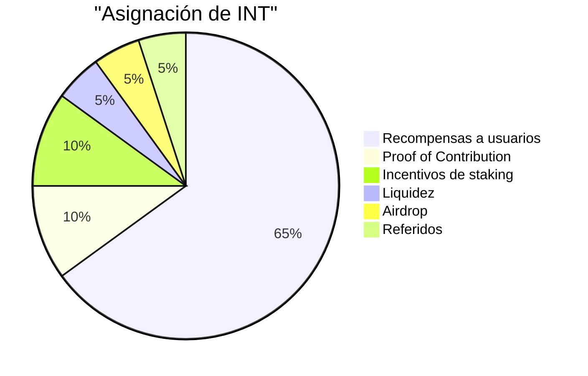
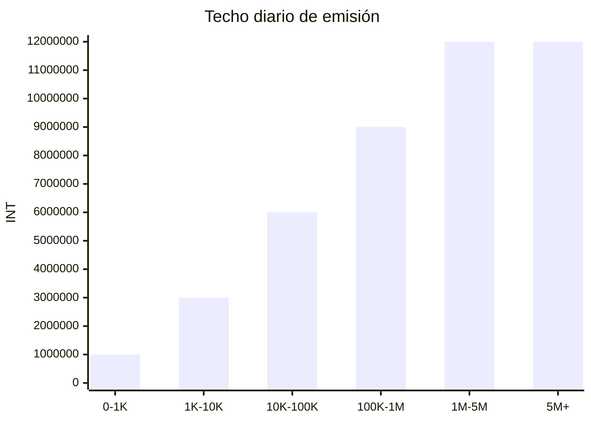
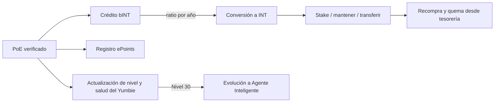

# Economía de contribución y diseño del token

La columna económica de Yumo Yumo construye un puente por capas entre el uso cotidiano y la coordinación abierta. La Prueba de Gasto, la verificación de comercios, las mejoras de producto y las tareas de comunidad se asientan primero en la capa bINT. Esa capa hace visibles la calidad, la confianza y la continuidad de la contribución. La capa INT lleva la coordinación económica más amplia, el staking y las superficies de gobernanza que maduran con el tiempo. Junto a ellas, ePoints registra la huella en dólares del costo oculto que aflora en cada recibo verificado, y el NFT Fundacional — Yumbie — ancla la identidad digital portátil del usuario dentro del sistema.

Esta separación importa porque la contribución, el valor y la identidad transitan por compuertas distintas. El usuario que aporta valor al sistema acumula primero bINT. El tiempo, el comportamiento de tenencia y la confianza determinan cómo ese saldo pasa a INT. Cada recibo verificado escribe además un registro de ePoints que captura la medida en dólares del costo oculto revelado. El Yumbie del usuario lleva la memoria visible de ese trayecto. El resultado es una economía que premia la participación constante y creíble mientras alinea el valor con la contribución de largo plazo.

## Capas del token

| Capa | Forma | ¿Transferible? | Propósito |
| --- | --- | --- | --- |
| **INT** | Token SPL en cadena | Sí | Coordinación económica, staking, incentivos del ecosistema |
| **bINT** | En cadena, sin transferencia (ATA congelada) | No — se convierte a INT por acción del usuario | Contabilidad de la contribución; capa blanda entre el trabajo y la recompensa |
| **ePoints** | En cadena, sin transferencia (ATA congelada) | No | Registro en dólares del costo oculto que aflora en cada recibo verificado |
| **NFT Fundacional (Yumbie)** | Token-2022 NonTransferable | No | Identidad digital persistente; compañero visual que evoluciona con el usuario |

bINT y ePoints capturan dos señales distintas del mismo recibo. bINT mide la intensidad de la contribución dentro de la economía Yumo. ePoints mide el valor en dólares del costo oculto devuelto al usuario. Nunca se sobrescriben y se convierten mediante lógicas distintas.

## Distribución de INT

La oferta total de INT está limitada a 99 mil millones. El sesenta y cinco por ciento se reserva para recompensas a los usuarios. El diez por ciento alimenta el carril Proof of Contribution, donde **el equipo central y los contribuidores externos** ganan según el trabajo realizado y el impacto producido. El diez por ciento sostiene los incentivos de staking que fortalecen la participación de largo plazo. El resto se reparte entre flujos de liquidez, airdrop y referidos. Esta arquitectura mantiene la economía del equipo alineada con la misma lógica de contribución que rige la participación de los usuarios.

| Métrica clave | Valor |
| --- | --- |
| Oferta total de INT | 99,000,000,000 |
| Decimales | 6 |
| Horizonte de recompensas a usuarios | 15 años |
| Pico diario del fondo de emisión | 12,000,000 INT |
| Ratio base de conversión año 1 | 1 bINT = 5 INT |
| Ratio base de conversión año 10 | 1 bINT = 1 INT |
| Techo diario de bINT por usuario | 1.000 bINT (el techo efectivo escala con nivel y puntaje de salud) |
| Horizonte de incentivos de staking | 5 años |
| Carril de recompensa del equipo | A través de Proof of Contribution, según el impacto del trabajo |

## Emisión de recompensas al usuario

El carril de Recompensas al Usuario opera con parámetros fijados en contratos inteligentes. A medida que el uso activo mensual crece, el fondo diario se expande por escalones hasta alcanzar un pico de 12 millones de INT. La curva de conversión desciende con el tiempo: la contribución temprana parte de un ratio base más alto, y los años posteriores migran hacia una forma de distribución más equilibrada. En la etapa actual, estos parámetros ofrecen una columna económica transparente y predecible. A medida que la gobernanza madure, los procesos comunitarios podrán asumir un papel mayor en ajustes futuros.

La curva base de conversión se mueve a la baja con el tiempo. Empieza con `1 bINT = 5 INT` en el primer año, alcanza `1 bINT = 1 INT` hacia el décimo y traslada la contribución de largo plazo a un marco económico más equilibrado.

Un techo diario por usuario de bINT protege al sistema frente a la concentración y al spam. El techo duro se sitúa en 1.000 bINT por usuario por día. El techo efectivo al que llega cada persona es función de su nivel (contribución acumulada) y de su puntaje de salud (calidad reciente). Los usuarios nuevos arrancan muy por debajo del techo; los contribuidores sostenidos y de alta calidad se acercan a él con el tiempo. Esta estructura debilita la presión de spam porque la contribución vale más cuando calidad, confianza y tiempo avanzan juntos.

## Diseño de staking

Los incentivos de staking se liberan a lo largo de un horizonte de cinco años. Los tenedores de INT pueden bloquear sus tokens en uno de seis tramos, donde los bloqueos más largos ganan recompensas proporcionalmente mayores.

| Período de bloqueo | Peso APR | APR indicativo |
| --- | --- | --- |
| 7 días | 1,0× | ~35% |
| 14 días | 1,5× | ~50% |
| 21 días | 2,0× | ~70% |
| 30 días | 2,5× | ~85% |
| 60 días | 4,0× | ~140% |
| 90 días | 6,0× | ~210% |

Los APR escalan con el monto total comprometido en la red y no son promesas fijas. Las recompensas se acumulan continuamente y pueden reclamarse en cualquier momento sin desbloquear el principal. El principal sólo es retirable después de que expire el período de bloqueo elegido. El staking se activa una semana después del Evento de Generación del Token (TGE), de modo que la ventana inicial de descubrimiento de precio se cierre antes de que se active el lado de la demanda.

## Liquidez

El cinco por ciento de la oferta total se reserva para liquidez en cadena. La asignación se divide en dos capas con roles distintos.

| Capa | Cantidad | Rol |
| --- | --- | --- |
| **Liquidez inicial** | 1.000.000.000 INT | Siembra el mercado público en cadena en el TGE mediante un pool unilateral de arranque de liquidez. La posición LP queda bloqueada 12 meses. |
| **Liquidez de reserva** | 3.950.000.000 INT | Se mantiene en reserva para despliegues regidos por la comunidad. Puede activarse para extender el descubrimiento de precio al alza cuando el balance de INT del pool vivo cae por debajo de un umbral definido, o para sostener profundidad durante la volatilidad. |

Esta división mantiene al mercado de lanzamiento lo bastante liviano para un descubrimiento de precio genuino, a la vez que preserva una reserva defensiva que puede activarse por decisión comunitaria en etapas posteriores.

## Recompra y quema

Los ingresos de tesorería provenientes del negocio de productos de datos y del superávit operativo financian un carril de recompra y quema de INT. La primera versión de este mecanismo opera manualmente a través de una billetera multifirma con un temporizador de 24-48 horas y un panel público que muestra reservas y quemas. Las versiones posteriores trasladan la decisión a la gobernanza comunitaria una vez que maduran las superficies de staking e identidad. En cada versión, las quemas ejecutadas son finales y en cadena; no hay re-emisión posterior.

## NFT Fundacional — Yumbie

Cada usuario recibe un NFT Fundacional — Yumbie — tras su primera Prueba de Gasto verificada y la conexión de su billetera. El NFT se acuña sólo al costo de gas y es no transferible. Es la identidad persistente del usuario dentro de Yumo y lleva el registro visible de su trayecto a través del nivel, el ánimo y la historia.

Cuando el usuario alcanza el Nivel 30, el Yumbie evoluciona de su forma Fundacional a Agente Inteligente. La forma Fundacional toma la silueta reconocible de recibo amarillo que marca la entrada de la contribución. La forma Agente Inteligente toma una presentación más formal, al estilo de papel membretado, que señala una posición establecida dentro del sistema. La evolución es de una sola vía; el NFT subyacente permanece como el mismo activo en cadena.

## Contabilidad previa al TGE

Antes del Evento de Generación del Token, la plataforma rastrea la contribución a través de cPoints, una medida de reputación de sistema cerrado. cPoints existen sólo en la fase previa al TGE. Informan los pesos iniciales de airdrop y onboarding en el TGE y luego quedan en desuso. Desde el TGE en adelante, las capas bINT y ePoints reemplazan el rol de cPoints con semántica de contribución más fuerte y contabilidad en cadena.

## Cómo se conectan las capas

Cada recibo verificado escribe a la vez contribución en bINT, comprensión del costo oculto en ePoints y progresión de identidad en el Yumbie del usuario. La conversión de bINT a INT mueve valor de la capa de contribución a la capa económica con un ratio que favorece la participación temprana y se equilibra con el tiempo. El staking devuelve valor a los tenedores de largo plazo. La recompra y quema desde tesorería cierra el ciclo atando el ingreso real de la plataforma a la escasez del token.

Esta estructura debilita la presión de spam porque la contribución vale más cuando calidad, confianza y tiempo avanzan juntos. Favorece a los usuarios fuertes y a los contribuidores constantes porque la red crece a través de la participación con valor histórico en lugar del volumen superficial. El diseño del token queda por ello inseparable de la tesis del producto; es la expresión económica de la memoria, el precio y el motor de orientación de Yumo.
