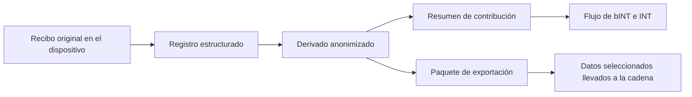

# Lo que aporta Web3

El enfoque Web3 de Yumo Yumo crea valor mucho más allá de la distribución de recompensas. Su aporte más profundo consiste en llevar la memoria financiera, la propiedad del usuario y las reglas económicas a carriles más duraderos y más fáciles de inspeccionar. A medida que crece la memoria de gasto, crece el valor del producto para el usuario; la capa Web3 fortalece la portabilidad de ese valor, la continuidad de la historia de contribución y la superficie económica abierta que se forma alrededor.

En sistemas cerrados de puntos, la contribución queda atrapada dentro del perímetro de la aplicación. En la propuesta de Yumo, los paquetes de datos seleccionados pueden viajar con el usuario, la historia de contribución puede conectarse con reglas económicas más visibles y la memoria de precios puede vivir dentro de un espacio de coordinación de más largo plazo. Ese cambio hace que el sistema se perciba menos como una máquina privada de incentivos y más como un carril financiero duradero.

Solana encaja con las necesidades prácticas de esa visión. Interacciones frecuentes, costes accesibles y un ecosistema maduro sostienen la producción de bINT, la coordinación de INT, el staking y las futuras capas de gobernanza. La experiencia visible para el usuario sigue siendo ligera y familiar mientras la infraestructura en cadena soporta la continuidad por debajo.

Web3 también resulta clave porque da a la memoria de precios una forma más sólida a largo plazo. Cuando los mismos productos y servicios quedan registrados durante años, las series resultantes se convierten en algo más que un archivo personal. Pueden viajar con el usuario en paquetes seleccionados, llevar una huella de propiedad y adquirir significado en superficies económicas más amplias. Así, la memoria de precios se transforma en memoria económica portátil.

| Lo que habilitan los carriles abiertos | Efecto para el usuario | Efecto para la red |
| --- | --- | --- |
| Historial portátil de contribución | Los datos acompañan al usuario | Las reglas económicas se vuelven más visibles |
| Paquetes seleccionados en cadena | La huella de propiedad gana fuerza | La economía abierta se vuelve más duradera |
| Gobernanza que crece con el tiempo | El usuario toca más decisiones | Los parámetros maduran con la comunidad |
| Memoria persistente de precios | Claridad financiera de largo plazo | Infraestructura colectiva más fuerte |

Por eso Yumo no usa la cadena como adorno. Utiliza Web3 como uno de los carriles centrales que fortalecen la propiedad, la memoria de precios y la continuidad económica. La capa en cadena permanece silenciosa en la experiencia visible mientras carga con el peso de largo plazo del sistema.
