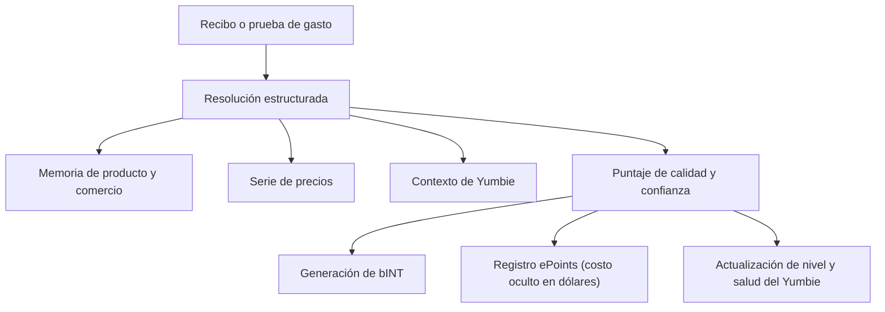

# Prueba de Gasto y memoria de precios

La Prueba de Gasto es el motor principal de Yumo Yumo. Cuando un recibo u otra prueba de gasto entra en el sistema, ocurre mucho más que la creación de un registro. Se abren al mismo tiempo nuevas capas para memoria personal, series de precios, contexto de guía y economía de contribución. Por eso la Prueba de Gasto actúa como la estructura central que alimenta tanto el lado del usuario como el lado de la economía abierta.

En la primera etapa, el registro se resuelve en comercio, tiempo, importe total, líneas de producto, composición de cesta y señales de contexto. Esa resolución ofrece al usuario una memoria limpia a la que puede volver más adelante. Cuando el mismo producto o el mismo comercio reaparecen con el tiempo, el sistema extiende la memoria de precios, fortalece los patrones de cesta y mejora la capacidad de Yumbie para priorizar lo importante. El mismo registro también atraviesa capas de calidad y confianza antes de contribuir a la producción de bINT, y así adquiere significado económico.

La fuerza de esta arquitectura proviene de convertir un solo recibo en múltiples resultados. La memoria de producto muestra qué artículos se repiten. La memoria de comercio revela patrones de preferencia. La marca temporal abre el ritmo de la vida diaria. La serie de precios sigue la dirección del cambio. Así el registro responde a cuánto se pagó, a qué se pagó, cuándo, en qué condiciones y cómo se ha movido ese coste con el tiempo.

La capa de calidad resulta decisiva. Se evalúan de forma conjunta la legibilidad, la coherencia entre totales y líneas, la naturalidad entre comercio y horario, los patrones de repetición y las señales más amplias de confianza. Un registro más fuerte aporta más valor a la memoria, a la serie de precios y al carril económico. Así la red premia mejor la contribución con valor histórico que el volumen superficial.

La memoria de precios es uno de los beneficios más claros para el usuario. Cuando la misma persona incorpora productos o servicios durante meses, aparece un archivo personal del movimiento de precios. Ese archivo muestra cómo cambia un producto entre comercios, en qué momento una categoría acelera, qué artículos conservan mayor estabilidad y dónde se concentra la presión de la cesta. Con el tiempo, esa visibilidad abre el camino para superficies de comparación más amplias y mapas de precios construidos por la comunidad.

| Qué crea un registro | Efecto para el usuario | Efecto para la red |
| --- | --- | --- |
| Memoria estructurada del recibo | Regreso significativo al pasado | Mayor calidad de datos |
| Series temporales de producto y comercio | Seguimiento más claro del precio | Memoria colectiva más fuerte |
| Contexto de Yumbie | Orientación mejor sincronizada | Mejor personalización |
| Señal de contribución (bINT) | Crédito blando hacia conversión a INT | Crecimiento de la economía abierta |
| Registro de costo oculto (ePoints) | Huella en dólares de la presión de gasto | Peso futuro en distribuciones de token |
| Progresión de identidad | El nivel y la salud del Yumbie avanzan | Base de contribuidores de largo plazo más sólida |

Imaginemos un hogar que compra leche, café y pañales en la misma cadena durante tres meses. El sistema no se limita a añadir nuevas líneas cada vez. Detecta el aumento en pañales, mide el efecto de un cambio de comercio sobre el café, fortalece patrones de compra conjunta y lee con mayor precisión el ritmo del hogar. El usuario recibe una guía más útil y la red crece con datos más limpios y más valiosos a lo largo del tiempo.
