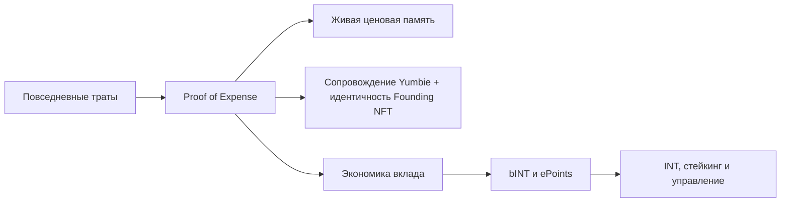

# [RU] Whitepaper Yumo Yumo

> **Superseded.** The Vision Paper manifesto now lives at `/vision`. Tokenomics content has moved to Technical Paper §04. Do not edit files in this directory; make changes in `content/technical-paper/` instead.

## Вступление

Yumo Yumo строит персональную финансовую операционную систему, которая читает деньги через ритм повседневной жизни. Поход в магазин, приближающийся счет, привычный товар, который тихо дорожает, потребности дома, подготовка к поездке и повторяющиеся мелкие решения становятся структурированными сигналами внутри системы. Yumo собирает эти сигналы в единый поток через Proof of Expense, живую ценовую память, сопровождение Yumbie и открытую экономику вклада.

Эта структура создает ценность сразу в двух направлениях. С одной стороны, пользователь видит свою финансовую историю в более богатом контексте; товары, магазины, время, состав корзины и повторяющиеся шаблоны становятся частью живой памяти. С другой стороны, тот же поток превращается в экономическое участие; пользователь, который производит надежные данные, видит ценность своего вклада через архитектуру bINT и INT. Продуктовый опыт и экономическая координация растут на одной и той же основе.

Yumbie — видимый проводник этой основы. Он превращает финансовую память в теплое, понятное и своевременное сопровождение. Он показывает, какое подорожание действительно важно, какой паттерн покупок связан с ритмом домохозяйства и какая возможность уместна именно сегодня. Поэтому в центре этого документа находится не отдельная таблица и не один механизм вознаграждения, а живая связь человека с личными финансами.

Слой Web3 добавляет этой истории долгосрочный рельс. Выбранные пакеты данных могут двигаться вместе с пользователем, экономические правила становятся прозрачнее, история вклада соединяется с ончейн-координацией, а ценовая память получает непрерывность, выходящую за пределы базы данных одной компании. Оригинальные изображения чеков остаются на устройстве пользователя; система работает со структурированными и анонимизированными производными. Пользователь может удалить персональные данные из системного слоя, экспортировать структурированную историю и вынести выбранные пакеты в блокчейн с отметкой владения.

Большинство сегодняшних продуктов персональных финансов классифицируют операции, формируют месячные сводки и показывают цели накоплений. Yumo Yumo нацелен на более широкую поверхность. Ценовая траектория одного и того же товара на протяжении месяцев, повторяющиеся потребности одного и того же домохозяйства, постепенное смещение между магазинами, давление приближающегося счета, тихие сдвиги внутри корзины и производство данных, которое способно превратиться в экономику вклада, объединяются внутри одной системы. Поэтому этот whitepaper в одной дуге открывает и пользовательский опыт приложения, и операционную логику новой финансовой инфраструктуры.

Эта рамка собирает в одном документе и широкого читателя, и инвестора. На публичной стороне она делает видимой пользовательскую ценность, продуктовые поверхности и ценовую память. На инвесторской стороне объясняет открытую экономику, прозрачность параметров, качество вклада, владение данными и то, почему рельсы Web3 дают более прочный фундамент. Тезис Yumo Yumo в том, чтобы вывести данные ежедневных трат из роли просто наблюдаемой истории и превратить их в живой финансовый слой.

Этот whitepaper движется по восьми потокам. Сначала он формулирует тезис новой категории. Затем раскрывает движок Proof of Expense и ценовую память, после этого объясняет роль Yumbie, продуктовые поверхности, экономику вклада, дизайн токена, ценность Web3, суверенитет данных и долгосрочный тезис. Цель — показать и ощутимую ценность для пользователя, и механическую ясность, которой ожидает инвестор.
