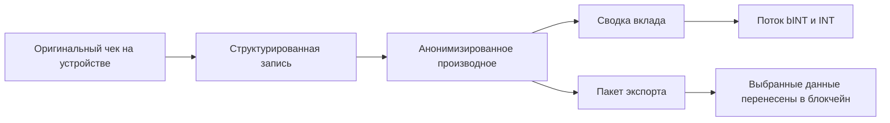

# Что дает Web3

Подход Yumo Yumo к Web3 создает ценность намного шире распределения наград. Его главный вклад состоит в переносе финансовой памяти, пользовательского владения и экономических правил на рельсы, которые живут дольше и читаются прозрачнее. По мере роста памяти о тратах растет и ценность продукта для пользователя; слой Web3 усиливает переносимость этой ценности, устойчивость истории вклада и открытую экономическую поверхность вокруг нее.

В закрытых системах баллов вклад заперт внутри границ приложения. В подходе Yumo выбранные пакеты данных могут двигаться вместе с пользователем, история вклада соединяется с более видимыми экономическими правилами, а ценовая память живет в пространстве долгосрочной координации. Этот сдвиг делает систему менее похожей на частную машину поощрений и больше — на устойчивый финансовый рельс.

Solana соответствует практическим требованиям такого видения. Частые взаимодействия, доступные издержки и зрелая экосистема поддерживают выпуск bINT, координацию INT, стейкинг и более поздние слои управления. Видимый пользовательский опыт остается легким и привычным, тогда как ончейн-инфраструктура несет долгосрочную непрерывность под поверхностью.

Web3 важен и потому, что дает ценовой памяти более сильную форму на длинном горизонте. Когда одни и те же товары и услуги фиксируются годами, получающиеся ряды становятся больше, чем личным архивом. Они могут двигаться вместе с пользователем в виде выбранных пакетов, нести отметку владения и приобретать значение на более широких экономических поверхностях. Так ценовая память превращается в переносимую экономическую память.

| Что открывают открытые рельсы | Эффект для пользователя | Эффект для сети |
| --- | --- | --- |
| Переносимая история вклада | Данные двигаются вместе с пользователем | Экономические правила становятся видимее |
| Выбранные ончейн-пакеты данных | След владения усиливается | Открытая экономика становится устойчивее |
| Управление, растущее со временем | Пользователь сильнее касается решений | Параметры созревают вместе с сообществом |
| Устойчивая ценовая память | Долгосрочная финансовая ясность | Более сильная коллективная инфраструктура |

Поэтому Yumo использует блокчейн не как украшение. Web3 становится одним из ключевых рельсов, которые усиливают владение, ценовую память и экономическую непрерывность. Цепочка остается тихим слоем в пользовательском опыте и в то же время несет на себе долгосрочный вес всей системы.
