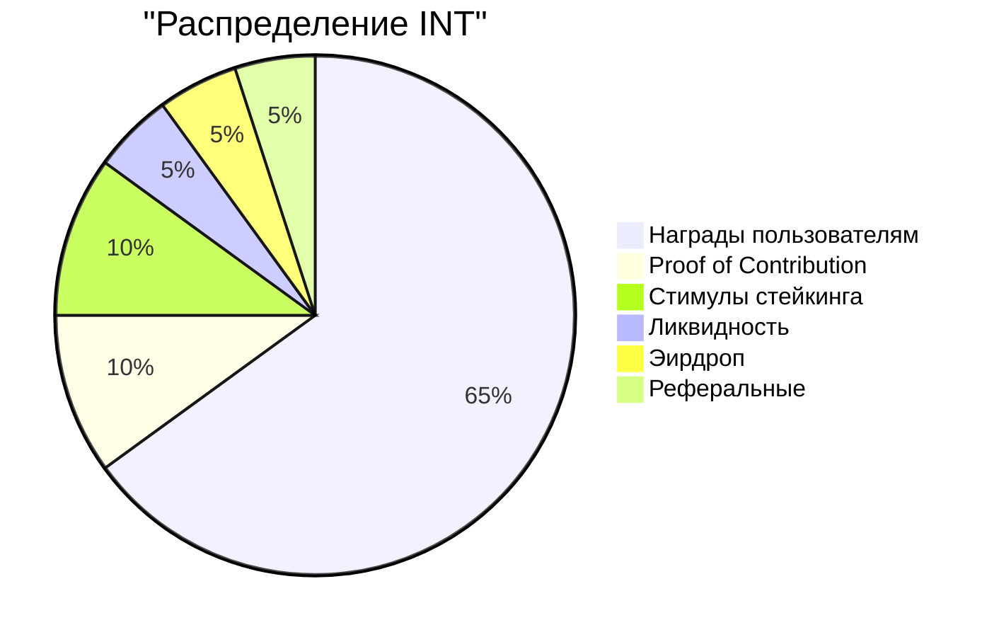
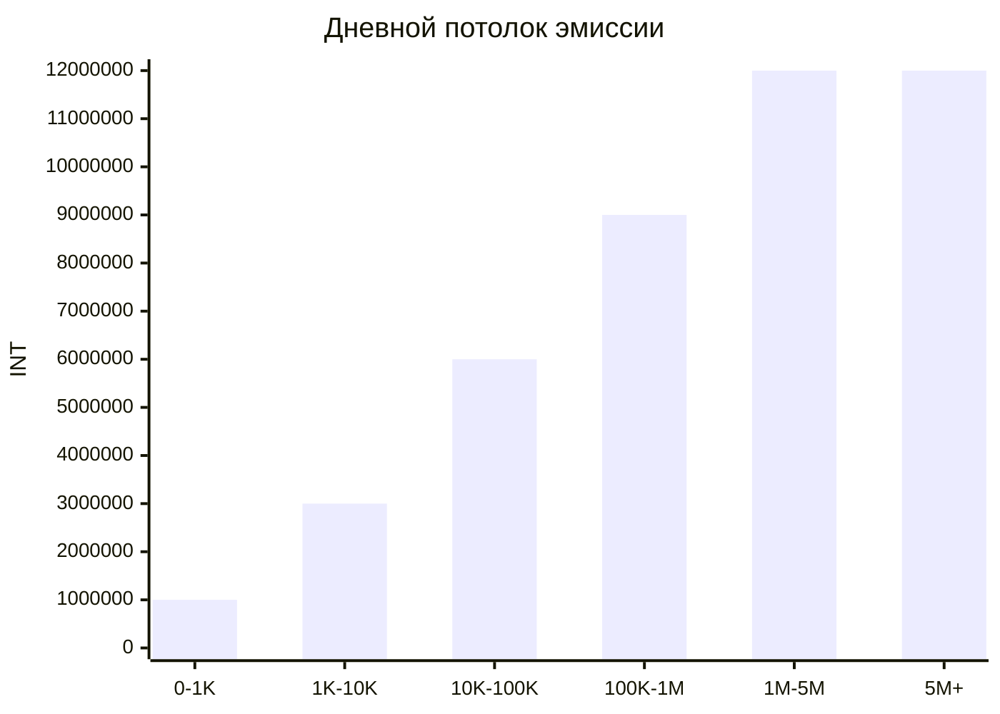
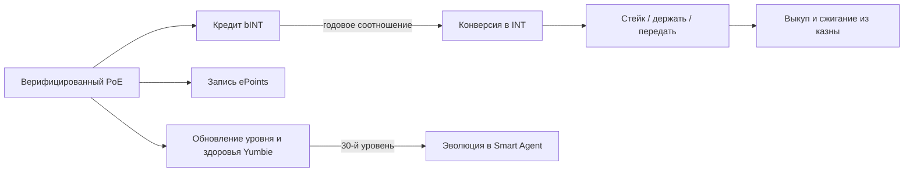

# Экономика вклада и дизайн токена

Экономическая основа Yumo Yumo строит многослойный мост между повседневным использованием и открытой координацией. Proof of Expense, проверка магазинов, улучшения товарных записей и задания сообщества сначала оседают в слое bINT. Этот слой делает видимыми качество, доверие и непрерывность вклада. Слой INT несёт более широкую экономическую координацию, стейкинг и поверхности управления, которые созревают со временем. Рядом с ними ePoints фиксирует долларовый след скрытой стоимости, проявленной каждым проверенным чеком, а Founding NFT — Yumbie — закрепляет переносимую цифровую идентичность пользователя внутри системы.

Это разделение важно, потому что вклад, ценность и идентичность проходят через разные ворота. Пользователь, добавляющий ценность системе, сначала накапливает bINT. Время, поведение удержания и доверие формируют переход этого баланса в INT. Каждый проверенный чек также пишет запись ePoints, фиксирующую долларовую меру выявленной скрытой стоимости. Yumbie пользователя несёт видимую память этого пути. В результате — экономика, которая вознаграждает устойчивое и достоверное участие, удерживая ценность в согласии с долгосрочным вкладом.

## Слои токена

| Слой | Форма | Передаваемый? | Назначение |
| --- | --- | --- | --- |
| **INT** | SPL-токен в сети | Да | Экономическая координация, стейкинг, стимулы экосистемы |
| **bINT** | В сети, непередаваемый (замороженный ATA) | Нет — конвертируется в INT по действию пользователя | Учёт вклада; мягкий слой между трудом и наградой |
| **ePoints** | В сети, непередаваемый (замороженный ATA) | Нет | Долларовая запись скрытой стоимости, проявленной по каждому проверенному чеку |
| **Founding NFT (Yumbie)** | Token-2022 NonTransferable | Нет | Устойчивая цифровая идентичность; визуальный спутник, эволюционирующий вместе с пользователем |

bINT и ePoints улавливают два разных сигнала из одного чека. bINT измеряет интенсивность вклада внутри экономики Yumo. ePoints измеряет долларовую ценность понимания скрытой стоимости, возвращаемого пользователю. Они никогда не перекрывают друг друга и конвертируются по разной логике.

## Распределение INT

Общий объём INT ограничен 99 миллиардами. Шестьдесят пять процентов резервируются под награды пользователям. Десять процентов питают канал Proof of Contribution, где **основная команда и внешние контрибьюторы** получают вознаграждение за выполненную работу и созданное влияние. Десять процентов поддерживают стимулы стейкинга, укрепляющие долгосрочное участие. Оставшаяся доля распределяется между потоками ликвидности, эирдропа и реферальных наград. Эта архитектура удерживает экономику команды на той же логике вклада, что управляет участием пользователей.

| Ключевой показатель | Значение |
| --- | --- |
| Общий объём INT | 99 000 000 000 |
| Десятичные знаки | 6 |
| Горизонт наград пользователям | 15 лет |
| Пиковый дневной пул эмиссии | 12 000 000 INT |
| Базовое соотношение конверсии в 1-й год | 1 bINT = 5 INT |
| Базовое соотношение конверсии в 10-й год | 1 bINT = 1 INT |
| Дневной потолок bINT на пользователя | 1 000 bINT (фактический потолок масштабируется по уровню и шкале здоровья) |
| Горизонт стимулов стейкинга | 5 лет |
| Канал вознаграждения команды | Через Proof of Contribution, по влиянию работы |

## Эмиссия наград пользователям

Канал наград пользователям работает на параметрах, зафиксированных в смарт-контрактах. По мере роста месячной активной аудитории дневной пул расширяется ступенями и достигает пика в 12 миллионов INT. Кривая конверсии движется вниз со временем: ранний вклад стартует с более высокого базового соотношения, а поздние годы переходят к более сбалансированному распределению. На текущем этапе эти параметры дают прозрачный и предсказуемый экономический хребет. По мере созревания управления процессы сообщества возьмут на себя большую роль в будущих корректировках.

Базовая кривая конверсии движется вниз со временем. Она начинается с `1 bINT = 5 INT` в первый год, достигает `1 bINT = 1 INT` к десятому году и переносит долгосрочный вклад в более сбалансированную экономическую рамку.

Дневной потолок bINT на пользователя защищает систему от концентрации и спама. Жёсткий потолок — 1 000 bINT на пользователя в день. Фактический потолок каждого человека — функция от его уровня (накопленный вклад) и шкалы здоровья (качество недавнего вклада). Новые пользователи стартуют значительно ниже потолка; устойчивые контрибьюторы высокого качества приближаются к нему со временем. Эта структура ослабляет давление спама, потому что вклад набирает ценность тогда, когда качество, доверие и время движутся вместе.

## Дизайн стейкинга

Стимулы стейкинга высвобождаются на горизонте пяти лет. Держатели INT могут блокировать токены в одном из шести тарифов; более длинные блокировки получают пропорционально большую награду.

| Период блокировки | Вес APR | Ориентировочный APR |
| --- | --- | --- |
| 7 дней | 1,0× | ~35% |
| 14 дней | 1,5× | ~50% |
| 21 день | 2,0× | ~70% |
| 30 дней | 2,5× | ~85% |
| 60 дней | 4,0× | ~140% |
| 90 дней | 6,0× | ~210% |

Цифры APR масштабируются с общим объёмом застейканного по сети и не являются фиксированным обещанием. Награды накапливаются непрерывно и могут быть востребованы в любой момент без разблокировки основной суммы. Основная сумма становится изымаемой только после истечения выбранного периода блокировки. Стейкинг открывается через неделю после Token Generation Event (TGE), чтобы окно первоначального ценообразования закрылось до того, как активируется спрос.

## Ликвидность

Пять процентов общего объёма зарезервированы под ончейн-ликвидность. Эта доля разделена на два слоя с разными ролями.

| Слой | Объём | Роль |
| --- | --- | --- |
| **Начальная ликвидность** | 1 000 000 000 INT | Засевает публичный ончейн-рынок на TGE через односторонний bootstrap-пул ликвидности. LP-позиция заблокирована на 12 месяцев. |
| **Резервная ликвидность** | 3 950 000 000 INT | Удерживается в резерве для развёртываний под управлением сообщества. Может быть активирована для расширения ценообразования вверх, когда баланс INT в живом пуле падает ниже заданного порога, или для поддержки глубины во время волатильности. |

Это разделение оставляет рынок запуска достаточно лёгким для подлинного ценообразования и одновременно сохраняет оборонительный резерв, который может быть активирован решением сообщества на последующих этапах.

## Выкуп и сжигание

Поступления казны от направления продуктов на данных и операционного профицита питают канал выкупа и сжигания INT. Первая версия этого механизма работает вручную через мультиподписной кошелёк с таймлоком 24-48 часов и публичной панелью, отражающей резервы и историю сжиганий. Последующие версии передают решение управлению сообщества, как только созревают поверхности стейкинга и идентичности. В каждой версии исполненные сжигания окончательны и ончейн; последующего повторного выпуска не происходит.

## Founding NFT — Yumbie

Каждый пользователь получает Founding NFT — Yumbie — после первого верифицированного Proof of Expense и подключения кошелька. NFT минтится только по стоимости газа и непередаваем. Это устойчивая идентичность пользователя внутри Yumo, несущая видимый журнал его пути через уровень, настроение и историю.

Когда пользователь достигает 30-го уровня, Yumbie эволюционирует из Founding-формы в Smart Agent. Founding-форма принимает узнаваемый силуэт жёлтого чека, маркирующий вход вклада. Smart-Agent-форма принимает более формальное представление в стиле фирменного бланка, обозначая устоявшееся положение внутри системы. Эволюция односторонняя; нижележащий NFT остаётся тем же ончейн-активом.

## Учёт до TGE

До Token Generation Event платформа отслеживает вклад через cPoints — закрытую систему репутационной меры. cPoints существуют только в фазе до TGE. Они формируют начальные веса эирдропа и онбординга на TGE и затем выводятся из обращения. Начиная с TGE, слои bINT и ePoints заменяют роль cPoints более сильной семантикой вклада и ончейн-учётом.

## Как соединяются слои

Каждый верифицированный чек одновременно пишет вклад в bINT, понимание скрытой стоимости в ePoints и прогресс идентичности в Yumbie пользователя. Конверсия из bINT в INT переносит ценность из слоя вклада в экономический слой по соотношению, благоприятствующему раннему участию и выравнивающемуся со временем. Стейкинг возвращает ценность долгосрочным держателям. Управляемые казной выкуп и сжигание замыкают петлю, привязывая реальный доход платформы к редкости токена.

Эта структура ослабляет давление спама, потому что вклад набирает ценность, когда качество, доверие и время движутся вместе. Она благоприятствует сильным пользователям и устойчивым контрибьюторам, потому что сеть растёт через участие с исторической ценностью, а не через поверхностный объём. Дизайн токена поэтому неотделим от продуктовой тезисности; это экономическое выражение памяти, цены и движка ориентации Yumo.
