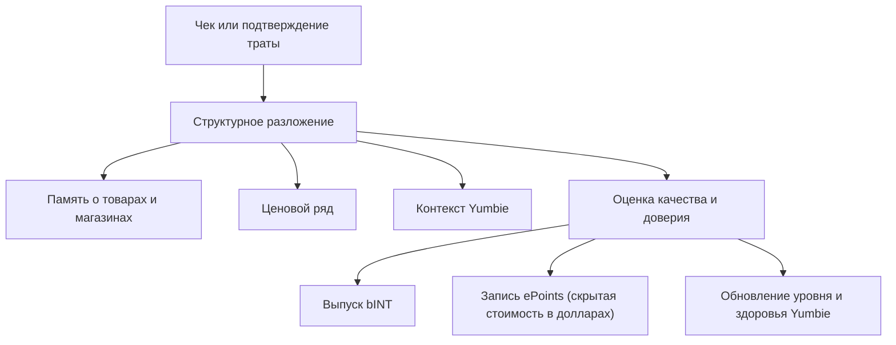

# Подтверждение расхода и память о ценах

Proof of Expense — главный двигатель Yumo Yumo. Когда чек или иное подтверждение траты попадает в систему, происходит больше, чем создание записи. Одновременно открываются новые слои для личной памяти, ценовых рядов, контекста сопровождения и экономики вклада. Именно поэтому Proof of Expense выступает как центральная структура, питающая и пользовательскую сторону, и сторону открытой экономики.

На первом этапе запись раскладывается на магазин, время, итоговую сумму, товарные строки, состав корзины и сигналы контекста. Эта структуризация дает пользователю чистую память, к которой можно вернуться позже. Когда тот же товар или тот же магазин появляется снова, система продлевает ценовую память, усиливает паттерны корзины и повышает точность приоритизации Yumbie. Та же запись проходит через слои качества и доверия перед тем, как стать вкладом в выпуск bINT, и именно так получает экономический смысл.

Сила Proof of Expense в том, что один чек превращается во множество выходов. Память о товаре показывает, что повторяется. Память о магазине раскрывает паттерны предпочтений. Временная метка открывает ритм повседневной жизни. Ценовой ряд показывает направление изменения. В результате запись отвечает не только на вопрос, сколько было заплачено, но и на вопросы за что, когда, в каких условиях и как эта стоимость менялась во времени.

Слой качества здесь играет решающую роль. Вместе оцениваются читаемость, согласованность итогов и строк, естественность связи магазина и времени, паттерны повторения и более широкие сигналы доверия. Более сильная запись приносит больше ценности памяти, ценовым рядам и экономическому рельсу. Так сеть выше ценит исторически значимый вклад, чем поверхностный объем.

Ценовая память — один из самых заметных пользовательских выигрышей Proof of Expense. Когда человек в течение месяцев добавляет в систему одни и те же товары или услуги, возникает личный архив движения цен. Этот архив показывает, как товар отличается от магазина к магазину, когда категория ускоряет рост, какие позиции ведут себя стабильнее и где внутри корзины накапливается давление. Со временем такая видимость открывает путь к более широким поверхностям сравнения и общественным картам цен.

| Что создает одна запись | Эффект для пользователя | Эффект для сети |
| --- | --- | --- |
| Структурированная память о чеке | Осмысленное возвращение к прошлому | Более высокое качество данных |
| Временные ряды товаров и магазинов | Более ясное отслеживание цены | Более сильная коллективная память о ценах |
| Контекст Yumbie | Более своевременное сопровождение | Лучшая персонализация |
| Сигнал вклада (bINT) | Мягкий кредит к конверсии в INT | Рост открытой экономики |
| Запись скрытой стоимости (ePoints) | Долларовый след давления расходов | Будущий вес в распределениях токена |
| Прогресс идентичности | Уровень и здоровье Yumbie движутся вперёд | Более сильная база долгосрочных контрибьюторов |

Если семья в течение трех месяцев покупает молоко, кофе и подгузники в одной и той же сети, система не просто добавляет новые строки. Она замечает рост цены на подгузники, измеряет влияние смены магазина на кофе, усиливает паттерны совместных покупок и точнее читает ритм домохозяйства. Пользователь получает более полезное сопровождение, а сеть растет за счет более чистых и более ценных во времени данных.
