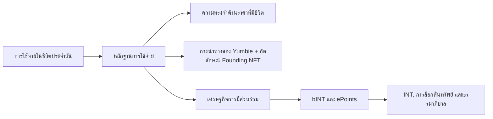

# [TH] Yumo Yumo Whitepaper

> **Superseded.** The Vision Paper manifesto now lives at `/vision`. Tokenomics content has moved to Technical Paper §04. Do not edit files in this directory; make changes in `content/technical-paper/` instead.

## บทเปิด

Yumo Yumo กำลังสร้างระบบปฏิบัติการทางการเงินส่วนบุคคลที่อ่านเรื่องเงินผ่านจังหวะของชีวิตประจำวัน การแวะซื้อของที่ร้านประจำ บิลที่กำลังจะมาถึง สินค้าที่ค่อย ๆ แพงขึ้น ความต้องการในบ้าน การเตรียมตัวเดินทาง และการตัดสินใจเล็ก ๆ ที่เกิดซ้ำ ล้วนกลายเป็นสัญญาณที่มีโครงสร้างภายในระบบ Yumo รวบสัญญาณเหล่านี้ผ่านหลักฐานการใช้จ่าย ความทรงจำด้านราคาที่มีชีวิต การนำทางของ Yumbie และเศรษฐกิจการมีส่วนร่วมแบบเปิด

โครงสร้างนี้สร้างคุณค่าไปพร้อมกันสองทิศทาง ด้านแรก ผู้ใช้มองเห็นประวัติการเงินของตัวเองในบริบทที่ลึกขึ้น สินค้า ร้านค้า เวลา องค์ประกอบของตะกร้า และรูปแบบที่เกิดซ้ำจะกลายเป็นชั้นความทรงจำเดียวกัน ด้านที่สอง กระแสเดียวกันนี้จะกลายเป็นการมีส่วนร่วมทางเศรษฐกิจ ผู้ใช้ที่สร้างข้อมูลคุณภาพสูงและเชื่อถือได้จะเห็นมูลค่าของการมีส่วนร่วมผ่านสถาปัตยกรรม bINT และ INT ประสบการณ์ของผลิตภัณฑ์และการประสานงานทางเศรษฐกิจจึงเติบโตบนแกนเดียวกัน

Yumbie คือผู้นำทางที่ผู้ใช้มองเห็นได้ชัดที่สุดของแกนนี้ มันแปลงความทรงจำทางการเงินให้เป็นการชี้นำที่อบอุ่น เข้าใจง่าย และเกิดขึ้นในจังหวะที่เหมาะสม มันช่วยชี้ว่าการขึ้นราคาครั้งไหนสำคัญ รูปแบบการซื้อแบบใดเชื่อมกับจังหวะของบ้าน และโอกาสใดควรถูกยกขึ้นมาในวันนี้ ด้วยเหตุนี้ หัวใจของเอกสารฉบับนี้จึงกลายเป็นความสัมพันธ์ที่มีชีวิตกับการเงินส่วนบุคคล

ชั้น Web3 เติมรางระยะยาวให้เรื่องนี้ แพ็กเกจข้อมูลที่ผู้ใช้เลือกสามารถเคลื่อนที่ไปพร้อมกับผู้ใช้ กติกาทางเศรษฐกิจมองเห็นได้ชัดขึ้น ประวัติการมีส่วนร่วมเชื่อมกับการประสานงานบนเชน และความทรงจำด้านราคามีความต่อเนื่องที่ยาวไกลกว่าฐานข้อมูลของบริษัทเพียงแห่งเดียว ภาพใบเสร็จต้นฉบับจะอยู่บนอุปกรณ์ของผู้ใช้ ส่วนระบบจะทำงานกับข้อมูลอนุพันธ์ที่ผ่านการจัดโครงสร้างและทำให้ไม่ระบุตัวตน ผู้ใช้สามารถลบข้อมูลส่วนบุคคลฝั่งระบบ ส่งออกประวัติที่มีโครงสร้าง และนำแพ็กเกจข้อมูลที่เลือกขึ้นเชนพร้อมร่องรอยความเป็นเจ้าของได้

ผลิตภัณฑ์ด้านการเงินส่วนบุคคลในปัจจุบันส่วนใหญ่จะจัดประเภทธุรกรรม สรุปรายเดือน และแสดงเป้าหมายการออม Yumo Yumo เล็งไปที่พื้นผิวที่กว้างกว่านั้น เส้นทางราคาของสินค้าเดียวกันตลอดหลายเดือน ความต้องการที่เกิดซ้ำของบ้านเดียวกัน การเปลี่ยนร้านที่ค่อย ๆ ขยับ แรงกดดันจากบิลที่กำลังจะมาถึง การเลื่อนตัวเงียบ ๆ ภายในตะกร้า และการผลิตข้อมูลที่สามารถกลายเป็นเศรษฐกิจการมีส่วนร่วม ทั้งหมดนี้รวมตัวอยู่ในระบบเดียว whitepaper ฉบับนี้จึงเปิดทั้งประสบการณ์การใช้งานและตรรกะการทำงานของโครงสร้างพื้นฐานทางการเงินรูปแบบใหม่อยู่ในเส้นเรื่องเดียวกัน

กรอบนี้ทำให้ผู้อ่านทั่วไปและนักลงทุนอยู่ในเอกสารเดียวกัน ในฝั่งสาธารณะ มันทำให้คุณค่าของผู้ใช้ พื้นผิวของผลิตภัณฑ์ และความทรงจำด้านราคามองเห็นได้ ในฝั่งนักลงทุน มันอธิบายเศรษฐกิจแบบเปิด ความโปร่งใสของพารามิเตอร์ คุณภาพของการมีส่วนร่วม ความเป็นเจ้าของข้อมูล และเหตุผลที่รางของ Web3 ให้พื้นฐานที่มั่นคงกว่า ข้อเสนอของ Yumo Yumo คือนำข้อมูลการใช้จ่ายในชีวิตประจำวันออกจากการเป็นเพียงประวัติที่ถูกติดตาม และทำให้มันกลายเป็นชั้นการเงินที่มีชีวิต

whitepaper ฉบับนี้จะเดินไปตามแปดเส้นเรื่องหลัก เริ่มจากการวางเหตุผลว่าทำไมหมวดหมู่ใหม่นี้จึงกำลังก่อตัว จากนั้นอธิบายกลไกหลักฐานการใช้จ่ายและความทรงจำด้านราคา ก่อนจะขยับไปสู่บทบาทของ Yumbie พื้นผิวของผลิตภัณฑ์ เศรษฐกิจการมีส่วนร่วม การออกแบบโทเค็น คุณค่าที่ Web3 เพิ่มเข้ามา ความเป็นเจ้าของข้อมูล และวิสัยทัศน์ระยะยาว จุดมุ่งหมายคือทำให้ทั้งคุณค่าที่ผู้ใช้สัมผัสได้และความชัดเจนเชิงกลไกที่นักลงทุนต้องการอยู่ในภาพเดียวกัน
