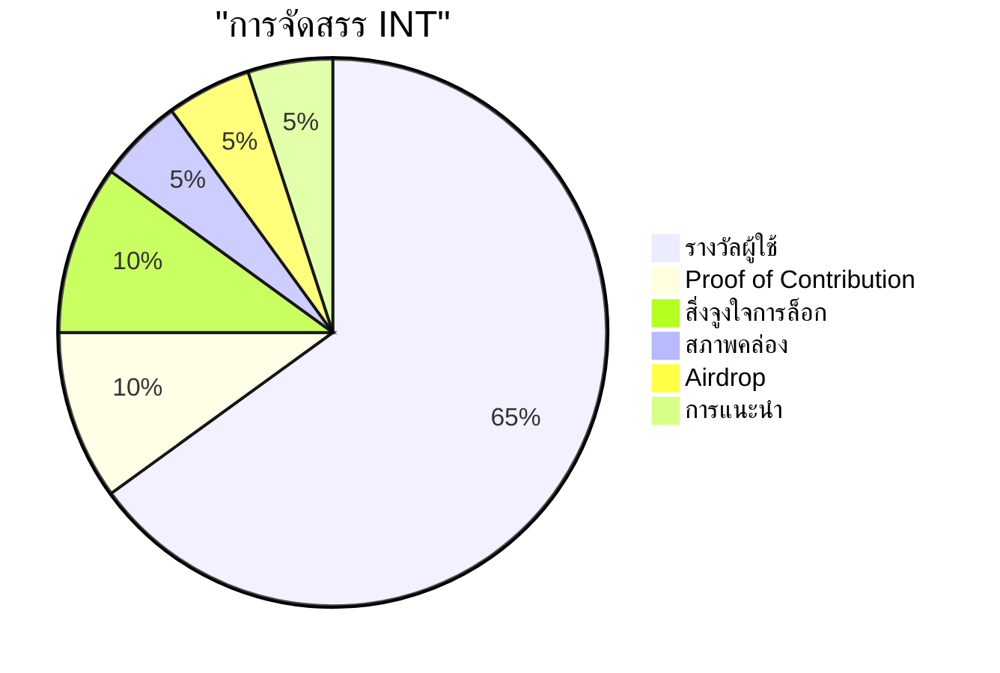
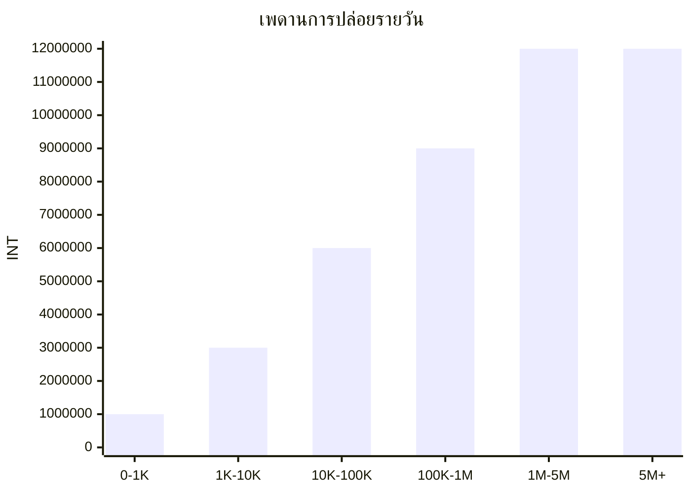
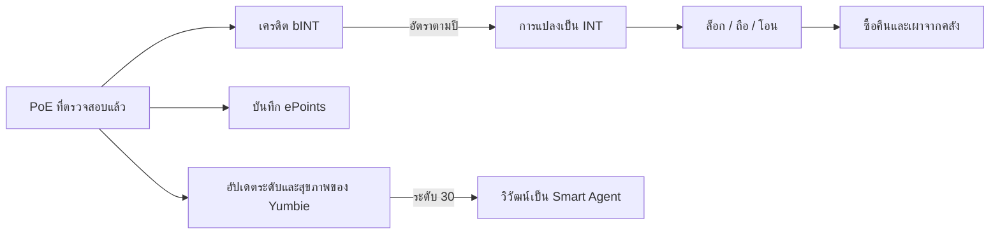

# เศรษฐกิจการมีส่วนร่วมและการออกแบบโทเค็น

แกนเศรษฐกิจของ Yumo Yumo สร้างสะพานหลายชั้นระหว่างการใช้งานในชีวิตประจำวันกับการประสานงานแบบเปิด หลักฐานการใช้จ่าย การยืนยันร้านค้า การปรับปรุงข้อมูลสินค้า และภารกิจของชุมชน จะถูกบันทึกลงในชั้น bINT ก่อน ชั้นนี้ทำให้คุณภาพ ความไว้วางใจ และความต่อเนื่องของการมีส่วนร่วมมองเห็นได้ ชั้น INT รองรับการประสานงานทางเศรษฐกิจที่กว้างขึ้น การล็อกสินทรัพย์ และพื้นผิวธรรมาภิบาลที่เติบโตตามเวลา เคียงข้างกัน ePoints บันทึกร่องรอยต้นทุนแฝงในหน่วยดอลลาร์ที่ปรากฏจากใบเสร็จที่ได้รับการตรวจสอบ และ Founding NFT — Yumbie — ยึดอัตลักษณ์ดิจิทัลแบบพกพาของผู้ใช้ไว้ภายในระบบ

การแยกชั้นนี้สำคัญ เพราะการมีส่วนร่วม คุณค่า และอัตลักษณ์ ผ่านประตูที่แตกต่างกัน ผู้ใช้ที่สร้างคุณค่าให้ระบบจะสะสม bINT ก่อน เวลา พฤติกรรมการถือครอง และความไว้วางใจ เป็นตัวกำหนดว่ามูลค่านั้นจะเคลื่อนไปสู่ INT อย่างไร ใบเสร็จที่ได้รับการตรวจสอบยังเขียนบันทึก ePoints ที่จับการวัดเป็นดอลลาร์ของต้นทุนแฝงที่เปิดเผยอีกด้วย Yumbie ของผู้ใช้เก็บความทรงจำที่มองเห็นได้ของเส้นทางนี้ ผลลัพธ์คือเศรษฐกิจที่ให้รางวัลกับการมีส่วนร่วมที่มั่นคงและน่าเชื่อถือ พร้อมจัดวางคุณค่าให้สอดคล้องกับการมีส่วนร่วมระยะยาว

## ชั้นของโทเค็น

| ชั้น | รูปแบบ | โอนได้หรือไม่ | จุดประสงค์ |
| --- | --- | --- | --- |
| **INT** | โทเค็น SPL บนเชน | ได้ | การประสานงานทางเศรษฐกิจ การล็อกสินทรัพย์ สิ่งจูงใจของอีโคซิสเต็ม |
| **bINT** | บนเชน โอนไม่ได้ (ATA ถูกแช่แข็ง) | ไม่ได้ — แปลงเป็น INT ตามการกระทำของผู้ใช้ | บัญชีการมีส่วนร่วม ชั้นนุ่มระหว่างงานกับรางวัล |
| **ePoints** | บนเชน โอนไม่ได้ (ATA ถูกแช่แข็ง) | ไม่ได้ | บันทึกในหน่วยดอลลาร์ของต้นทุนแฝงที่ปรากฏจากใบเสร็จที่ได้รับการตรวจสอบ |
| **Founding NFT (Yumbie)** | Token-2022 NonTransferable | ไม่ได้ | อัตลักษณ์ดิจิทัลที่คงทน เพื่อนทางสายตาที่เติบโตไปกับผู้ใช้ |

bINT และ ePoints จับสัญญาณสองอย่างที่แตกต่างกันจากใบเสร็จใบเดียวกัน bINT วัดความเข้มข้นของการมีส่วนร่วมภายในเศรษฐกิจ Yumo ePoints วัดมูลค่าเป็นดอลลาร์ของความเข้าใจต้นทุนแฝงที่ส่งคืนผู้ใช้ ทั้งสองไม่ทับซ้อนกัน และแปลงผ่านตรรกะที่แตกต่างกัน

## การกระจาย INT

อุปทาน INT รวมจำกัดที่ 9.9 หมื่นล้าน หกสิบห้าเปอร์เซ็นต์สงวนไว้สำหรับรางวัลผู้ใช้ สิบเปอร์เซ็นต์ป้อนเข้าช่องทาง Proof of Contribution ซึ่ง **ทีมหลักและผู้ร่วมสร้างภายนอก** ได้รับผลตอบแทนตามผลงานที่ทำและผลกระทบที่สร้างขึ้น สิบเปอร์เซ็นต์รองรับสิ่งจูงใจการล็อกสินทรัพย์ที่เสริมการมีส่วนร่วมระยะยาว ส่วนที่เหลือกระจายไปยังกระแสสภาพคล่อง airdrop และการแนะนำ สถาปัตยกรรมนี้รักษาเศรษฐกิจของทีมให้สอดคล้องกับตรรกะการมีส่วนร่วมเดียวกันกับที่ขับเคลื่อนการมีส่วนร่วมของผู้ใช้

| ตัวชี้วัดหลัก | ค่า |
| --- | --- |
| อุปทาน INT รวม | 99,000,000,000 |
| ทศนิยม | 6 |
| ขอบฟ้ารางวัลผู้ใช้ | 15 ปี |
| ยอดสูงสุดต่อวันของกองทุนการปล่อย | 12,000,000 INT |
| อัตราแปลงพื้นฐานปีที่ 1 | 1 bINT = 5 INT |
| อัตราแปลงพื้นฐานปีที่ 10 | 1 bINT = 1 INT |
| เพดาน bINT รายวันต่อผู้ใช้ | 1,000 bINT (เพดานที่แท้จริงปรับตามระดับและคะแนนสุขภาพ) |
| ขอบฟ้าสิ่งจูงใจการล็อก | 5 ปี |
| ช่องทางรางวัลของทีม | ผ่าน Proof of Contribution ตามผลกระทบของงาน |

## การปล่อยรางวัลผู้ใช้

ช่องทางรางวัลผู้ใช้ทำงานบนพารามิเตอร์ที่กำหนดในสัญญาอัจฉริยะ เมื่อการใช้งานรายเดือนที่ทำงานเติบโตขึ้น กองทุนรายวันจะขยายตัวเป็นขั้นและถึงจุดสูงสุดที่ 12 ล้าน INT เส้นโค้งการแปลงเคลื่อนลงตามเวลา การมีส่วนร่วมในช่วงต้นเริ่มต้นที่อัตราพื้นฐานที่สูงกว่า ปีต่อๆ มาเคลื่อนสู่รูปแบบการกระจายที่สมดุลกว่า ในช่วงปัจจุบัน พารามิเตอร์เหล่านี้เป็นกระดูกสันหลังทางเศรษฐกิจที่โปร่งใสและคาดการณ์ได้ เมื่อธรรมาภิบาลเติบโตขึ้น กระบวนการของชุมชนจะมีบทบาทมากขึ้นในการปรับเปลี่ยนในอนาคต

เส้นโค้งการแปลงพื้นฐานเคลื่อนลงตามเวลา เริ่มต้นด้วย `1 bINT = 5 INT` ในปีแรก ถึง `1 bINT = 1 INT` ในปีที่สิบ และนำการมีส่วนร่วมระยะยาวเข้าสู่กรอบเศรษฐกิจที่สมดุลกว่า

เพดาน bINT รายวันต่อผู้ใช้ปกป้องระบบจากการกระจุกตัวและสแปม เพดานแข็งอยู่ที่ 1,000 bINT ต่อผู้ใช้ต่อวัน เพดานที่ผู้ใช้แต่ละคนเข้าถึงได้จริงเป็นฟังก์ชันของระดับ (การมีส่วนร่วมสะสม) และคะแนนสุขภาพ (คุณภาพการมีส่วนร่วมในช่วงล่าสุด) ผู้ใช้ใหม่เริ่มต้นต่ำกว่าเพดานมาก ผู้ร่วมสร้างที่มั่นคงและมีคุณภาพสูงเข้าใกล้เพดานเมื่อเวลาผ่านไป โครงสร้างนี้ลดแรงกดดันสแปม เพราะการมีส่วนร่วมจะมีค่ามากขึ้นเมื่อคุณภาพ ความไว้วางใจ และเวลาเคลื่อนไปด้วยกัน

## การออกแบบการล็อกสินทรัพย์

สิ่งจูงใจการล็อกถูกปล่อยตลอดขอบฟ้าห้าปี ผู้ถือ INT สามารถล็อกโทเค็นในหนึ่งในหกระดับ การล็อกที่ยาวนานกว่าจะได้รับรางวัลที่สูงกว่าตามสัดส่วน

| ระยะเวลาล็อก | น้ำหนัก APR | APR ตัวอย่าง |
| --- | --- | --- |
| 7 วัน | 1.0× | ~35% |
| 14 วัน | 1.5× | ~50% |
| 21 วัน | 2.0× | ~70% |
| 30 วัน | 2.5× | ~85% |
| 60 วัน | 4.0× | ~140% |
| 90 วัน | 6.0× | ~210% |

ตัวเลข APR ปรับตามจำนวนรวมที่ล็อกในเครือข่าย และไม่ใช่คำสัญญาที่คงที่ รางวัลสะสมอย่างต่อเนื่องและสามารถเคลมได้ทุกเมื่อโดยไม่ต้องปลดล็อกเงินต้น เงินต้นจะถอนได้ก็ต่อเมื่อระยะเวลาล็อกที่เลือกหมดอายุ การล็อกสินทรัพย์เปิดใช้งานหนึ่งสัปดาห์หลังจาก Token Generation Event (TGE) เพื่อให้หน้าต่างการค้นพบราคาในช่วงต้นจบลงก่อนที่ฝั่งอุปสงค์จะถูกเปิดใช้งาน

## สภาพคล่อง

ห้าเปอร์เซ็นต์ของอุปทานรวมสงวนไว้สำหรับสภาพคล่องบนเชน การจัดสรรนี้แบ่งเป็นสองชั้นที่มีบทบาทต่างกัน

| ชั้น | จำนวน | บทบาท |
| --- | --- | --- |
| **สภาพคล่องเริ่มต้น** | 1,000,000,000 INT | หว่านตลาดสาธารณะบนเชนใน TGE ผ่านพูลสภาพคล่องด้านเดียว ตำแหน่ง LP ถูกล็อก 12 เดือน |
| **สภาพคล่องสำรอง** | 3,950,000,000 INT | เก็บไว้สำรองสำหรับการปรับใช้ที่ชุมชนกำกับ อาจเปิดใช้งานเพื่อขยายการค้นพบราคาขึ้นเมื่อยอด INT ในพูลที่ใช้งานอยู่ลดต่ำกว่าเกณฑ์ที่กำหนด หรือเพื่อสนับสนุนความลึกในช่วงผันผวน |

การแบ่งนี้ทำให้ตลาดเปิดตัวเบาพอสำหรับการค้นพบราคาที่แท้จริง ขณะเดียวกันสงวนเงินสำรองเชิงป้องกันที่สามารถเปิดใช้งานได้ด้วยการตัดสินใจของชุมชนในระยะต่อไป

## การซื้อคืนและเผา

รายรับจากคลังของธุรกิจผลิตภัณฑ์ข้อมูลและส่วนเกินจากการดำเนินงานป้อนช่องทางการซื้อคืนและเผา INT รุ่นแรกของกลไกนี้ทำงานด้วยมือผ่านกระเป๋ามัลติซิกพร้อมไทม์ล็อก 24-48 ชั่วโมง และแดชบอร์ดสาธารณะที่แสดงเงินสำรองและประวัติการเผา รุ่นถัดไปจะโอนการตัดสินใจไปยังธรรมาภิบาลของชุมชนเมื่อพื้นผิวการล็อกและอัตลักษณ์เติบโตเต็มที่ ในทุกรุ่น การเผาที่ดำเนินการแล้วถือเป็นที่สิ้นสุดและอยู่บนเชน ไม่มีการรีมินต์ตามมา

## Founding NFT — Yumbie

ผู้ใช้แต่ละคนได้รับ Founding NFT — Yumbie — หลังจากหลักฐานการใช้จ่ายที่ได้รับการตรวจสอบครั้งแรกและการเชื่อมต่อกระเป๋า NFT ถูกมินต์ด้วยค่าก๊าซเท่านั้นและโอนไม่ได้ เป็นอัตลักษณ์ที่คงทนของผู้ใช้ภายใน Yumo และแบกบันทึกที่มองเห็นได้ของเส้นทางผ่านระดับ อารมณ์ และประวัติ

เมื่อผู้ใช้ถึงระดับ 30 Yumbie จะเปลี่ยนจากรูปแบบ Founding เป็น Smart Agent รูปแบบ Founding มีเงาใบเสร็จสีเหลืองที่จดจำได้ ซึ่งเป็นสัญลักษณ์ของจุดเริ่มต้นการมีส่วนร่วม รูปแบบ Smart Agent มีการนำเสนอที่เป็นทางการกว่า ในสไตล์กระดาษหัวจดหมาย แสดงสถานะที่จัดตั้งขึ้นภายในระบบ การวิวัฒน์เป็นทางเดียว NFT ที่เป็นพื้นฐานยังคงเป็นสินทรัพย์บนเชนเดียวกัน

## การบัญชีก่อน TGE

ก่อน Token Generation Event แพลตฟอร์มติดตามการมีส่วนร่วมผ่าน cPoints การวัดชื่อเสียงในระบบปิด cPoints มีอยู่เฉพาะในระยะก่อน TGE บอกน้ำหนัก airdrop เริ่มต้นและน้ำหนัก onboarding ที่ TGE จากนั้นเลิกใช้งาน ตั้งแต่ TGE เป็นต้นไป ชั้น bINT และ ePoints แทนที่บทบาทของ cPoints ด้วยความหมายของการมีส่วนร่วมที่แข็งแกร่งกว่าและการบัญชีบนเชน

## ชั้นต่างๆ เชื่อมต่อกันอย่างไร

ใบเสร็จที่ตรวจสอบแล้วทุกใบเขียนการมีส่วนร่วมไปยัง bINT ความเข้าใจต้นทุนแฝงไปยัง ePoints และความก้าวหน้าของอัตลักษณ์ไปยัง Yumbie ของผู้ใช้พร้อมกัน การแปลงจาก bINT เป็น INT ย้ายมูลค่าจากชั้นการมีส่วนร่วมไปยังชั้นเศรษฐกิจในอัตราที่เอื้อต่อการมีส่วนร่วมในช่วงต้น และสมดุลขึ้นเมื่อเวลาผ่านไป การล็อกสินทรัพย์คืนมูลค่าให้กับผู้ถือระยะยาว การซื้อคืนและเผาที่จัดการโดยคลังปิดวงจรโดยผูกรายได้แพลตฟอร์มที่แท้จริงเข้ากับความขาดแคลนของโทเค็น

โครงสร้างนี้ลดแรงกดดันสแปม เพราะการมีส่วนร่วมจะมีค่ามากขึ้นเมื่อคุณภาพ ความไว้วางใจ และเวลาเคลื่อนไปด้วยกัน ส่งเสริมผู้ใช้ที่แข็งแกร่งและผู้ร่วมสร้างที่มั่นคง เพราะเครือข่ายเติบโตผ่านการมีส่วนร่วมที่มีคุณค่าทางประวัติศาสตร์ ไม่ใช่ปริมาณผิวเผิน การออกแบบโทเค็นจึงแยกไม่ออกจากแนวคิดของผลิตภัณฑ์ เป็นการแสดงออกทางเศรษฐกิจของความทรงจำ ราคา และเครื่องยนต์การนำทางของ Yumo
