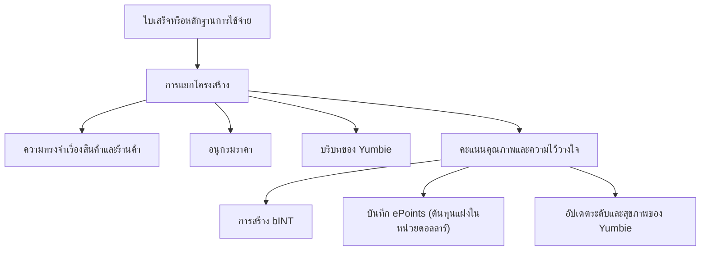

# หลักฐานการใช้จ่ายและความทรงจำด้านราคา

หลักฐานการใช้จ่ายคือเครื่องยนต์หลักของ Yumo Yumo เมื่อใบเสร็จหรือหลักฐานการใช้จ่ายรูปแบบอื่นเข้าสู่ระบบ สิ่งที่เกิดขึ้นไม่ได้มีเพียงการสร้างบันทึกหนึ่งรายการเท่านั้น แต่เปิดชั้นใหม่ให้กับความทรงจำส่วนบุคคล อนุกรมราคา บริบทการนำทาง และเศรษฐกิจการมีส่วนร่วมพร้อมกัน นี่จึงเป็นเหตุผลที่หลักฐานการใช้จ่ายทำหน้าที่เป็นโครงสร้างแกนกลางที่หล่อเลี้ยงทั้งฝั่งผู้ใช้และฝั่งเศรษฐกิจแบบเปิด

ในช่วงแรกของกระบวนการ ระบบจะแยกบันทึกออกเป็นร้านค้า เวลา ยอดรวม รายการสินค้า องค์ประกอบของตะกร้า และสัญญาณของบริบท การแยกโครงสร้างนี้ทำให้ผู้ใช้มีความทรงจำที่สะอาดและกลับมาดูได้ในภายหลัง เมื่อสินค้าชิ้นเดิมหรือร้านเดิมปรากฏขึ้นอีก ระบบจะต่อยอดความทรงจำด้านราคา เสริมความชัดของรูปแบบตะกร้า และทำให้ Yumbie จัดลำดับสิ่งสำคัญได้แม่นยำยิ่งขึ้น บันทึกเดียวกันยังผ่านชั้นคุณภาพและความไว้วางใจก่อนจะกลายเป็นส่วนหนึ่งของการสร้าง bINT ซึ่งทำให้มันมีความหมายทางเศรษฐกิจ

พลังของหลักฐานการใช้จ่ายอยู่ที่การแปลงใบเสร็จหนึ่งใบให้กลายเป็นผลลัพธ์หลายชั้น ความทรงจำเรื่องสินค้าช่วยให้เห็นว่าอะไรเกิดซ้ำ ความทรงจำเรื่องร้านค้าช่วยเผยรูปแบบความชอบ ตราประทับเวลาช่วยเปิดจังหวะชีวิตประจำวัน และอนุกรมราคาช่วยตามรอยทิศทางของการเปลี่ยนแปลง คำตอบจากระบบจึงไม่ได้มีเพียงคำถามว่า “จ่ายไปเท่าไร” แต่ขยายไปถึง “จ่ายให้กับอะไร เมื่อไร ภายใต้เงื่อนไขแบบไหน และต้นทุนนี้เปลี่ยนไปอย่างไรตามเวลา”

ชั้นคุณภาพมีความสำคัญอย่างยิ่ง ระบบจะพิจารณาความชัดเจน ความสอดคล้องระหว่างยอดรวมกับรายการ ความเป็นธรรมชาติระหว่างร้านค้ากับเวลา รูปแบบการเกิดซ้ำ และสัญญาณความไว้วางใจในภาพรวมร่วมกัน บันทึกที่แข็งแรงกว่าจะเพิ่มคุณค่าให้กับความทรงจำ อนุกรมราคา และรางเศรษฐกิจมากกว่า ทำให้เครือข่ายให้ความสำคัญกับการมีส่วนร่วมที่มีคุณค่าตามเวลา มากกว่าปริมาณที่ผิวเผิน

ความทรงจำด้านราคาคือหนึ่งในประโยชน์ที่ผู้ใช้เห็นได้ชัดที่สุด เมื่อผู้ใช้นำสินค้าและบริการเดิมเข้าสู่ระบบต่อเนื่องกันหลายเดือน ระบบจะสร้างคลังส่วนบุคคลของการเคลื่อนไหวด้านราคา คลังนี้ช่วยให้เห็นว่าสินค้าหนึ่งเปลี่ยนไปอย่างไรระหว่างร้านค้า ช่วงใดที่หมวดสินค้าบางประเภทเร่งตัวขึ้น รายการใดยังคงมีเสถียรภาพมากกว่า และแรงกดดันในตะกร้าสะสมอยู่ตรงส่วนใด เมื่อเวลาผ่านไป ความชัดเจนนี้จะกลายเป็นฐานสำหรับพื้นผิวเปรียบเทียบที่กว้างขึ้นและแผนที่ราคาที่ชุมชนช่วยกันสร้าง

| บันทึกหนึ่งรายการสร้างอะไร | ผลต่อผู้ใช้ | ผลต่อเครือข่าย |
| --- | --- | --- |
| ความทรงจำใบเสร็จแบบมีโครงสร้าง | กลับไปดูอดีตได้อย่างมีความหมาย | คุณภาพข้อมูลสูงขึ้น |
| อนุกรมเวลาของสินค้าและร้านค้า | ติดตามราคาได้ชัดขึ้น | ความทรงจำด้านราคาส่วนรวมแข็งแรงขึ้น |
| บริบทของ Yumbie | คำแนะนำที่ตรงจังหวะมากขึ้น | การปรับให้เหมาะกับแต่ละคนดีขึ้น |
| สัญญาณการมีส่วนร่วม (bINT) | เครดิตที่จะแปลงไปสู่ INT | การเติบโตของเศรษฐกิจแบบเปิด |
| บันทึกต้นทุนแฝง (ePoints) | ร่องรอยแรงกดดันการใช้จ่ายในหน่วยดอลลาร์ | น้ำหนักในการกระจายโทเค็นในอนาคต |
| ความก้าวหน้าด้านอัตลักษณ์ | ระดับและสุขภาพของ Yumbie เคลื่อนไปข้างหน้า | ฐานผู้ร่วมสร้างระยะยาวที่แข็งแรงขึ้น |

ลองนึกถึงครอบครัวหนึ่งที่ซื้อ นม กาแฟ และผ้าอ้อม จากเครือร้านเดิมต่อเนื่องกันสามเดือน ระบบจะไม่ได้เพียงเพิ่มรายการใหม่ทุกครั้ง แต่จะสังเกตราคาผ้าอ้อมที่สูงขึ้น วัดผลของการเปลี่ยนร้านต่อราคากาแฟ เสริมรูปแบบการซื้อร่วมกัน และอ่านจังหวะของครัวเรือนได้แม่นยำขึ้น ผู้ใช้จึงได้รับการนำทางที่เป็นประโยชน์มากขึ้น ขณะที่เครือข่ายเติบโตจากข้อมูลที่สะอาดและมีคุณค่าทางประวัติศาสตร์มากขึ้น
