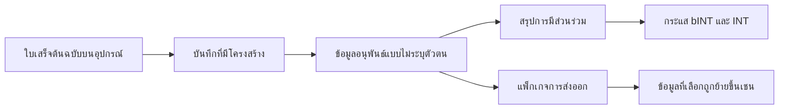

# คุณค่าที่ Web3 เติมเข้ามา

แนวทาง Web3 ของ Yumo Yumo สร้างคุณค่ามากกว่าการกระจายรางวัลอย่างชัดเจน คุณค่าที่ลึกที่สุดคือการย้ายความทรงจำทางการเงิน ความเป็นเจ้าของของผู้ใช้ และกติกาทางเศรษฐกิจไปสู่รางที่อยู่ได้นานกว่าและตรวจสอบได้ง่ายกว่า เมื่อความทรงจำเรื่องการใช้จ่ายเติบโตขึ้น มูลค่าของผลิตภัณฑ์ต่อผู้ใช้ก็เพิ่มขึ้นตามไปด้วย ส่วนชั้น Web3 จะช่วยเสริมความสามารถในการพกพาคุณค่านั้น ความต่อเนื่องของประวัติการมีส่วนร่วม และพื้นผิวเศรษฐกิจแบบเปิดที่ก่อตัวขึ้นรอบ ๆ มัน

ในระบบคะแนนแบบปิด การมีส่วนร่วมมักถูกกักไว้ภายในขอบเขตของแอป แต่ในแนวทางของ Yumo แพ็กเกจข้อมูลที่เลือกสามารถเคลื่อนไปพร้อมกับผู้ใช้ ประวัติการมีส่วนร่วมสามารถเชื่อมกับกติกาทางเศรษฐกิจที่มองเห็นได้ชัดเจนกว่า และความทรงจำด้านราคาสามารถอยู่ภายในพื้นที่การประสานงานระยะยาว การเปลี่ยนแปลงนี้ทำให้ระบบดูเป็นรางทางการเงินที่ทนทาน มากกว่าจะเป็นเพียงเครื่องจักรให้รางวัลภายในแอป

Solana ตอบโจทย์ความต้องการเชิงปฏิบัติของวิสัยทัศน์นี้ได้ดี การทำธุรกรรมถี่ ต้นทุนที่เป็นมิตร และระบบนิเวศที่เติบโตแล้ว รองรับการสร้าง bINT การประสานงานของ INT การล็อกสินทรัพย์ และกระบวนการธรรมาภิบาลในระยะต่อไป ประสบการณ์ที่ผู้ใช้เห็นยังคงเบาและคุ้นเคย ขณะที่โครงสร้างบนเชนรองรับความต่อเนื่องระยะยาวอยู่เบื้องหลัง

Web3 ยังสำคัญเพราะทำให้ความทรงจำด้านราคามีรูปทรงระยะยาวที่แข็งแรงขึ้น เมื่อสินค้าและบริการเดิมถูกบันทึกต่อเนื่องกันหลายปี อนุกรมที่เกิดขึ้นจะเป็นมากกว่าคลังส่วนตัว มันสามารถเคลื่อนที่ไปพร้อมกับผู้ใช้ในรูปของแพ็กเกจที่เลือก มีร่องรอยความเป็นเจ้าของ และสร้างความหมายในพื้นผิวเศรษฐกิจที่กว้างขึ้น ด้วยเหตุนี้ ความทรงจำด้านราคาจึงกลายเป็นความทรงจำทางเศรษฐกิจที่พกพาได้

| สิ่งที่รางเปิดทำให้เกิดขึ้น | ผลต่อผู้ใช้ | ผลต่อเครือข่าย |
| --- | --- | --- |
| ประวัติการมีส่วนร่วมที่พกพาได้ | ข้อมูลเคลื่อนไปพร้อมผู้ใช้ | กติกาทางเศรษฐกิจมองเห็นได้ชัดขึ้น |
| แพ็กเกจข้อมูลที่เลือกบนเชน | ร่องรอยความเป็นเจ้าของแข็งแรงขึ้น | เศรษฐกิจแบบเปิดมีความทนทานมากขึ้น |
| ธรรมาภิบาลที่ขยายตามเวลา | ผู้ใช้แตะการตัดสินใจได้มากขึ้น | พารามิเตอร์เติบโตไปพร้อมชุมชน |
| ความทรงจำด้านราคาที่คงอยู่ | ความชัดเจนทางการเงินระยะยาว | โครงสร้างข้อมูลร่วมแข็งแรงขึ้น |

ด้วยเหตุนี้ Yumo จึงใช้เชนในฐานะหนึ่งในรางหลักที่ช่วยเสริมความเป็นเจ้าของ ความทรงจำด้านราคา และความต่อเนื่องทางเศรษฐกิจ Web3 ในที่นี้ไม่ได้เพิ่มน้ำหนักให้ประสบการณ์ผู้ใช้ หากทำหน้าที่เป็นชั้นเงียบ ๆ ที่รองรับอนาคตระยะยาวของระบบทั้งหมด
