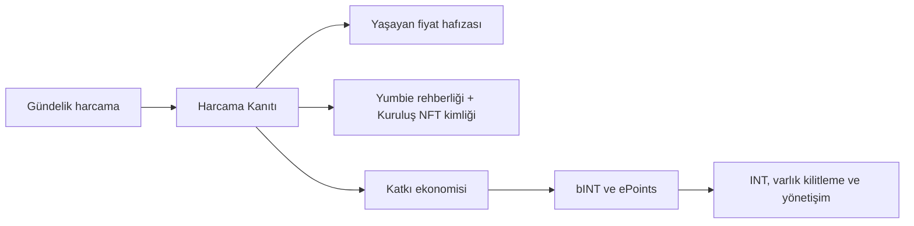

# [TR] Yumo Yumo Whitepaper

> **Geçersiz.** Vision Paper manifestosu artık `/vision` altında yaşar. Tokenomics içeriği Technical Paper §04'e taşınmıştır. Bu dizindeki dosyaları düzenlemeyin; değişiklikleri `content/technical-paper/` içinde yapın.

## Açılış

Yumo Yumo, kişisel finansı gün sonu özetlerinden çıkarıp hayatın kendi ritmiyle birlikte okuyan bir finansal işletim sistemi kurar. Markete uğrama kararı, yaklaşan fatura, sık alınan bir ürünün sessizce pahalanması, ev içi düzenin ihtiyaçları, yolculuk hazırlığı ve küçük tekrarlar bu sistemin ana verisini oluşturur. Yumo bu akışı Harcama Kanıtı, yaşayan fiyat hafızası, Yumbie rehberliği ve açık ekonomi katmanlarıyla bir araya getirir.

Bu yapı kullanıcıya iki yönde değer taşır. İlk yönde kişi kendi harcama geçmişini daha derin bir bağlamla görür; ürün, mağaza, zaman, sepet ve tekrar ilişkileri görünür hale gelir. İkinci yönde aynı akış bir katkı ekonomisine dönüşür; güvenilir veri üreten kullanıcı, bu katkının ekonomik karşılığını bINT ve INT mimarisi üzerinden görür. Böylece ürün deneyimi ile ekonomik koordinasyon aynı omurgada buluşur.

Yumbie bu omurganın kullanıcı yüzündeki rehberidir. Harcama hafızasını sıcak, anlaşılır ve zamanlaması doğru bir yönlendirmeye çevirir. Hangi artışın önemli olduğunu, hangi alışveriş deseninin hane ritmiyle bağlantı kurduğunu, hangi fırsatın o gün için anlamlı olduğunu görünür kılar. Bu sayede dokümanın merkezine yaşayan bir finans ilişkisi yerleşir.

Web3 katmanı bu hikâyeye daha uzun ömürlü bir zemin ekler. Seçili dışa aktarma paketleri kullanıcıyla birlikte taşınabilir, ekonomik kurallar daha görünür hale gelir, katkı hafızası zincir üstü koordinasyonla buluşur ve fiyat hafızası tek bir şirket veritabanının sınırlarını aşan bir süreklilik kazanır. Fiş görselleri cihazda başlar ve doğrulama sırasında kısa ömürlü, şifreli sistem işleme katmanından geçebilir; kalıcı ürün mantığı ise yapılandırılmış ve anonimleştirilmiş türevlerle çalışır. Kullanıcı, istediği anda sistemdeki kişisel verisini silebilir, yapılandırılmış geçmişini dışa aktarabilir ve seçili özetleri zincir üstü sahiplik iziyle doğrulayabilir.

Bugünün kişisel finans ürünleri çoğu zaman işlemleri sınıflandırır, aylık özet çıkarır ve tasarruf hedefi gösterir. Yumo Yumo daha geniş bir alanı hedefler. Aynı ürünün aylar içindeki fiyat yolculuğu, aynı hanenin tekrar eden ihtiyaçları, mağaza tercihinin zamanla değişmesi, yaklaşan fatura baskısı, sepet içindeki sessiz kaymalar ve katkı ekonomisine dönüşebilen veri üretimi tek bir sistem içinde birleşir. Bu nedenle whitepaper, bir uygulama deneyimini ve yeni bir finansal altyapının çalışma mantığını aynı bütün içinde açar.

Bu çerçeve kamusal okur ile yatırımcıyı aynı belge içinde buluşturur. Kamusal tarafta kullanıcı değerini, ürün yüzeylerini ve fiyat hafızasını görünür kılar. Yatırımcı tarafında ise açık ekonomi, parametre şeffaflığı, katkı kalitesi, veri sahipliği ve Web3 raylarının neden daha güçlü bir zemin sunduğunu açıklar. Yumo Yumo’nun iddiası, gündelik harcama verisini yalnızca izlenen bir geçmiş olmaktan çıkarıp yaşayan bir finans katmanına dönüştürmektir.

## Şirket ve Misyon

Yumo Yumo, Amerika Birleşik Devletleri'nin Delaware eyaletinde kurulu Yumo Yumo Inc. tarafından geliştirilir. Şirketin misyonu, gündelik harcama kanıtlarını kullanıcıya ait, anlaşılır ve taşınabilir bir finansal hafızaya dönüştürmek; bu hafızadan doğan anonimleştirilmiş fiyat ve sepet sinyallerini açık ekonomiyle kullanıcı katkısına bağlamaktır.

Yumo Yumo'nun vizyonu, gelişen pazarlardan başlayarak kişisel finansı statik raporlardan çıkarıp kanıtlanabilir harcama verisi, Yumbie rehberliği ve uzun ömürlü Web3 rayları üzerinde çalışan küresel bir finansal işletim sistemine dönüştürmektir.

Belgenin akışı sekiz bölümden oluşur. İlk bölüm kategori tezini ve zamanlamayı kurar. Ardından Harcama Kanıtı motoru ile fiyat hafızası açılır. Sonraki bölümler Yumbie ve ürün yüzeylerini, katkı ekonomisini, token tasarımını, Web3 katmanının taşıdığı kalıcılığı, veri egemenliğini ve kapanış tezini sırasıyla derinleştirir. Böylece kullanıcı tarafında hissedilen değer ile yatırımcı tarafında aranan mekanik açıklık tek bir mimari içinde okunur.
