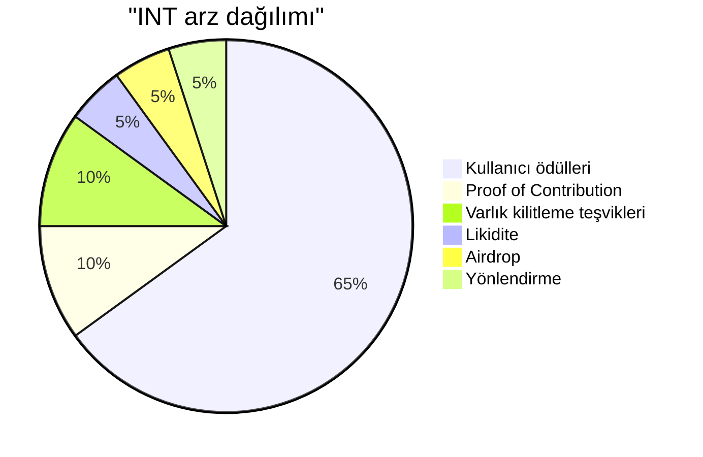
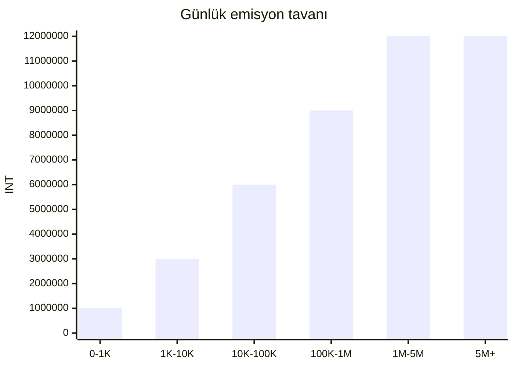
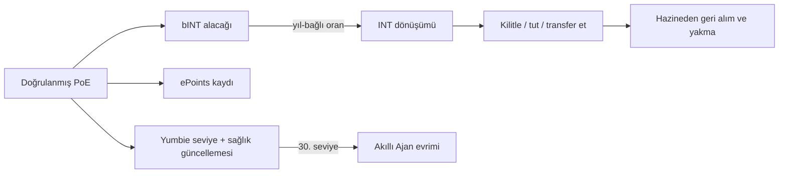

# Katkı Ekonomisi ve Token Tasarımı

Yumo Yumo'nun ekonomik omurgası, gündelik kullanım ile açık koordinasyon arasında katmanlı bir köprü kurar. Harcama Kanıtı, mağaza doğrulamaları, ürün iyileştirmeleri ve topluluk görevleri önce bINT katmanında muhasebeleşir. Bu katman katkının kalitesini, güvenini ve zaman içindeki sürekliliğini görünür kılar. INT katmanı daha açık ekonomik koordinasyonun, varlık kilitlemenin ve ilerleyen yönetişim yüzeylerinin taşıyıcısıdır. Bunların yanında ePoints her doğrulanmış fişin ortaya çıkardığı saklı maliyetin dolar bazlı kaydını tutar; Yumbie ise — kullanıcının taşınabilir dijital kimliği olan Kuruluş NFT'si — sistem içindeki yolculuğun görünen yüzüdür.

Bu ayrım önemlidir; çünkü katkı, değer ve kimlik farklı kapılardan akar. Sisteme değer katan kullanıcı önce bINT biriktirir. Zaman, elde tutma davranışı ve güven seviyesi bu birikimin INT tarafına nasıl geçeceğini belirler. Her doğrulanmış fiş aynı zamanda saklı maliyetin dolar ölçüsünü ePoints olarak kayda alır. Kullanıcının Yumbie'si bu yolculuğun görünür hafızasını taşır. Sonuç: düzenli ve güvenilir katılımı ödüllendiren, değeri uzun vadeli katkıyla hizalı tutan bir ekonomi.

## Token Katmanları

| Katman | Form | Devredilebilir mi? | Amacı |
| --- | --- | --- | --- |
| **INT** | Zincir üstü SPL token | Evet | Ekonomik koordinasyon, varlık kilitleme, ekosistem teşvikleri |
| **bINT** | Zincir üstü, devredilemez (donmuş ATA) | Hayır — kullanıcı isteğiyle INT'e dönüşür | Katkı muhasebesi; iş ile ödül arasındaki yumuşak katman |
| **ePoints** | Zincir üstü, devredilemez (donmuş ATA) | Hayır | Her doğrulanmış fişte ortaya çıkan saklı maliyetin dolar bazlı kaydı |
| **Kuruluş NFT'si (Yumbie)** | Token-2022 NonTransferable | Hayır | Kalıcı dijital kimlik; kullanıcıyla birlikte gelişen görsel yoldaş |

bINT ve ePoints aynı fişten iki farklı sinyal yakalar. bINT, Yumo ekonomisi içindeki katkı yoğunluğunu ölçer. ePoints, kullanıcıya geri verilen saklı maliyet kavrayışının dolar değerini ölçer. Birbirlerinin yerine geçmezler ve farklı mantıkla dönüşürler.

## INT Dağılımı

Toplam INT arzı 99 milyar ile sınırlıdır. Altı hat birlikte arzın yüzde yüzünü oluşturur; bu haritanın dışında ayrı bir ekip allocation'ı yoktur. Yüzde 65 kullanıcı ödüllerine ayrılır. Yüzde 10'luk bölüm Proof of Contribution hattını besler; burada **çekirdek ekip ve dış katkıcılar** ürettikleri işin ve yarattıkları etkinin karşılığında ödül alır — ekibin bağımsız bir allocation'ı yoktur ve kullanıcı katılımını yöneten katkı mantığıyla aynı yoldan kazanır. Yüzde 10'luk varlık kilitleme teşviki uzun vadeli katılımı güçlendirir. Kalan bölüm likidite, airdrop ve yönlendirme akışlarına dağılır.

| Temel gösterge | Değer |
| --- | --- |
| Toplam INT arzı | 99,000,000,000 |
| Ondalık basamak | 6 |
| Kullanıcı ödül ufku | 15 yıl |
| Günlük tepe emisyon havuzu | 12,000,000 INT |
| İlk yıl baz dönüşüm oranı | 1 bINT = 5 INT |
| 10. yıl baz dönüşüm oranı | 1 bINT = 1 INT |
| Kullanıcı başına günlük bINT tavanı | 1.000 bINT (etkin tavan seviye ve sağlık puanına göre ölçeklenir) |
| Varlık kilitleme teşvik ufku | 5 yıl |
| Ekip ödül hattı | Proof of Contribution üzerinden, yapılan işin etkisine göre |

## Kullanıcı Ödülleri Emisyonu

Kullanıcı Ödülleri hattı akıllı sözleşmede sabitlenmiş parametrelerle ilerler. Aylık aktif kullanıcı ölçeği büyüdükçe günlük havuz basamaklı şekilde genişler ve tepe değerde 12 milyon INT'e ulaşır. Dönüşüm eğrisi zaman içinde aşağı yönlüdür; erken katkı daha yüksek baz oranla başlar, sonraki yıllar daha dengeli bir ekonomik dağılıma oturur. Bu parametreler bugünkü aşamada şeffaf ve öngörülebilir bir ekonomik omurga sunar. Yönetişim olgunlaştıkça topluluk süreçleri bu alanlarda daha geniş rol alabilir.

Baz dönüşüm eğrisi zamanla aşağı yönlü ilerler. İlk yılda `1 bINT = 5 INT` ile başlayan hat, onuncu yılda `1 bINT = 1 INT` düzeyine gelir ve uzun vadeli katkıyı daha dengeli bir ekonomik çerçeveye taşır.

Kullanıcı başına günlük bINT tavanı sistemi yoğunlaşmadan ve spam'dan korur. Sert tavan kullanıcı başına günde 1.000 bINT'tir. Bir kullanıcının fiilen ulaştığı etkin tavan, kendi seviyesinin (kümülatif katkı) ve sağlık puanının (yakın dönem katkı kalitesi) bileşkesidir. Yeni kullanıcılar tavanın çok altından başlar; sürekli ve yüksek kaliteli katkıcılar zaman içinde tavana yaklaşır. Bu yapı katkıyı kalite, güven ve zamanla birlikte ağırlık kazandığı için spam baskısını zayıflatır.

## Varlık Kilitleme Tasarımı

Varlık kilitleme teşvikleri beş yıllık bir ufukta dağıtılır. INT sahipleri tokenlerini altı kademe içinden birine kilitler; daha uzun kilit oransal olarak daha yüksek ödül kazanır.

| Kilit süresi | APR çarpanı | Gösterge APR |
| --- | --- | --- |
| 7 gün | 1,0× | ~35% |
| 14 gün | 1,5× | ~50% |
| 21 gün | 2,0× | ~70% |
| 30 gün | 2,5× | ~85% |
| 60 gün | 4,0× | ~140% |
| 90 gün | 6,0× | ~210% |

APR rakamları ağ genelinde toplam kilitli miktarla birlikte ölçeklenir ve sabit bir vaat değildir. Ödüller sürekli birikir ve ana paranın kilidi açılmadan herhangi bir anda çekilebilir. Ana para ancak seçilen kilit süresi dolduktan sonra çekilebilir. Varlık kilitleme, Token Üretim Etkinliği'nden (TGE) bir hafta sonra açılır; böylece ilk fiyat keşfi penceresi tamamlandıktan sonra talep tarafı devreye girer.

## Likidite

Toplam arzın yüzde 5'i zincir üstü likidite için ayrılır. Bu pay iki farklı rolü olan iki katmana bölünür.

| Katman | Miktar | Rol |
| --- | --- | --- |
| **Başlangıç likiditesi** | 1.000.000.000 INT | TGE'de tek-taraflı bir likidite önyükleme havuzunda zincir üstü piyasayı tohumlar. LP pozisyonu 12 ay kilitlidir. |
| **Rezerv likidite** | 3.950.000.000 INT | Topluluk yönetimindeki konuşlandırmalar için rezervde tutulur. Canlı havuzdaki INT bakiyesi belirli bir eşiğin altına düştüğünde fiyat keşfini yukarı uzatmak veya oynaklık dönemlerinde derinliği desteklemek için devreye alınabilir. |

Bu ayrım, lansman piyasasını gerçek fiyat keşfine yetecek kadar ince tutarken sonraki aşamalarda topluluk kararıyla aktive edilebilecek bir savunma kasası bırakır.

## Geri Alım ve Yakma

Veri ürünü işi ve operasyonel artıdan gelen hazine girişleri INT geri alım ve yakma hattını besler. Bu mekanizmanın ilk sürümü çoklu-imza cüzdan + 24-48 saat zaman kilidi + halka açık rezerv ve yakma göstergesi ile manuel çalışır. Sonraki sürümler, varlık kilitleme ve kimlik yüzeyleri olgunlaştıkça karar süreçlerini topluluk yönetişimine devreder. Her sürümde gerçekleştirilen yakma kesin ve zincir üstüdür; ardından yeniden basım yapılmaz.

## Kuruluş NFT'si — Yumbie

Her kullanıcı ilk doğrulanmış Harcama Kanıtı ve cüzdan bağlantısının ardından bir Kuruluş NFT'si — Yumbie — alır. NFT yalnızca işlem ücreti karşılığında basılır ve devredilemez. Kullanıcının Yumo içindeki kalıcı kimliğidir; seviyesi, ruh hâli ve geçmişi bu NFT üzerinde görünür biçimde taşınır.

Kullanıcı 30. seviyeye ulaştığında Yumbie, Kuruluş formundan Akıllı Ajan'a evrilir. Kuruluş formu, katkının başlangıcını simgeleyen tanıdık sarı fiş silüetini taşır. Akıllı Ajan formu, sistem içinde edinilmiş duruşu işaret eden, antetli kağıda yakın daha resmi bir görünüm alır. Evrim tek yönlüdür; zincir üstündeki NFT aynı varlık olarak kalır.

## TGE Öncesi Muhasebe

Token Üretim Etkinliği'nden önce platform katkıyı cPoints adlı kapalı sistemli bir itibar ölçüsüyle izler. cPoints yalnızca TGE öncesi aşamada vardır. TGE anında başlangıç airdrop ve onboarding ağırlıklarını besler, ardından kullanım dışı kalır. TGE sonrasında bINT ve ePoints katmanları daha güçlü katkı semantiği ve zincir üstü muhasebe ile cPoints'in rolünü devralır.

## Katmanlar Nasıl Birleşir

Doğrulanmış her fiş aynı anda bINT katmanına katkı, ePoints katmanına saklı maliyet kavrayışı ve Yumbie'ye kimlik ilerlemesi yazar. bINT'ten INT'e dönüşüm, erken katılımı kayıran ve zamanla dengelenen bir oranla değeri katkı katmanından ekonomik katmana taşır. Varlık kilitleme uzun vadeli tutuculara değer geri verir. Hazine yönetimindeki geri alım ve yakma, gerçek platform gelirini token kıtlığına bağlayarak döngüyü kapatır.

Bu yapı spam baskısını zayıflatır; çünkü katkı kalite, güven ve zamanla birlikte değer kazanır. Güçlü kullanıcıları ve düzenli emek veren katkıcıları öne çıkarır; çünkü ağ yüzeysel hacimle değil, tarihsel değeri olan sürekli katkıyla zenginleşir. Token tasarımı bu nedenle ürünün hafıza, fiyat ve rehberlik omurgasının ekonomik karşılığını kurar.
