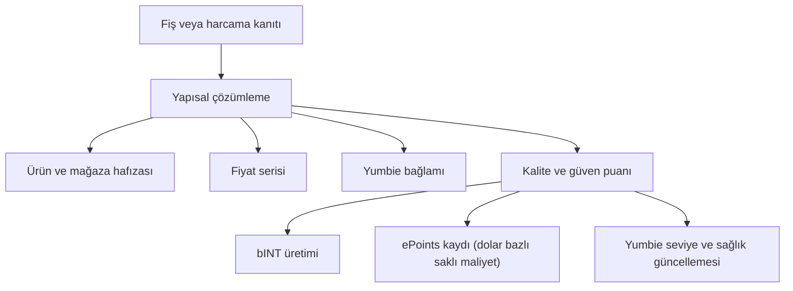

# Harcama Kanıtı ve Fiyat Hafızası

Harcama Kanıtı, Yumo Yumo’nun ana motorudur. Bir fiş ya da başka bir harcama kanıtı sisteme girdiğinde tek bir kayıt oluşmaz; aynı anda kişisel hafıza, fiyat serisi, rehberlik bağlamı ve katkı ekonomisi için yeni katmanlar açılır. Bu yüzden Harcama Kanıtı, ürünün hem kullanıcı tarafını hem de açık ekonomi tarafını aynı anda besleyen çekirdek yapıdır.

Bir kayıt ilk aşamada mağaza, zaman, toplam tutar, ürün satırları, sepet kompozisyonu ve bağlam sinyalleri gibi alanlara ayrılır. Bu çözümleme kullanıcıya sonradan dönüp bakabileceği temiz bir hafıza sunar. Aynı ürün ya da aynı mağaza zaman içinde yeniden göründükçe sistem fiyat hafızasını uzatır, sepet kalıplarını belirginleştirir ve Yumbie’nin önceliklendirme kabiliyetini keskinleştirir. Aynı kayıt, kalite ve güven katmanlarından geçerek bINT üretimine katkı verdiğinde ekonomik anlam da kazanır.

Harcama Kanıtı’nın gücü, tek bir fişi çoklu çıktıya dönüştürmesinden gelir. Ürün hafızası hangi kalemlerin tekrar ettiğini görür. Mağaza hafızası tercih desenini okur. Zaman damgası gündelik ritmi açar. Fiyat serisi ise değişimin yönünü takip eder. Böylece kayıt, yalnızca “ne kadar ödendi” bilgisini taşımaz; “neye, ne zaman, hangi koşul içinde ve zaman içinde nasıl değişerek ödendi” bilgisini görünür hale getirir.

Kalite katmanı burada belirleyici rol oynar. Okunabilirlik, toplam ile satırların uyumu, mağaza ve zaman ilişkisinin doğallığı, tekrar örüntüsü ve genel güven sinyalleri birlikte değerlendirilir. Güçlü kayıt hem hafızaya hem fiyat serisine hem de ekonomik hatta daha yüksek değer taşır. Böylece ağ, dikkat toplamaya dayalı yüzeysel hareketlerden çok, tarihsel değeri olan düzenli katkıyı öne çıkarır.

## Teknik Mimari

Harcama Kanıtı hattı ürünün teknik omurgasını da görünür kılar. Akış, belge yakalama ile başlar; görsel boyutu ve okunabilirliği optimize edilir. Ardından belge çözümleme katmanı mağaza, satır, toplam, zaman ve vergi gibi alanları çıkarır. Sonraki katmanda ürün ve mağaza çözümleme motoru kayıtları daha kalıcı kimliklere bağlar. Fiyat serisi katmanı bu kayıtları zaman içinde dizerek yaşayan hafızayı kurar. Rehberlik katmanı ise aynı kaydı Yumbie için anlamlı önceliklere dönüştürür. Ekonomik katman da kalite ve güven değerlendirmesini alıp katkı akışına bağlar.

Bu mimari sayesinde tek bir fiş aynı anda hafıza, fiyat, rehberlik ve ekonomi için paralel sonuçlar doğurur. Teknik açıdan bakıldığında bu, ürünün çekirdeğinde çok katmanlı bir işleme hattı olduğu anlamına gelir. Whitepaper açısından bu nokta önemlidir; çünkü Yumo’nun değeri aynı verinin farklı katmanlarda yeniden işlenebilmesinden ve her katmanın birbirini beslemesinden gelir.

Fiyat hafızası, Harcama Kanıtı’nın kullanıcı tarafındaki en güçlü kazanımlarından biridir. Kullanıcı aynı ürünü ya da aynı hizmeti aylar boyunca sisteme taşıdıkça ortaya kişisel bir fiyat arşivi çıkar. Bu arşiv, bir ürünün marketten markete nasıl farklılaştığını, hangi dönemde hızla pahalandığını, hangi kalemlerin daha istikrarlı seyrettiğini ve sepet baskısının hangi alanlarda yoğunlaştığını görünür kılar. Bu görünürlük ileride daha geniş karşılaştırma yüzeyleri ve topluluk kaynaklı fiyat haritaları için de zemin hazırlar.

| Aynı kayıt ne üretir? | Kullanıcı tarafındaki etkisi | Ağ tarafındaki etkisi |
| --- | --- | --- |
| Yapılandırılmış fiş hafızası | Geçmişe anlamlı dönüş | Veri kalitesinin yükselmesi |
| Ürün ve mağaza zaman serisi | Fiyat değişimini daha rahat izleme | Daha güçlü kolektif fiyat hafızası |
| Yumbie bağlamı | Zamanlaması doğru yönlendirme | Daha iyi kişiselleştirme |
| Katkı sinyali (bINT) | INT dönüşümüne yumuşak kredi | Açık ekonominin büyümesi |
| Saklı maliyet kaydı (ePoints) | Harcama baskısının dolar bazlı izi | İleride token dağıtımlarında ağırlık |
| Kimlik ilerlemesi | Yumbie seviyesi ve sağlığı ilerler | Daha güçlü uzun vadeli katkıcı tabanı |

Örneğin aynı aile üç ay boyunca aynı marketten süt, kahve ve çocuk bezi aldığında sistem her yeni fişle yalnızca yeni satırlar eklemez. Çocuk bezindeki artışı fark eder, kahvede mağaza değişiminin etkisini ölçer, sepet içindeki birlikte alınan kalıpları güçlendirir ve hane ritmini daha net okur. Bu süreç sonunda kullanıcı daha doğru rehberlik alırken, ağ da tarihsel değeri olan daha kaliteli veriyle büyür.

Bu noktada Harcama Kanıtı, ürünün teknik tarafıyla ekonomik tarafı arasında gerçek bir köprü kurar. Belge çözümleme güçlü olduğunda hafıza daha doğru büyür. Hafıza doğru büyüdüğünde fiyat hafızası ve Yumbie rehberliği daha anlamlı hale gelir. Aynı doğruluk katkı ekonomisinde de daha sağlıklı bir ödül dağılımı yaratır. Bu zincirleme etki, Yumo’nun geniş whitepaper çerçevesinde teknik mimari ile kullanıcı değeri arasında doğrudan bağ kurmasını sağlar.
