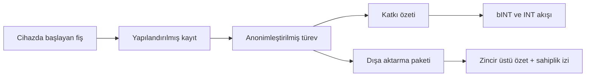

# Web3’ün Kattığı Değer

Yumo Yumo’nun Web3 yaklaşımı ödül dağıtımından daha geniş bir değer üretir. Asıl katkı, finansal hafızanın, kullanıcı sahipliğinin ve ekonomik kuralların daha kalıcı ve daha görünür raylara taşınmasıdır. Harcama hafızası büyüdükçe ürünün kullanıcıya sunduğu değer artar; Web3 katmanı bu değerin taşınabilirliğini, dayanıklılığını ve toplulukla birlikte gelişen ekonomik tarafını güçlendirir.

Kapalı puan sistemlerinde kullanıcı katkısı uygulamanın sınırları içinde kalır. Yumo’nun yaklaşımında ise seçili dışa aktarma paketleri kullanıcıyla birlikte hareket edebilir, katkı geçmişi daha açık kurallarla ekonomik hatta bağlanır ve fiyat hafızası daha uzun ömürlü bir koordinasyon alanı kazanır. Bu fark, sistemin hem kullanıcı gözünde hem de topluluk gözünde daha güvenilir bir altyapı gibi algılanmasını sağlar.

Solana seçimi bu vizyonun pratik gereksinimlerine uyum gösterir. Sık işlem akışı, kullanıcı dostu maliyetler ve olgun araç ekosistemi, bINT üretimi, INT koordinasyonu, varlık kilitleme ve ilerleyen yönetişim süreçleri için uygun bir zemin sunar. Böylece kullanıcı deneyimi akıcı kalırken zincir üstü katman sessizce çalışan ama uzun vadeli değeri taşıyan bir altyapı rolü üstlenir.

Web3’ün fiyat hafızasına katkısı özellikle güçlüdür. Aynı ürün ve hizmetler yıllar boyunca kaydedildiğinde ortaya çıkan seriler, kişisel bir arşiv olmanın ötesine geçer. Bu seriler seçili dışa aktarma paketleri halinde kullanıcıyla birlikte taşınabilir, zincir üstü özetler üzerinden sahiplik iziyle güçlenebilir ve daha geniş ekonomik yüzeylerde anlam kazanabilir. Böylece fiyat hafızası tek bir uygulama geçmişi olmaktan çıkar, kullanıcı tarafından taşınabilen bir ekonomik belleğe dönüşür.

| Açık rayların sağladığı alan | Kullanıcıya etkisi | Ağa etkisi |
| --- | --- | --- |
| Taşınabilir katkı geçmişi | Verinin kullanıcıyla birlikte hareket etmesi | Daha görünür ekonomik kurallar |
| Seçili zincir üstü özetler ve commitment'lar | Sahiplik izinin güçlenmesi | Daha dayanıklı açık ekonomi |
| Toplulukla büyüyen yönetişim | Kararlara zamanla daha fazla temas | Parametrelerin olgunlaşması |
| Kalıcı fiyat hafızası | Uzun vadeli ekonomik berraklık | Daha güçlü kolektif veri ağı |

Bu nedenle Yumo Yumo, zincir üstü katmanı kullanıcı egemenliğini, fiyat hafızasını ve ekonomik sürekliliği büyüten temel raylardan biri olarak kurar. Web3 burada görünen ürün yüzeyinin altında çalışan kalıcı bir taşıyıcı rolü üstlenir.

## Neden Web2 Rayları Yetmiyor

Kapalı veri katmanları ürünleri hızlı başlatabilir, ancak uzun vadede kullanıcı sahipliği, ekonomik şeffaflık ve taşınabilirlik açısından sınırlı kalır. Yumo’nun seçtiği yol, katkı mantığını, dönüşüm akışını ve seçili özetlerini daha açık raylara taşır. Böylece ekonomik kurallar yalnızca şirket içi kontrol alanında kalmaz; topluluk tarafından görülebilen, zamanla gelişebilen ve kullanıcıyla birlikte hareket edebilen bir yapıya kavuşur.

Bu fark özellikle fiyat hafızasında belirginleşir. Kişisel ekonomik geçmişin yıllar içinde kurduğu veri değeri, uygulama içi geçmişten taşınabilir ekonomik belleğe dönüştüğünde daha uzun ömürlü hale gelir. Zincir üstü sahiplik izi ve dışa taşınabilir paket mantığı bu sürekliliği güçlendirir. Böylece Web3, Yumo için kalıcılık, taşınabilirlik ve kullanıcı egemenliği rayına dönüşür.
