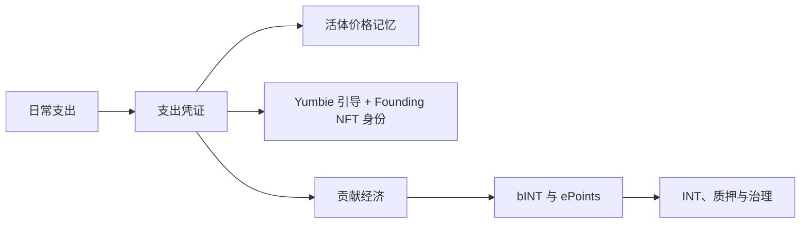

# [CN] Yumo Yumo Whitepaper

> **Superseded.** The Vision Paper manifesto now lives at `/vision`. Tokenomics content has moved to Technical Paper §04. Do not edit files in this directory; make changes in `content/technical-paper/` instead.

## 开篇

Yumo Yumo 正在构建一套个人财务操作系统，它通过生活本身的节奏来理解金钱。一次去超市的临时采购、一张即将到期的账单、一个安静上涨的常买商品、家庭日常所需、旅行准备，以及日复一日的小决策，都会在系统里变成结构化信号。Yumo 通过支出凭证、活体价格记忆、Yumbie 引导层以及开放式贡献经济，把这些信号收拢到同一条主线上。

这套结构会同时向两个方向创造价值。一方面，用户能够以更丰富的语境看见自己的财务历史；商品、商户、时间、购物篮结构以及重复模式都会进入同一层活体记忆。另一方面，同样的流动会转化为经济参与；持续产出高质量数据的用户，可以通过 bINT 与 INT 架构看到自己贡献的经济回报。产品体验与经济协调因此在同一条骨架上共同生长。

Yumbie 是这条骨架的可见向导。它把财务记忆转化为温暖、清晰、时机准确的陪伴式引导。它会指出哪一次涨价真正重要，哪一种购物模式与家庭节奏相关，哪一个机会在今天值得行动。因此，这份文档的中心会自然落在一种与个人财务持续共处的关系上。

Web3 层为这套叙事补上一条更长久的轨道。选定的数据包可以跟随用户迁移，经济规则更容易被看见，贡献记忆可以连接到链上协调，价格记忆也获得超越单一公司数据库的连续性。原始小票图片保留在用户设备中；系统侧处理的是结构化、匿名化后的衍生数据。用户可以删除系统中的个人数据，导出结构化历史，并把选定的数据包带着所有权痕迹迁移到链上。

如今的大多数个人理财产品只是对交易进行分类、生成月度摘要，并展示储蓄目标。Yumo Yumo 瞄准的是更广阔的面。同一件商品在数月之间的价格走向、同一个家庭反复出现的需求、商户之间逐渐发生的迁移、临近账单带来的压力、购物篮里悄然发生的位移，以及可以转化为贡献经济的数据生产，全部汇入同一套系统。因此这份 whitepaper 在同一条主线上同时打开了应用层的使用体验和一种新型金融基础设施的运行逻辑。

这一框架让大众读者和投资者出现在同一份文档中。面向公众的一侧，它让用户价值、产品界面和价格记忆变得可见。面向投资者的一侧，它解释开放经济、参数透明、贡献质量、数据所有权，以及为什么 Web3 轨道能够提供更稳固的基础。Yumo Yumo 的论点，是让日常支出数据不再只是被观察的历史，而是一层活的金融。

这份 whitepaper 会沿着八个主线展开。它先建立新类别的论点，再解释支出凭证引擎与价格记忆，随后进入 Yumbie、产品界面、贡献经济、代币设计、Web3 所带来的价值、数据所有权，以及长期命题。目标是在同一个整体中同时呈现用户可感知的价值与投资者需要看到的机制清晰度。
