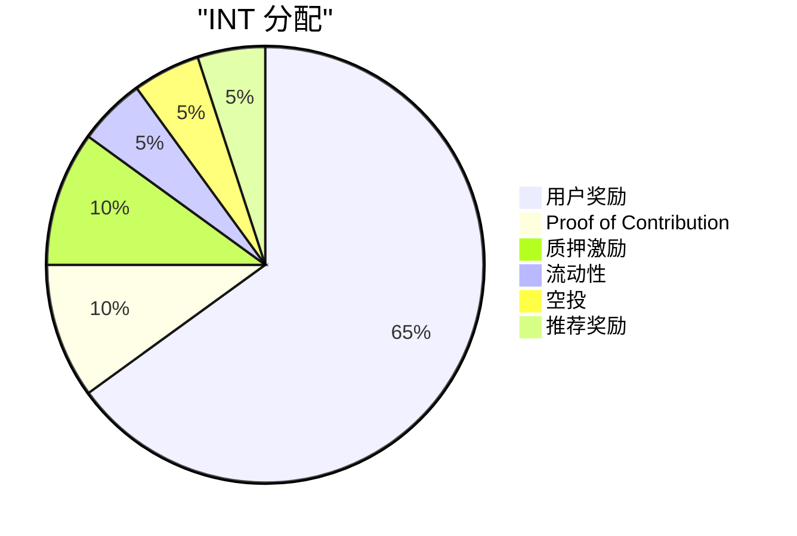
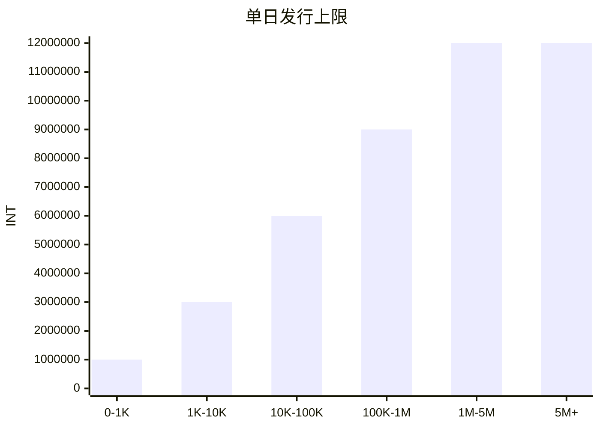
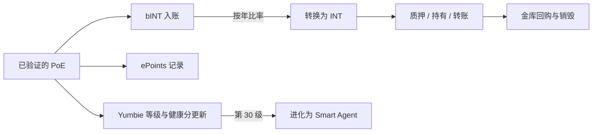

# 贡献经济与代币设计

Yumo Yumo 的经济骨架在日常使用与开放协调之间架起多层桥梁。支出凭证、商户验证、商品改进以及社区任务先沉淀到 bINT 层。这个层级让贡献的质量、信任与持续性变得可见。INT 层承载更广泛的经济协调、质押以及随时间成熟的治理界面。与此同时，ePoints 记录每张已验证票据所揭示的隐性成本的美元足迹；Founding NFT — Yumbie — 则在系统内锚定用户可携带的数字身份。

这种分层很重要，因为贡献、价值与身份各自走不同的门。为系统创造价值的用户先积累 bINT。时间、持有行为与信任决定这些余额如何走向 INT。每张已验证票据还会写入一条 ePoints 记录，捕捉所揭示的隐性成本的美元尺度。用户的 Yumbie 承载这段旅程的可见记忆。结果是一种奖励稳定且可信参与、并使价值与长期贡献保持一致的经济。

## 代币层级

| 层 | 形式 | 是否可转让 | 用途 |
| --- | --- | --- | --- |
| **INT** | 链上 SPL 代币 | 可转让 | 经济协调、质押、生态系统激励 |
| **bINT** | 链上、不可转让（冻结的 ATA） | 不可 — 由用户操作转换为 INT | 贡献记账；工作与奖励之间的柔性层 |
| **ePoints** | 链上、不可转让（冻结的 ATA） | 不可 | 每张已验证票据所揭示隐性成本的美元记录 |
| **Founding NFT（Yumbie）** | Token-2022 NonTransferable | 不可 | 持久的数字身份；与用户共同进化的视觉伙伴 |

bINT 与 ePoints 从同一张票据中捕捉两种不同的信号。bINT 衡量 Yumo 经济内部的贡献强度。ePoints 衡量返回给用户的隐性成本洞察的美元价值。两者从不互相覆盖，并通过不同的逻辑进行转换。

## INT 分配

INT 总供应量上限为 990 亿。65% 留作用户奖励。10% 注入 Proof of Contribution 通道，**核心团队与外部贡献者**根据所完成的工作和所产生的影响获得奖励。10% 支撑质押激励，强化长期参与。其余部分分配到流动性、空投与推荐奖励流。这一架构使团队经济与驱动用户参与的同一贡献逻辑保持对齐。

| 关键指标 | 数值 |
| --- | --- |
| INT 总供应量 | 99,000,000,000 |
| 小数位 | 6 |
| 用户奖励期限 | 15 年 |
| 单日发行池峰值 | 12,000,000 INT |
| 第 1 年基础转换比例 | 1 bINT = 5 INT |
| 第 10 年基础转换比例 | 1 bINT = 1 INT |
| 每用户每日 bINT 上限 | 1,000 bINT（实际上限依等级与健康分动态调整） |
| 质押激励期限 | 5 年 |
| 团队奖励通道 | 通过 Proof of Contribution，根据工作影响 |

## 用户奖励的发行

用户奖励通道运行在智能合约固定的参数之上。随着月活跃使用增长，每日发行池按阶梯扩展，并在峰值达到 1200 万 INT。转换曲线随时间下行：早期贡献从较高的基础比例开始，后期年份过渡到更均衡的分配形态。在现阶段，这些参数提供透明且可预测的经济骨架。随着治理成熟，社区流程可在未来的调整中承担更大角色。

基础转换曲线随时间下行。从第 1 年的 `1 bINT = 5 INT` 起步，到第 10 年达到 `1 bINT = 1 INT`，把长期贡献带入更均衡的经济框架。

每用户每日 bINT 上限保护系统免受集中化和垃圾刷量。硬上限为每用户每日 1,000 bINT。每个用户实际能达到的上限是其等级（累计贡献）与健康分（近期贡献质量）的函数。新用户起步远低于上限；持续且高质量的贡献者随时间接近上限。这一结构削弱垃圾刷量的压力，因为贡献只有在质量、信任与时间共同推进时才更有价值。

## 质押设计

质押激励在五年期限内释放。INT 持有者可在六个锁定档位中选择质押，锁定时间越长，获得的奖励按比例越高。

| 锁定期 | APR 权重 | 参考 APR |
| --- | --- | --- |
| 7 天 | 1.0× | ~35% |
| 14 天 | 1.5× | ~50% |
| 21 天 | 2.0× | ~70% |
| 30 天 | 2.5× | ~85% |
| 60 天 | 4.0× | ~140% |
| 90 天 | 6.0× | ~210% |

APR 数值随全网总质押规模动态调整，并非固定承诺。奖励持续累计，可在任意时刻领取，无需解锁本金。本金仅在所选锁定期结束后方可提取。质押在代币生成事件（TGE）一周后启动，让初期的价格发现窗口在需求侧激活之前完成。

## 流动性

总供应量的 5% 留作链上流动性。该分配分为两层，各自承担不同角色。

| 层 | 数量 | 角色 |
| --- | --- | --- |
| **初始流动性** | 1,000,000,000 INT | 在 TGE 通过单边流动性引导池为链上公开市场播种。LP 仓位锁定 12 个月。 |
| **储备流动性** | 3,950,000,000 INT | 储备用于社区治理下的部署。当活跃池中 INT 余额跌至设定阈值以下时，可激活以向上延展价格发现，或在波动期支撑深度。 |

这种分层使发行市场足够轻盈以实现真实的价格发现，同时保留一笔防御性储备，可在后续阶段通过社区决定激活。

## 回购与销毁

来自数据产品业务与运营盈余的金库收入，资助 INT 的回购与销毁通道。该机制的第一版通过多签钱包加 24-48 小时时间锁手动运行，并配备公开仪表板展示储备与销毁历史。随着质押与身份界面成熟，后续版本将决策权移交社区治理。每个版本中，已执行的销毁是最终且链上的；不会出现后续重新铸造。

## Founding NFT — Yumbie

每位用户在首次完成已验证的支出凭证并连接钱包之后会获得一个 Founding NFT — Yumbie。该 NFT 仅以 gas 成本铸造，且不可转让。它是用户在 Yumo 内部的持久身份，通过等级、心情与历史承载其旅程的可见记录。

当用户达到第 30 级时，Yumbie 从 Founding 形态进化为 Smart Agent。Founding 形态采用辨识度高的黄色票据轮廓，标志贡献的起点。Smart Agent 形态采用更正式、近似抬头信纸（letterhead）的呈现，象征在系统内已建立的地位。这种进化是单向的；底层 NFT 仍然是同一个链上资产。

## TGE 前的记账

在代币生成事件之前，平台通过 cPoints 跟踪贡献，这是一种封闭系统的声誉度量。cPoints 仅存在于 TGE 前阶段。它们为 TGE 时的初始空投与入驻权重提供信息，之后即被弃用。从 TGE 开始，bINT 与 ePoints 层以更强的贡献语义和链上记账取代 cPoints 的角色。

## 各层如何衔接

每张已验证票据同时把贡献写入 bINT、把隐性成本洞察写入 ePoints、把身份进展写入用户的 Yumbie。bINT 到 INT 的转换按有利于早期参与且随时间趋于平衡的比例，把价值从贡献层移到经济层。质押把价值回馈给长期持有者。由金库管理的回购与销毁通过把真实平台收入与代币稀缺性挂钩来闭合循环。

这一结构削弱垃圾刷量压力，因为贡献只有在质量、信任与时间共同推进时才更有价值。它眷顾强用户与稳定贡献者，因为网络通过具有历史价值的持续参与而非肤浅的量级增长。代币设计因此与产品论点不可分割；它是 Yumo 记忆、价格与引导引擎的经济表达。
