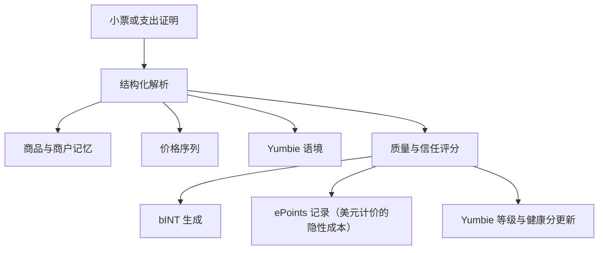

# 支出凭证引擎与价格记忆

支出凭证是 Yumo Yumo 的核心引擎。当一张小票或其他支出证明进入系统时，发生的并不只是“生成一条记录”。它会同时打开个人记忆、价格序列、引导语境以及贡献经济的新层次。因此，支出凭证既是产品用户侧的核心结构，也是开放经济侧的起点。

在第一阶段，一条记录会被拆解为商户、时间、总额、商品行、购物篮结构和周边语境信号。这样的结构化处理，给用户留下可以回看的清晰记忆层。随着同一商品或同一商户不断重复出现，系统会拉长价格记忆、强化购物篮模式，并提升 Yumbie 对优先级的判断能力。同一条记录还会经过质量与信任层，再参与 bINT 的生成，从而获得经济意义。

支出凭证的力量，在于把一张小票变成多个输出。商品记忆帮助系统看见什么在重复，商户记忆揭示偏好模式，时间戳打开日常节奏，价格序列则记录变化方向。这样一来，系统回答的已经不只是“花了多少钱”，而是“为哪些东西、在什么时候、在什么情境下花了钱，以及这些成本如何随时间发生变化”。

质量层在这里起到决定性作用。可读性、总额与明细的一致性、商户与时间关系的自然性、重复模式以及更广义的信任信号会被一起评估。更强的记录会为记忆、价格序列和经济轨道带来更高价值。这样一来，网络会把更多价值放在具有时间深度的真实贡献之上。

价格记忆是支出凭证带给用户最直观的收益之一。当用户在数月内不断把同样的商品或服务带入系统时，就会形成一份个人化的价格档案。这份档案展示同一商品在不同商户之间如何变化，哪类商品在何时加速上涨，哪些项目更稳定，以及购物篮压力集中在什么地方。随着时间推移，这种可见性也会为更丰富的比较界面和社区价格地图奠定基础。

| 一条记录会产生什么 | 用户侧影响 | 网络侧影响 |
| --- | --- | --- |
| 结构化小票记忆 | 更有意义地回看过去 | 更高的数据质量 |
| 商品与商户时间序列 | 更清楚地追踪价格变化 | 更强的集体价格记忆 |
| Yumbie 语境 | 更准确的时机引导 | 更好的个性化 |
| 贡献信号（bINT） | 朝向 INT 转换的软信用 | 开放经济增长 |
| 隐性成本记录（ePoints） | 美元计价的支出压力轨迹 | 未来代币分配中的权重 |
| 身份进展 | Yumbie 等级与健康分向前推进 | 更稳固的长期贡献者基础 |

例如，一个家庭连续三个月都在同一家超市购买牛奶、咖啡和纸尿裤，系统并不会只是简单追加新明细。它会识别纸尿裤的涨价、衡量更换商户对咖啡价格的影响、强化这些商品的联购模式，并更准确地读出家庭节奏。用户因此得到更有用的引导，网络则通过更干净、更具历史价值的数据持续成长。
