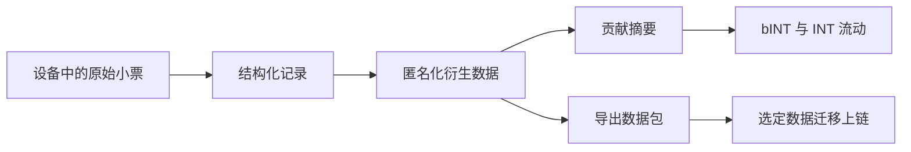

# Web3 带来的价值

Yumo Yumo 的 Web3 路径所创造的价值远不止奖励分发。它最深的作用，在于把财务记忆、用户所有权以及经济规则放到更持久、更容易被看见的轨道上。随着支出记忆不断增长，产品对用户的价值也会提高；Web3 层则强化这种价值的可携带性、贡献历史的持续性，以及围绕它建立起来的开放经济界面。

在封闭积分系统里，贡献会被锁在应用边界之内。而在 Yumo 的路径里，选定的数据包可以跟随用户迁移，贡献历史可以连接到更可见的经济规则，价格记忆也能生活在一个更长期的协调空间中。这种变化让系统看起来不再像一台封闭的激励机器，而更像一条可持续的金融轨道。

Solana 与这种愿景的实际需求高度契合。高频互动、友好的成本与成熟的生态，支撑着 bINT 的生成、INT 的协调、质押以及更后续的治理流程。用户可见体验保持轻盈熟悉，链上基础设施则在下方承接长期连续性。

Web3 还为价格记忆提供了更强的长期形态。当同样的商品与服务被持续记录多年时，形成的序列已经不只是个人档案。它们可以作为选定数据包跟随用户迁移，带着所有权痕迹存在，并在更广阔的经济界面中获得意义。这样一来，价格记忆就从应用内部历史，转变为一种可携带的经济记忆。

| 开放轨道带来的能力 | 用户侧效果 | 网络侧效果 |
| --- | --- | --- |
| 可携带的贡献历史 | 数据可跟随用户移动 | 经济规则更可见 |
| 选定数据包上链 | 所有权痕迹更强 | 开放经济更耐久 |
| 随时间扩展的治理 | 用户与决策的连接更深 | 参数与社区共同成熟 |
| 持续存在的价格记忆 | 更长周期的财务清晰度 | 更强的集体数据基础设施 |

因此，Yumo 会把 Web3 放在强化所有权、价格记忆与经济连续性的核心轨道之一。它在可见体验中保持安静，却承接着整套系统的长期重量。
