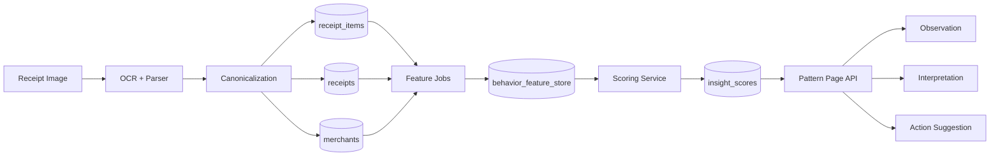
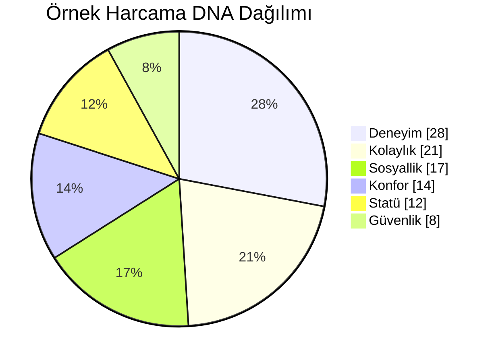
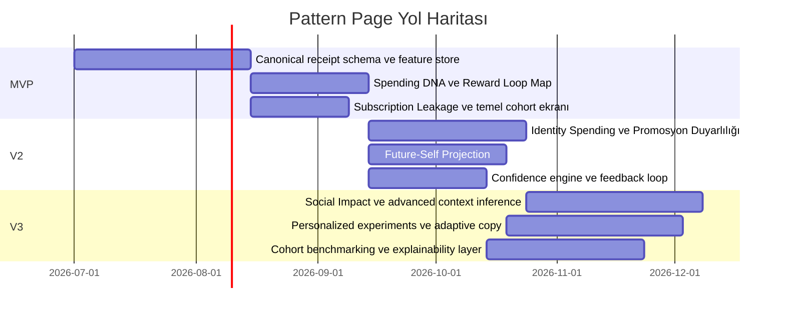

# Yumo Yumo Pattern Page Araştırma Raporu

## Yönetici Özeti

Yumo Yumo’nun Pattern Page’i, klasik “harcama kategorileri” ekranı olmamalı; onu güçlü kılacak şey, fiş seviyesindeki satır verilerinden **davranışsal neden-sonuç katmanı** üretmesi olacaktır. Mevcut finans uygulamalarının büyük çoğunluğu kullanıcıya “paran nereye gitti?” sorusuna kategori, merchant ve dönem bazlı cevap verirken; Yumo Yumo, OCR ile çıkarılmış satır kalemleri, zaman, lokasyon, tekrar, marka, indirim ve sepet kompozisyonu üzerinden “neden böyle harcıyorsun?” sorusuna daha yakın cevaplar üretebilir. Bu, davranışsal ekonomi, tüketici psikolojisi ve reklam etkileri literatürüyle uyumludur; ancak kullanıcıya **klinik/psikolojik teşhis** koymadan, “gözlenen davranış örüntüsü” dilinde anlatılmalıdır. citeturn20view5turn20view1turn20view0turn20view3turn20view2turn20view6

Literatür, ani satın alma davranışının duygusal dürtü, düşük öz-denetim, “pain of paying” mekanizması, zihinsel muhasebe, sosyal etki, kimlik sinyallemesi ve reklam/promo tetikleyicileriyle ilişkilendiğini gösteriyor. Buna karşılık, “dopamin”, “stres” veya “FOMO” gibi kavramları fiş verisinden doğrudan ölçülmüş biyolojik gerçekler gibi sunmak bilimsel olarak aşırı iddialı olur. Doğru ürün tavrı şudur: bu kavramlar **iç ürün dilinde** kullanılabilir; fakat kullanıcı yüzünde “Ödül Döngüsü Haritası”, “Kolaylık Kayması”, “Promosyon Duyarlılığı” gibi daha ihtiyatlı etik etiketler tercih edilmelidir. citeturn22view0turn22view1turn22view2turn22view8turn22view9turn22view10turn24view3

Rekabet tarafında Monzo ve Revolut güçlü analitik görünürlük; YNAB güçlü bilinçli bütçeleme; Rocket Money güçlü abonelik sızıntısı; Cleo güçlü kişilikli/konuşma tabanlı yönlendirme; Mint ise tarihsel olarak kategori ve aylık içgörü kalıbı sağlıyor. Ancak bu ürünlerin resmî olarak belgelenmiş alanlarında, **satır kalemi düzeyi receipt-OCR tabanlı davranış çıkarımı** öne çıkan bir model değil. Bu boşluk, Yumo Yumo’nun en güçlü ürün pozisyonudur. Bu raporun ana önerisi şudur: Pattern Page üç katmanlı olmalıdır — **gözlem**, **yorum**, **eylem**. Önce veri gösterilmeli, sonra olasılıklı içgörü verilmeli, en sonunda küçük fakat uygulanabilir bir hareket önerilmelidir. citeturn20view0turn20view1turn20view2turn20view3turn20view4turn20view5turn20view7turn20view6

## Araştırma Soruları ve İnceleme Çerçevesi

Bu proje için en kritik araştırma soruları şunlardır: fiş verisinden davranış çıkarmada hangi psikoloji ve davranışsal ekonomi kavramları gerçekten kullanılabilir; bu kavramlar hangi feature’larla güvenilir biçimde temsil edilebilir; mevcut finans uygulamaları hangi UX formlarını iyi yapıyor ve nerede yetersiz kalıyor; kullanıcıya hangi içgörüler açıklayıcı gelirken hangi dil rahatsız edici, paternalist veya manipülatif görünür; ve en önemlisi, bu sayfa nasıl hem “vay canına” etkisi üretir hem de tasarrufu artıran gerçek davranış değişimine bağlanır. Bu raporda bu sorular, birincil akademik kaynaklar, resmî ürün sayfaları/help merkezleri ve resmî uygulama açıklamaları üzerinden incelendi. Eksik yerlerde açıkça “heuristic” etiketi kullanıldı; yani literatürden ilham alan ama ürün içinde ayrıca doğrulanması gereken çıkarımlar ayrı işaretlendi. citeturn22view0turn22view1turn22view6turn22view7turn20view0turn20view1turn20view2turn20view3turn20view4turn20view6

Bu raporda aşağıdaki etiketleme kullanılıyor. **Kanıt-destekli** ifadesi, kavramın doğrudan literatürde yer aldığı anlamına gelir. **Kanıttan türetilmiş heuristic** ifadesi, kavramın dayandığı psikolojik mekanizmanın kanıtlı olduğu ama Yumo Yumo skorunun kendisinin ürün tasarımı olduğu anlamına gelir. **Heuristic** ise daha çok veri ürünü pratiğine dayanan, A/B test ve kullanıcı geri bildirimiyle doğrulanması gereken öneridir. Bu ayrım özellikle “Dopamine Heatmap”, “Stress Index” ve “Ad Vulnerability” gibi pazarlama açısından çekici ama metodolojik olarak dikkatli çerçevelenmesi gereken alanlarda önemlidir. citeturn22view2turn3search5turn14search0turn14search7

## Literatür Taraması

Aşağıdaki tablo, Pattern Page’in dayandırılabileceği temel literatürü özetler. Son sütundaki “ürün sonucu”, Yumo Yumo açısından doğrudan tasarım çıkarımıdır.

| Tema | Temel kaynak | Kısa bulgu | Yumo Yumo için ürün sonucu |
|---|---|---|---|
| Dürtüsel satın alma | Rook, *The Buying Impulse* citeturn2search0turn22view0 | Dürtüsel satın alma, sadece plansız değil; duygusal, ani ve sonradan olumsuz sonuç doğurabilen özgül bir deneyimdir. | “Dürtüsel” etiketi sadece plansızlık değil; ani zaman paternleri, sepet anomalleri ve tekrar dışı satın alma ile hesaplanmalı. |
| Öz-denetim ve impuls | Vohs & Faber, *Self-Regulatory Resource Availability Affects Impulse Buying* citeturn2search1turn22view1 | Öz-denetim kaynakları düştüğünde impulsif harcama isteği, ödeme istekliliği ve gerçek harcama artar. | Akşam geç saat, yorgunluk proxy’leri ve “alışılmadık yüksek sepet” kombinasyonları risk sinyali olabilir. |
| Ödül tahmini ve dopamin | Schultz ve devamındaki RPE literatürü citeturn4search13turn4search0turn4search2turn22view2 | Dopaminerjik sistem, beklenen ve gerçekleşen ödül farkını işleyen reward prediction error sinyalleriyle öğrenmeye katkı verir. | “Dopamine Heatmap” biyolojik ölçüm gibi değil; **Reward Loop Map** olarak, tekrar eden anlık ödül davranışlarını gösteren heuristic olmalı. |
| Present bias / hiperbolik iskonto | Laibson, *Hyperbolic Discount Functions, Undersaving, and Savings Policy* citeturn1search0turn22view4 | İnsanlar bugünkü faydayı gelecekteki faydaya göre aşırı ağırlıklandırma eğilimindedir; bu da undersaving ile ilişkilidir. | Future-Self kartları ve “şu anki hızla devam edersen” simülasyonları güçlüdür. |
| Zihinsel muhasebe | Thaler, *Mental Accounting Matters* citeturn0search1 | Haneler parayı zihinsel hesaplarda organize eder, değerlendirir ve takip eder. | İçgörüler kategori bazından ziyade kullanıcı zihinsel bütçelerine benzeyen “rutin/ödül/sosyal/kaçamak” lensleriyle de sunulmalı. |
| Bütçeyi sıfırlama etkisi | Soster et al., *Bottom Dollar Effect* citeturn16search2turn23search7 | Bütçeyi sıfırlayan harcamalar, üründen duyulan memnuniyeti düşürebilir. | “Bu satın alma seni düzenli olarak ay sonu sıfıra yaklaştırıyor” tarzı risk kartları tasarlanabilir. |
| İstisnai harcamalarda aşırı harcama | Sussman & Alter, *The Exception Is the Rule* citeturn24view2 | İnsanlar olağandışı/istisnai harcamaları tekil görüp toplam etkisini küçümser, seri halinde aşırı harcar. | FOMO ve “special occasion” içgörüleri için kritik: elektronik, kutlama, seyahat gibi kalemler kümelenmeli. |
| Pain of paying | Rick et al., *Tightwads and Spendthrifts*; Thomas et al. *How Credit Card Payments Increase Unhealthy Food Purchases* citeturn22view9turn22view8 | Ödeme acısına duyarlılık bireyden bireye değişir; daha düşük ödeme acısı bazı bağlamlarda daha yüksek harcamayla ilişkilidir. | İndirim, premium seçim ve yüksek frekanslı küçük alımlar için “ödeme sürtünmesizliği” skoru tasarlanabilir. |
| Bütçenin gerçek etkisi | Lukas et al., *Influence of Budgets on Consumer Spending* citeturn23search1turn23search18turn16search16 | Bütçeler mükemmel işlemez ama harcamayı yine de azaltabilir; etkisi kalıcı olabilir. | Pattern Page bütçenin yerine geçmesin; içgörüleri mikro-hedef ve hafif sınırlarla eyleme bağlasın. |
| Ödeme sıklığı ve öznel zenginlik | De La Rosa & Tully, *The Impact of Payment Frequency on Consumer Spending and Subjective Wealth Perceptions* citeturn23search2 | Daha sık ödeme, öznel zenginlik algısını artırıp daha fazla harcamaya yol açabilir. | Maaş dönemi, erken ay / geç ay ve ödeme sonrası pencere feature’ları önemli. |
| Sosyal etki | Bearden et al., *Measurement of Consumer Susceptibility to Interpersonal Influence* citeturn6search0turn22view5 | Kişiler arası etkiye açıklık ayrı bir tüketici özelliğidir. | Grup yemeği, hafta sonu akşamı, restoran/bar kümeleri gibi sosyal proxy’ler anlamlıdır. |
| Kimlik sinyallemesi | Berger & Heath, *Where Consumers Diverge from Others* citeturn5search0turn22view6 | Kimlik açısından sembolik alanlarda insanlar farklılaşarak kimlik sinyali verir. | “Identity Spending” kartı özellikle stil, wellness, kahve zincirleri, premium market, spor, hobi için değerlidir. |
| Kendilik tehditi ve telafi edici tüketim | Stuppy et al., *I Am, Therefore I Buy*; Chen et al., *Control Deprivation* citeturn24view0turn24view3 | Tüketim kendilik doğrulama, kendilik yükseltme veya kontrol telafisi aracı olabilir. | Düşük kontrol / yoğun dönemlerde utilitarian ve düzen sağlayan satın almalar ayrı segmentlenebilir. |
| Reklama karşı baş etme bilgisi | Friestad & Wright, *Persuasion Knowledge Model* citeturn5search2turn22view7 | Tüketiciler ikna girişimlerini anlamayı ve bunlarla baş etmeyi öğrenir; bu bilgi herkeste aynı değildir. | “Ad Vulnerability” yerine kullanıcı yüzünde “Promosyon Duyarlılığı” veya “İkna Tetikleyicileri” gibi daha nötr etiketler kullanılmalı. |
| Kıtlık ve promosyon etkisi | Kristofferson et al., *Dark Side of Scarcity Promotions* citeturn7search8turn22view10 | Kıtlık promosyonları rekabet ve tehdit hissi yaratabilir; davranışı tetikleyebilir. | Limited edition, kampanya, hafta sonu etkinlik, teaser bazlı merchant kümeleri FOMO skoruna temel olabilir. |
| Harcama-zenginlik inancı | Kappes et al., *Beliefs about Whether Spending Implies Wealth* citeturn3search26turn24view1 | Harcamanın zenginlik sinyali olduğuna daha çok inanan kişiler daha bol harcayıp daha kırılgan olabilir. | “Status / premium / görünür tüketim” ekseni finansal kırılganlık iletişimi için kullanılabilir. |

Bu tabloya dayanarak net ürün sonucu şudur: Pattern Page’in en güçlü içgörüleri, kullanıcının **tekrar**, **anormallik**, **sembolik seçim**, **promosyon duyarlılığı**, **zaman penceresi** ve **sepet kompozisyonu** üzerinden okunabilen davranışları olacaktır. Buna karşılık, “kişilik tipi”, “stres düzeyi” veya “dopamin düzeyi” gibi soyut etiketler ancak kullanıcıya gösterilen metinde açık bir olasılık ve alçakgönüllülük diliyle sunulursa etik ve bilimsel olarak savunulabilir. citeturn22view1turn22view2turn22view5turn22view6turn22view7turn22view10

## Rekabet Analizi ve Benchmarklar

Aşağıdaki karşılaştırma, yalnızca resmî ürün sayfaları, help center içerikleri ve resmî uygulama açıklamalarına dayanır. Bir alandaki boşluk, “üründe kesinlikle yoktur” anlamına değil, **kamusal resmî belgelerde doğrulanamadı** anlamına gelir. Audit sırasında Mint’in artık bağımsız ürün olarak değil, Credit Karma’ya taşınmış tarihsel benchmark olarak konumlandığı görüldü. Spotify Wrapped ise finans ürünü değil; fakat kişisel veriyle **hikâyeleştirilmiş, paylaşılabilir, kimlik hissi yaratan UX** açısından en önemli referanstır. citeturn20view5turn21view3turn20view4turn20view1turn20view0turn20view3turn20view2turn20view7turn20view6turn12search3turn12search16

| Ürün | Resmî olarak görülen güçlü yan | Zayıf kalan alan | Yumo Yumo için boşluk | Resmî kaynak / ekran |
|---|---|---|---|---|
| Mint / Credit Karma | Hesap bağlama, işlem görünürlüğü, kategori bazlı harcama, aylık içgörüler, net worth citeturn20view5turn21view3 | Satır kalemi, receipt semantiği, psikolojik anlatı görünmüyor | Tarihsel “kategori + monthly insight” kalıbını aşmak | Resmî ürün sayfası ve Mint ekranı citeturn20view5turn21view3 |
| YNAB | Hedef odaklı bütçeleme, spending/net worth raporları, spending trends ve breakdown citeturn8search5turn20view4turn17search2turn17search8turn17search11 | Psikografik içgörü ve otomatik davranış açıklaması zayıf | “Disiplin” yerine “kendini tanıma” katmanı eklenebilir | Resmî features ve ekranlar citeturn20view4turn25search5turn25search11 |
| Revolut | Zengin analytics, dönem karşılaştırması, farklı chart tipleri, merchant/country/card kırılımı, kategori düzenleme citeturn20view1turn9search6turn25search13 | Item-level receipt intelligence görünmüyor | Merchant-level analitiği receipt-level’e indirmek | Resmî help ve app store açıklaması citeturn20view1turn25search1turn25search7 |
| Monzo | Spending/Balance/Targets, category breakdown, interaktif grafikler, past-spend önerili target’lar citeturn20view0turn8search7turn25search3 | Davranışsal anlatı ve sembolik tüketim analizi yok | “Trends” katmanını davranış yorumu ile aşmak | Resmî help ve app store açıklaması citeturn20view0turn25search0turn25search9 |
| Cleo | Konuşma dili, kişiselleştirilmiş guidance, spending habits analizi, bütçe/goal akışı, “money relationship” dili citeturn20view3turn21view0turn21view1 | Güçlü persona var; fakat resmî belgelerde receipt-line-item davranış motoru görünmüyor | En yakın tonal benchmark: veri + kişilik | Resmî ana sayfa, FAQ ve app store citeturn20view3turn21view0turn21view1turn10search13turn10search15 |
| Rocket Money | Subscription control center, recurring bills, budget by category, net worth, bill negotiation citeturn20view2turn21view4 | Psikolojik pattern’lerden çok operasyonel tasarrufa odaklı | “Subscription leakage” kartı için çok iyi benchmark | Resmî özellik sayfaları ve recurring tab ekranı citeturn20view2turn21view4 |
| Büyük banka uygulamaları | Anomali uyarıları, recurring charge artışı, free trial hatırlatmaları, spending categories citeturn20view7turn11search0 | Genelde savunmacı/uyarıcı; derin kimlik veya davranış anlatısı yok | Pattern Page’i “uyarı merkezi” olmaktan çıkarmak gerekir | Resmî Capital One/Eno sayfası citeturn20view7turn11search0turn11search2 |
| Spotify Wrapped | Kişiselleştirilmiş interaktif yıl özeti, editorial + personalized layer, paylaşılabilir hikâye UX’i citeturn20view6turn12search3turn12search16 | Finansal eylem katmanı yok | Pattern Page için en iyi “identity + story” UX referansı | Resmî support ve newsroom citeturn20view6turn12search3turn12search13turn12search16 |

Audit’in ana sonucu şudur: Fintech ve banka uygulamaları çoğunlukla **kontrol, takip, bildirim ve bütçe** etrafında tasarlanmış. Spotify Wrapped ise **veriyi hikâyeye** dönüştürüyor. Yumo Yumo’nun ideal formu, bu iki dünyayı birleştirmek: bir yandan davranış değişimi yaratacak kadar analitik ve operasyonel olmak; öte yandan kullanıcının kendini gördüğünü hissedeceği kadar anlatısal, kişisel ve paylaşılabilir olmak. Bu nedenle Pattern Page, “dashboard”tan çok “kişisel harcama aynası” gibi düşünülmeli. Bu yargı, resmi ürün materyallerinin ortak deseninden yapılan bir çıkarımdır. citeturn20view0turn20view1turn20view2turn20view3turn20view4turn20view6turn20view7

## Veri Modeli ve Feature Engineering

Yumo Yumo’nun en kritik avantajı, bankacılık işlemi değil **receipt-level semantic event** üretmesidir. Bu yüzden veri modeli yalnızca `transactions` mantığında değil; `receipt`, `receipt_item`, `canonical_product`, `merchant`, `feature_event` ve `insight_score` mantığında kurulmalıdır. PostgreSQL tarafında ham OCR çıktısını saklamak için `jsonb`, zaman alanları için `timestamptz`, sık hesaplanan türetilmiş alanlar için `generated columns`, seçici performans için GIN ve partial index stratejileri anlamlıdır. PostgreSQL dokümantasyonu `jsonb`’nin indekslenebilir olduğunu, `timestamptz` kullanımının zaman bilgisi için doğal çözüm olduğunu ve generated columns’ın kolon bazlı hesaplamaya uygun olduğunu açıkça belirtiyor. citeturn15search0turn15search1turn15search2turn15search6turn15search17turn15search18



Önerilen kanonik şema aşağıdadır. Bu tablo, uygulama önerisidir; yani heuristiktir. Ancak seçilen veri tipleri ve indeks yaklaşımı PostgreSQL yetenekleriyle uyumludur. citeturn15search0turn15search1turn15search2turn15search6

| Tablo | Önerilen ana kolonlar | Neden gerekli |
|---|---|---|
| `users` | `user_id`, `birth_year`, `gender`, `city_id`, `timezone`, `consent_flags jsonb` | Yaş/cinsiyet/şehir yalnızca normatif benchmark ve cohort percentiles için kullanılmalı; açıklamanın ana sebebi olmamalı. |
| `receipts` | `receipt_id`, `user_id`, `merchant_id`, `purchase_ts timestamptz`, `currency`, `subtotal`, `discount_total`, `tax_total`, `tip_total`, `grand_total`, `payment_method_text`, `ocr_raw jsonb`, `ocr_confidence` | Fiş başı olay; ana zaman ve parasal toplamlar. |
| `receipt_items` | `receipt_item_id`, `receipt_id`, `line_no`, `raw_description`, `canonical_product_id`, `canonical_category_id`, `brand_id`, `qty`, `unit_price`, `line_total`, `discount_flag`, `promo_text`, `is_return`, `ocr_line_confidence` | Harcama davranışının gerçek sinyal kaynağı satır kalemleridir. |
| `merchants` | `merchant_id`, `merchant_name`, `merchant_chain_id`, `merchant_type`, `lat`, `lng`, `city_id`, `merchant_tags jsonb` | Merchant, zincir, konum ve bağlam çıkarımı. |
| `canonical_products` | `canonical_product_id`, `canonical_name`, `canonical_category_id`, `brand_id`, `pack_size`, `premium_tier`, `is_subscription_like`, `is_hedonic`, `is_utilitarian`, `identity_signal_tags jsonb` | Ürün semantiği ve psikolojik feature engineering için gerekli etiket tabanı. |
| `behavior_feature_store` | `user_id`, `date`, `feature_name`, `feature_value`, `window`, `source_count`, `feature_confidence` | Zaman pencereli feature katmanı. |
| `insight_scores` | `user_id`, `as_of_date`, `insight_type`, `score`, `confidence`, `drivers jsonb`, `copy_variant`, `evidence_type` | Pattern Page’e render edilecek nihai skorlar ve açıklayıcı driver’lar. |
| `cohort_benchmarks` | `cohort_key`, `feature_name`, `p10`, `p25`, `p50`, `p75`, `p90`, `sample_n` | Şehir/yaş bandı/gender cohort normalleri için. |
| `feedback_events` | `user_id`, `insight_type`, `feedback_label`, `dismissed`, `saved`, `acted`, `reported_wrong` | Model ve UX kalibrasyonu için zorunlu. |

### Mühendislik Edilmiş Feature Seti

Aşağıdaki feature’lar, Pattern Page’in bel kemiğini oluşturur. Bunların çoğu doğrudan receipt verisinden çıkar; bazıları dış referans verisi olmadan yalnızca kısmi proxy olarak kalır.

| Feature ailesi | Örnek feature | Hesap mantığı |
|---|---|---|
| Zaman | `hour_of_day`, `daypart`, `weekday_vs_weekend`, `payday_window` | `purchase_ts` üzerinden; payday penceresi için kullanıcı maaş ritmi veya inferred periodic inflow gerekir. |
| Sepet metrikleri | `basket_item_count`, `basket_total`, `avg_item_price`, `premium_ratio`, `discount_ratio`, `hedonic_ratio`, `utilitarian_ratio` | Satır kalemi etiketleri ve toplamlar üzerinden. |
| Tekrar / alışkanlık | `same_merchant_repeat_7d`, `same_chain_repeat_30d`, `same_product_repeat_interval_days`, `habit_strength` | Merchant ve ürün tekrar aralıkları ile. |
| Marka davranışı | `brand_loyalty_index`, `brand_switch_rate`, `private_label_share`, `premium_brand_share` | Aynı kategori içinde marka devamlılığı ve premium katman tercihi. |
| İndirim / promosyon | `promo_exposure_rate`, `limited_offer_rate`, `coupon_use_rate`, `markdown_dependency` | `promo_text`, `discount_flag`, merchant kampanya pattern’leri. |
| Konum bağlamı | `home_zone_ratio`, `work_zone_ratio`, `travel_zone_ratio`, `new_place_rate` | Kullanıcının tipik merchant kümeleri üzerinden inferred context. |
| Sosyal proxy | `group_meal_proxy`, `weekend_night_social_ratio`, `venue_social_index` | Restoran/bar, saat, hafta sonu ve sepet büyüklüğü kombinasyonu. |
| Sürtünme / ödeme | `small_frequent_spend_rate`, `cashless_proxy`, `round_amount_ratio`, `tip_variance` | Receipt ve payment text sınırlıysa proxy kalır. |
| Davranış anomalisi | `basket_zscore`, `merchant_novelty`, `exceptional_purchase_flag`, `sudden_spike_flag` | Kullanıcının kendi geçmişine göre. |
| Güven sinyali | `ocr_coverage`, `ocr_line_confidence_mean`, `canonicalization_hit_rate` | İçgörüleri göstermeden önce gerekli kalite kontrolü. |

### Örnek SQL ve Pseudocode

Aşağıdaki örnekler, üretim önerisidir. Yumo Yumo’nun gerçek veri hacmi ve normalizasyon yapısına göre uyarlanmalıdır.

```sql
create materialized view mv_user_daily_receipt_features as
select
    r.user_id,
    date_trunc('day', r.purchase_ts)::date as event_date,
    extract(hour from r.purchase_ts) as hour_of_day,
    case
        when extract(isodow from r.purchase_ts) in (6,7) then 'weekend'
        else 'weekday'
    end as weekpart,
    count(distinct r.receipt_id) as receipt_count,
    sum(r.grand_total) as spend_total,
    avg(r.grand_total) as avg_receipt_total,
    avg(item.item_count) as avg_item_count,
    avg(item.premium_ratio) as avg_premium_ratio,
    avg(item.discount_ratio) as avg_discount_ratio
from receipts r
join (
    select
        receipt_id,
        count(*) as item_count,
        avg(case when cp.premium_tier in ('premium','super_premium') then 1.0 else 0.0 end) as premium_ratio,
        avg(case when ri.discount_flag then 1.0 else 0.0 end) as discount_ratio
    from receipt_items ri
    left join canonical_products cp using (canonical_product_id)
    group by 1
) item using (receipt_id)
group by 1,2,3,4;
```

```sql
with product_repeats as (
  select
      r.user_id,
      ri.canonical_product_id,
      r.purchase_ts,
      lag(r.purchase_ts) over (
        partition by r.user_id, ri.canonical_product_id
        order by r.purchase_ts
      ) as prev_ts
  from receipts r
  join receipt_items ri using (receipt_id)
  where ri.canonical_product_id is not null
)
select
    user_id,
    canonical_product_id,
    avg(extract(epoch from (purchase_ts - prev_ts)) / 86400.0) as avg_repeat_interval_days,
    stddev(extract(epoch from (purchase_ts - prev_ts)) / 86400.0) as repeat_interval_std
from product_repeats
where prev_ts is not null
group by 1,2;
```

```python
def confidence_score(coverage, ocr_quality, consistency, novelty_penalty, sample_size):
    # heuristic
    score = (
        0.25 * coverage +
        0.20 * ocr_quality +
        0.30 * consistency +
        0.15 * min(sample_size / 50.0, 1.0) +
        0.10 * (1.0 - novelty_penalty)
    )
    return round(max(0, min(score, 1)), 3)
```

Burada önerilen kritik prensip şudur: **receipt güveni düşükse insight göstermeyin**. Yani Pattern Page, “her kullanıcıya her zaman bir şey söyleyen” ekran değil; yeterli veri varsa güçlü cümle kuran, yoksa “erken sinyal” moduna geçen ekran olmalıdır. Bu, hem ürün güvenini hem de profil oluşturma riskini azaltır. Profil oluşturma ve otomatik değerlendirme alanlarında şeffaflık, kullanılan verinin açıklanabilirliği ve anlamlı insan denetimi resmî veri koruma rehberlerinde özellikle vurgulanıyor. citeturn14search0turn14search7turn14search2

## İçgörü Motoru ve Görselleştirme Sistemi

Bu bölüm, Pattern Page’in çekirdeğini oluşturur. Ana prensip şu olmalı: her içgörü için **görsel**, **neden**, **güven**, **eylem** birlikte gelmeli. Sadece skor değil; skoru oluşturan sürücüler de gösterilmeli. Aşağıdaki tablo, önerilen ana içgörü setidir.

### İçgörü Tasarım Matrisi

| İçgörü | Kanıt durumu | Kullanıcı yüzündeki önerilen ad | Gerekli feature’lar | Algoritma / heuristic | Görsel öneri | Varsayılan eşik | Güven metriği |
|---|---|---|---|---|---|---|---|
| Spending DNA | Kanıttan türetilmiş heuristic | Harcama DNA’n | premium_ratio, hedonic_ratio, utilitarian_ratio, social_ratio, repeat_ratio, discount_ratio | Çoklu feature normalizasyonu + cohort percentile; 6 eksenli kompozit | Radar chart + kısa açıklama | En az 8 hafta ve 25 receipt | sample_n, category coverage, OCR hit rate |
| Reward Loop Map | Kanıttan türetilmiş heuristic | Ödül Döngüsü Haritan | hour_of_day, repeat_interval, merchant repeat, small frequent spend | Tekrarlı küçük ödül davranışı yoğunluk skoru | Heatmap | Aynı merchant/chain’de 3+ tekrar patern | temporal consistency |
| Stress Index | Heuristic | Kolaylık Kayması | convenience merchants, ready-to-eat, delivery-like items, premium convenience, time compression | Kullanıcının kendi baz çizgisine göre son 14 gün sapması | Sparkline + index | son 14 günde %20+ artış | baseline stability |
| Social Impact Map | Kanıttan türetilmiş heuristic | Sosyal Harcama Etkin | weekend night, group meal proxy, venue social index | Sosyal bağlamlı receipt oranı ve tutarı | Bubble / stacked bars | 10+ sosyal proxy receipt | proxy specificity |
| FOMO Score | Kanıttan türetilmiş heuristic | Kaçırma Baskısı | campaign text, scarcity words, event merchants, exceptional purchase clustering | scarcity/promo/event weighted score | Event strip + score | 3+ campaign-linked receipts / 30d | text match confidence |
| Ad Vulnerability | Heuristic | Promosyon Duyarlılığı | promo_exposure_rate, premium_brand_share, brand_switch_after_campaign, limited_offer_rate | teklif/promo karşısında artan sepet tepkisi | Funnel + bar comparison | cohort’a göre p75 üstü | cohort robustness |
| Identity Spending | Kanıttan türetilmiş heuristic | Kimlik Yatırımların | identity tags, symbolic categories, wellness/hobby/status markers | sembolik kategori harcama oranı + düzenlilik | Donut + story cards | 15%+ symbolic share or strong niche cluster | taxonomy coverage |
| Subscription Leakage | Kanıt + heuristic | Sessiz Sızıntılar | periodical repeats, service merchants, fixed intervals | recurring charge detector + unused pattern proxies | Ranked table | 3 periyot tekrar | interval regularity |
| Future-Self Projection | Kanıttan türetilmiş heuristic | Gelecekteki Sen | rolling spend, saving proxy, volatility, exceptional spend | trend extrapolation + percentile scenarios | Projection line | min 12 hafta veri | forecast error band |

Bu tablodaki en önemli metodolojik karar şudur: “Dopamine Heatmap” ve “Stress Index” gibi kavramları teknik ekip içinde kullanabilirsiniz; fakat kullanıcı yüzünde doğrudan nörobiyolojik veya klinik iddia barındıran adlar yerine daha emniyetli ve gözleme dayalı etiketler kullanmanız daha doğru olur. Nörobilim literatürü reward prediction error sinyalini destekler; ancak receipt verisi tek başına bireysel dopamin durumunu ölçmez. Benzer biçimde, WHO stresi zihinsel gerginlik durumu olarak tanımlar; receipt verisi ise ancak **davranışsal proxy** sağlayabilir. citeturn22view2turn3search5

### Spending DNA

Spending DNA, Pattern Page’in paylaşılabilir “hero” modülü olmalıdır. Psikolojik kişilik testi gibi görünmeli; ancak MBTI benzeri uydurma etiketlerden değil, gözlenebilir feature’lardan türemelidir. Benim önerdiğim 6 eksen: **Güvenlik**, **Konfor**, **Statü**, **Deneyim**, **Sosyallik**, **Kolaylık**. Bu eksenler, zihinsel muhasebe, kimlik sinyali, sosyal etki ve pain-of-paying literatürünün ürünleştirilmiş karşılığıdır. YNAB ve Revolut tarzı analitik şeffaflığı, Wrapped tarzı kişisel özet formuna dönüştürmek için ideal katmandır. citeturn0search1turn22view5turn22view6turn22view9turn20view4turn20view1turn20view6



Örnek kullanıcı metni şu tonda olmalıdır: “Son 90 günde harcamalarının ağırlığı deneyim ve kolaylık etrafında toplanıyor. Bu, ürün toplamaktan çok akışını rahatlatan ve küçük keyif anları satın alan bir profile işaret ediyor.” Bu copy, açıklayıcıdır; ama tanı koymaz. Bu içgörü **kanıttan türetilmiş heuristic** olarak işaretlenmelidir.

### Reward Loop Map

Bu modül, kullanıcıların günün hangi saatleri ve haftanın hangi günlerinde “küçük ama tekrarlı ödül” satın almaya daha yatkın olduğunu gösterir. Kahve zinciri, mini market, tatlı/snack, hızlı atıştırmalık, premium beverage gibi kalemler burada güçlü sinyal verir. Dürtü, öz-denetim ve reward literatürü bunu destekler; ama tekrar vurgulamak gerekir: bu doğrudan dopamin ölçeği değildir. Bu yüzden kullanıcı yüzünde “Ödül Döngüsü Haritası” çok daha sağlıklı bir isimdir. citeturn22view0turn22view1turn22view2turn22view8

| Saat \ Gün | Pzt | Sal | Çar | Per | Cum | Cts | Paz |
|---|---:|---:|---:|---:|---:|---:|---:|
| 07–10 | 2 | 3 | 2 | 2 | 3 | 1 | 1 |
| 10–14 | 1 | 1 | 2 | 1 | 2 | 3 | 2 |
| 14–17 | 4 | 5 | 5 | 4 | 5 | 3 | 2 |
| 17–21 | 2 | 2 | 3 | 3 | 4 | 5 | 4 |
| 21–24 | 1 | 1 | 1 | 2 | 4 | 5 | 3 |

Bu tablodaki örnekten üretilecek cümle: “Özellikle hafta içi 14.00–17.00 arasında küçük ama tekrarlı harcamaların belirginleşiyor; bu pencere, ihtiyaçtan çok otomatik rahatlatma rutini olabilir.” Yine “olabilir” dili kullanılmalı.

### Stress Index

Stres doğrudan ölçülemez; bu yüzden ürün adı olarak “Stres Endeksi” yerine “Kolaylık Kayması” veya “Baskı Altında Harcama” daha güvenlidir. Heuristic şu olabilir: hazır gıda, tek kişilik hızlı tüketim, convenience premium, geç saat alışverişi, son 14 günde merchant çeşitliliğinin düşmesi ve aynı pratik çözümlere yönelme birlikte artarsa skor yükselir. Öz-denetim kaybı ve kontrol telafisi çalışmaları bu yönü destekler. citeturn22view1turn24view3turn3search5

Örnek kart:
- Son 14 günde convenience odaklı harcamalarda **%31 artış**
- Aynı dönemde sepet başına ürün sayısı **azalmış**
- Kullanıcının normal paternine göre “hızlı çözüm” harcamaları **yüksek**

Bu içgörü için görünüm olarak büyük tek sayı yerine **trend sparkline + açıklayıcı driver listesi** daha iyidir.

### Social Impact Map

Sosyal harcama, doğrudan “yanında kim vardı” verisi olmadan çıkarılır; dolayısıyla bu modül proxy tabanlıdır. Restoran/bar/kafe sosyal venue etiketleri, hafta sonu akşam saatleri, tek fişte yüksek kişi başı tutar tahmini, group meal sepetleri ve özel gün kümeleri burada işe yarar. Sosyal etki literatürü ve kimlik sinyallemesi bunu destekler. citeturn22view5turn22view6

Bu modülün UX formu iki parçalı olmalı: bir harita veya bubble dağılımı değilse bile **“yalnız / sosyal bağlam”** karşılaştırmalı bar görünümü ve altında “hangi bağlamlarda harcaman yükseliyor?” açıklaması sunulmalı. Yorum dili şöyle olmalı: “Sosyal bağlam proxy’lerinde harcamaların toplam harcamanın %38’ini oluşturuyor. Özellikle Cuma-Cumartesi akşamları dışarıda yeme-içme, toplam sosyal etkinin büyük bölümünü oluşturuyor.” Bu, kullanıcıya suçluluk değil farkındalık verir.

### FOMO Score ve Ad Vulnerability

Bu iki modül birbirine yakındır ama ayrı tutulmalıdır. FOMO, daha çok **etkinlik/kıtlık/kaçma korkusu** mantığıyla; Ad Vulnerability ise **promosyon ve markalı ikna tetikleyicilerine tepki** mantığıyla çalışır. Scarcity promotion literatürü ve persuasion knowledge modeli, bu iki alanın ürünleştirilmesi için iyi çerçeve sunar. citeturn22view7turn22view10turn7search2

Örnek heuristic:

```python
fomo_score = (
    0.35 * scarcity_text_hits +
    0.25 * exceptional_purchase_cluster +
    0.20 * event_merchant_rate +
    0.20 * weekend_spike_ratio
)

promo_susceptibility = (
    0.30 * discount_campaign_uplift +
    0.25 * limited_offer_uplift +
    0.20 * premium_brand_after_promo +
    0.15 * merchant_repeat_after_campaign +
    0.10 * small_item_bundle_growth
)
```

Burada kullanıcı dilinde **“reklamlara karşı savunmasızsın”** yerine şu ton önerilir: “Kampanya ve sınırlı süreli tekliflerde harcama eğilimin normal dönemlere göre daha fazla yükseliyor.” Çünkü ilki yargılayıcıdır; ikincisi gözlemseldir.

### Identity Spending

Bu modül, Yumo Yumo’yu finans uygulamasından “kendilik aynası”na dönüştüren katmandır. Berger & Heath ve kendilik/telafi edici tüketim literatürü, sembolik ürün kategorilerinin kimlik iletişiminde güçlü olduğunu gösteriyor. Wellness, spor, özel kahve, organik market, gurme ürün, yaratıcı hobi, premium araçlar, kozmetik ve “future self”e yatırım kategorileri bu modül için adaydır. citeturn22view6turn24view0

En güvenli yaklaşım, her item’ı sabit biçimde “kimlik harcaması” diye etiketlemek değil; ürün taksonominizde `identity_signal_tags` tutup ancak **düzenli, kümelenmiş ve tutarlı** örüntüler olduğunda bunu göstermek olacaktır. Örnek copy: “Harcamalarının %16’sı yalnızca ihtiyacı karşılamakla kalmıyor; kurmak istediğin yaşam tarzını da destekliyor.” Bu, hem güçlü hem etik bir formdur.

### Subscription Leakage ve Future-Self Projection

Subscription leakage operasyonel olarak en kolay ve en değerli insight’tır. Rocket Money’nin resmî ürün anlatımı burada güçlü benchmark sağlar: recurring view, upcoming bills, unwanted subscriptions, cancellation assistance. Yumo Yumo receipt-only modda bunu kısmen yakalayabilir; ama gerçek kuvvet için banka/e-posta/merchant metadata entegrasyonu gerekebilir. Receipt-only dünyada en azından aynı merchant ve benzer tutarla belirli aralıklarla gelen kalemler tespit edilebilir. citeturn20view2turn21view4

Future-Self Projection ise present bias literatürüyle uyumludur ve Pattern Page’in uzun vadeli davranış değişimi yaratabilecek bileşenidir. Kullanıcıya tek bir deterministic tahmin yerine **üç senaryo** sunmak daha doğrudur: mevcut eğilim, kontrollü eğilim, agresif iyileşme. Böylece hem belirsizlik görünür olur hem de kullanıcıya agency verilir. citeturn22view4turn23search2

```sql
with monthly as (
  select
      user_id,
      date_trunc('month', purchase_ts)::date as month_start,
      sum(grand_total) as spend_total
  from receipts
  group by 1,2
),
trend as (
  select
      user_id,
      regr_slope(spend_total, extract(epoch from month_start)) as slope_per_sec,
      avg(spend_total) as avg_monthly_spend,
      stddev(spend_total) as spend_volatility
  from monthly
  group by 1
)
select * from trend;
```

Örnek kullanıcı cümlesi: “Bu hızla devam edersen gelecek 6 ayda aylık harcama bandın mevcut seviyenin biraz üzerinde kalabilir. Son 12 haftada convenience ve kampanya kaynaklı artışları dengeleyebilirsen bu eğri düzleşiyor.” Bu ton, tahmin değil yön hissi verir.

### Güven Eşiği ve Gösterim Kuralları

Bu sayfa için kritik kural: düşük güvenli içgörü gösterildiğinde ekran “zeki” görünmek yerine “uyduruyor” hissi verir. Önerilen gösterim kuralları aşağıdaki gibidir.

| Güven skoru | Gösterim kuralı | Copy tonu |
|---|---|---|
| `>= 0.75` | Tam insight + öneri | “Belirgin bir örüntü var…” |
| `0.55–0.74` | Insight + “erken sinyal” etiketi | “Son dönemde bir eğilim oluşuyor…” |
| `0.35–0.54` | Sadece görsel gözlem; yorum sınırlı | “Veride hafif bir yoğunlaşma görünüyor…” |
| `< 0.35` | İçgörü gizle | Gösterme |

Bu eşikler heuristiktir; fakat ürün güveni açısından çok önemlidir. Özellikle OCR quality, canonicalization hit rate ve sample size düşükse yorum katmanını kısmak gerekir.

## Yol Haritası, UX Kopyası, Deney Tasarımı, Etik ve Riskler

Önerilen ürün ilerlemesi üç aşamalı olmalıdır. MVP’de güvenilir, basit ve “vay” etkisi yüksek içgörüler; V2’de davranış açıklama motoru; V3’te cohort normları ve uyarlanabilir öneriler devreye girmelidir.



### MVP, V2, V3 Kapsamı

**MVP** için en doğru üç modül: **Spending DNA**, **Reward Loop Map**, **Subscription Leakage**. Sebebi basit: biri paylaşılabilir üst katman, biri davranış paterni, biri de net tasarruf değeri üretir. Bu kombinasyon hem duygusal hem rasyonel değer verir. **V2** aşamasında Identity Spending, Future-Self ve Promosyon Duyarlılığı eklenebilir. **V3** ise daha zor bağlam çıkarımlarına — sosyal bağlam, cohort normalization, adaptif öneri motoru — ayrılmalıdır. Bu sıra, önce güvenilir gözlem sonra daha yorumlayıcı katman ilkesine uygundur. citeturn20view2turn20view6turn22view6turn22view4turn22view10

### UX Kopya Rehberi

Finans + psikoloji birleşiminde kelime seçimi ürünün kaderini belirler. Aşağıdaki dil kuralları önerilir:

| Kaçınılacak dil | Tercih edilecek dil | Neden |
|---|---|---|
| “Sen streslisin” | “Kolaylık odaklı harcamalarında artış var” | Receipt verisi klinik durum ölçmez. |
| “Reklamlara çok kanıyorsun” | “Kampanya dönemlerinde harcaman daha çok yükseliyor” | Yargı değil gözlem. |
| “Dopamin bağımlılığı” | “Küçük ödül döngüleri” | Nörobiyolojik aşırı iddiadan kaçınma. |
| “Kadınlar/erkekler genelde…” | “Benzer yaşam bağlamındaki kullanıcılar arasında…” | Stereotip riski. |
| “Yanlış harcıyorsun” | “Bu patern bütçeni zorlayabilir” | Savunmaya itmeyen dil. |
| “Tasarruf etmelisin” | “İstersen bu pencerede küçük bir sınır deneyebilirsin” | Agency ve özerklik. |

Bu copy rehberi sadece UX tercihi değildir; profilleme ve otomatik değerlendirme alanlarında bireye kullanılan verinin nasıl açıklandığı, hangi mantıkla profil kurulduğu ve anlamlı itiraz/geri bildirim yolları sunulması regülatif açıdan da önemlidir. EDPB ve ICO rehberleri, profil oluşturma durumlarında şeffaflık, kullanılan mantığın açıklanabilirliği ve anlamlı insan müdahalesini vurgular. NIST Privacy Framework ise gizlilik riskinin sistem tasarımının erken aşamasında yönetilmesi gerektiğini söyler. citeturn14search0turn14search7turn14search2

### A/B Test Fikirleri ve KPI Seti

Pattern Page, yalnızca güzel görünerek değil davranış değişimi yaratarak başarılı sayılmalıdır. Bu yüzden deney tasarımı zorunludur.

| Deney | Hipotez | Baş KPI | İkincil KPI |
|---|---|---|---|
| Radar vs kart tabanlı DNA | Radar, paylaşım ve hatırlanabilirliği artırır | share_rate | dwell_time, revisit_rate |
| Sert copy vs gözlemsel copy | Gözlemsel copy daha az savunma yaratır | insight_accept_rate | dismiss_rate, reported_wrong |
| Tek büyük skor vs driver-first view | Driver-first görünüm güveni artırır | trust_vote_rate | CTR to action |
| Tasarruf eylemi kartı var/yok | “Bir sonraki adım” davranışa bağlar | action_completion | 30d retention |
| Cohort percentile gösterimi var/yok | Sosyal kıyas farkındalığı artırır ama ters de tepebilir | revisit_rate | anxiety_feedback, opt_out |
| Wrapped-style story mode vs dashboard mode | Story mode keşfi artırır | completion_rate | screenshot/share rate |

Önerilen ana KPI’lar: Pattern Page görüntüleme oranı, receipt upload sonrası sayfa açılma oranı, kullanıcı başına insight sayısı, dismiss oranı, “yanlış” geribildirimi, öneri takip oranı, 30/60 gün retention, share rate, tasarruf edilen tahmini tutar, subscription cancellation veya leakage flag conversion’ı. Wrapped’ın interaktif, kişisel ve paylaşılabilir formunun kültürel etki yaratması; fintech tarafında ise grafik/raporların netlik sağlaması birlikte düşünüldüğünde, yalnızca analitik doğruluk değil **narrative completion rate** ve **self-recognition rate** gibi ürün metrikleri de izlenmelidir. citeturn20view6turn12search13turn20view4turn20view1

### Gizlilik, Etik ve Uygulama Riskleri

Pattern Page’de yaş, cinsiyet ve şehir gibi demografik alanlar en hassas tasarım risklerinden biridir. Bu alanlar en iyi ihtimalle **normalizasyon ve cohort percentile** için kullanılmalı; içgörü metninin ana açıklayıcısı yapılmamalıdır. Örneğin “sen kadın olduğun için…” veya “X şehirde yaşayanlar gibi…” tarzı deterministik dil güven erozyonu ve profilleme kaygısı üretir. Doğru yaklaşım, demografiyi arka planda kullanıp ön yüzde “benzer yaşam bağlamındaki kullanıcılar” gibi soyutlanmış ve etik bir çerçeve sunmaktır. Profil oluşturma rehberleri, bireylerin hangi verilerle profillendiğini anlayabilmesini ve mantığa dair açıklamaya erişebilmesini özellikle önemli görür. citeturn14search0turn14search7

İkinci büyük risk **aşırı yorum** riskidir. Receipt verisi çok güçlüdür; ama her şeyi bilmez. Evde kiminle yaşandığını, o günkü ruh halini, iş stresini veya satın almanın gerçek amacını doğrudan bilmez. Bu nedenle Pattern Page, “neden”i kesin hükümle söylememeli; “olası sürücüler” ve “gözlenen paternler” dili kullanmalıdır. Üçüncü risk **veri kapsamı** riskidir: kullanıcı tüm fişleri yüklemiyorsa ya da online/abonelik harcamaları receipt akışına düşmüyorsa bazı içgörüler eksik veya yanlı olabilir. Dördüncü risk **OCR ve canonicalization hata riski**dir; özellikle premium ratio, identity tags veya promo text sınıflandırmaları yanlışsa yorum da bozulur. Beşinci risk **davranışsal manipülasyon** riskidir: içgörüler kullanıcıyı suçlu hissettirirse geri teper; fazla “eğlenceli” hale getirilirse de gerçek finansal fayda kaybolur. Bu yüzden tasarım ilkesi şu olmalı: önce açıklık, sonra merak, en son motivasyon. citeturn14search2turn14search0turn14search7

### Önerilen Birincil Kaynak Seti

Yumo Yumo’nun dahili araştırma reposunda sürekli referans verilmesi gereken çekirdek kaynak seti şudur: Rook 1987 dürtüsel satın alma; Vohs & Faber öz-denetim ve impuls; Schultz ve reward prediction error literatürü; Laibson present bias; Thaler mental accounting; Rick ve Thomas pain of paying; Bearden sosyal etkiye açıklık; Berger & Heath kimlik sinyallemesi; Friestad & Wright persuasion knowledge; Kristofferson scarcity promotions; Kappes spending-implies-wealth; ayrıca Monzo, Revolut, YNAB, Cleo, Rocket Money, Mint/Credit Karma ve Spotify Wrapped’ın resmî ürün/help sayfaları. Bu set hem bilimsel temel hem de ürün benchmarkı için yeterince güçlü bir çekirdek oluşturur. citeturn22view0turn22view1turn22view2turn22view4turn0search1turn22view8turn22view9turn22view5turn22view6turn22view7turn22view10turn24view1turn20view0turn20view1turn20view2turn20view3turn20view4turn20view5turn20view6

Sonuç olarak, Yumo Yumo Pattern Page için en doğru ürün cümlesi şudur: **Bu ekran, harcamayı kategorize eden bir ekran değil; harcamayı anlamlandıran bir ekran olmalı.** Bunu başarmanın yolu da receipt satırlarını psikoloji ve davranışsal ekonomiyle “doğrudan ispatlayamadığın yerde alçakgönüllü, kanıt bulduğun yerde ise açık” bir dil içinde birleştirmektir. Eğer bu denge kurulursa, Pattern Page yalnızca retention motoru değil, Yumo Yumo’nun asıl farklılaştırıcı ürünü olur. citeturn20view6turn20view0turn20view1turn20view2turn20view3turn22view6turn22view7