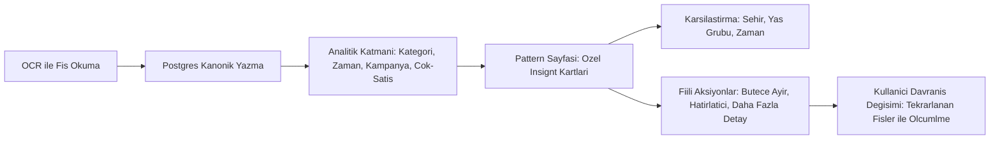

Araştırma Raporu: Yumo “Pattern” Sayfası Tasarım Çerçevesi
Tüketici Psikolojisi • Analitik İktisat • Reklam/UX En İyi Formaları

---

0) Amaç & Kapsam
Araştırma amacı: FİŞ→Postgres kanonik model üzerinden, demografi (şehir/yaş/cinsiyet) ve fiş metadata’sı (saat/gün/kampanya/kategori/marka/miktar) birleşiminden, “neden böyle harcadım?” sorusunu cevaplayan; hem modern psikoloji hem analitik ekonomi hem de UX/reklam disiplinlerinin kesişiminde, standart dışı ama basit bir “Pattern” sayfası mimarisi önermek.

---

1) Temel Davranışsal Çerçeveler (Neyi Açığa Çıkaracağız?)

1.1) Mental Accounting (Zihinsel Hesaplaşma)
Kullanıcı parayı “farklı kutulara” bölerek yönetir: faturalar, eğlence, market, tasarruf. Harcamalar arasındaki kaymalar, kutular arası “sızıntılar” olarak okunabilir. Thaler’ın klasik Mental Accounting modeli, insanların gelir/kaynak türüne göre ödeme eğilimlerini değiştirdiğini, “buldukları” parayı daha rahat harcadıklarını gösterir. Bu yüzden Pattern sayfası, kullanıcının kendi zihinsel hesaplarını görebileceği (ve sızdıran noktaları fark edeceği) bir ayna olmalıdır.【turn0search5】【turn0search6】【turn0search7】【turn0search8】【turn0search9】

1.2) Kayıp Kaçınma & Gain/Loss Framing (Kazanç/Kayıp Çerçeveleri)
Prospect Theory’ye göre, aynı miktardaki kayıp kazanca göre 2x civarında daha ağır basar. Bu, “indirimli aldım → kazandım” hissinin “indirim yapmadığım için kaybettim” hissine göre daha cazip olduğunu açıklar. Fiyatlama/indirim detayları fişte olduğunda, “İndirim tetikleyicisi” ve “indirimsiz rağbet” arasında ayrışan grafiğe dönüşebilir.【turn0search7】

1.3) Hedonik Adaptasyon & Tüketim Doyması
Alışverişin duygu getirişi zamanla azalır. Pattern sayfası, tekrarlayan kategorilerdeki (örneğin her hafta aynı kafede harcama) getiri-eğri düşüşünü “Bu alışkanlık sana hâlâ aynı duyguyu veriyor mu?” tarzı bir nudge ile gösterebilir.

1.4) Sosyal Normlar & Demografik Bağlam
Yaş, cinsiyet, şehir; tüketim tercihlerini güçlü şekilde yönlendirir. Yaşa göre kategori dağılımı, cinsiyete göre duygusal/dürtüsel harcama oranı, şehre göre fiyat duyarlılığı ve kategori popülaritesi, literatürde doğrulanmış segmentasyon sinyalleridir.【turn0search4】

1.5) Kampanya & İndirim Psikolojisi
POS verilerinde, indirimli ürünlerin hem hacim hem karlılık üzerindeki etkisi zamanla azalır; yani kullanıcının “indirim bağımlılığı” arttıkça, alışveriş sepetinin faydası azalabilir. Bu, Pattern sayfasında “İndirime duyarlılık skoru” ve “indirim bitişinde harcama davranışı” grafikleriyle gösterilebilir.【turn0search16】【turn0search17】【turn0search18】

1.6) Zaman/Saate Bağlı Trigerler ve Rutinler
Market verilerinde, günün saati ve haftanın günü, kategori seçiminde belirleyicidir (sabah kahve/akşam atıştırmalık vb.). Fiş zaman damgası ile kullanıcıya “En çok hangi saatlerde ne tür harcamalar yapıyorsun?” sorusunu sormak, rutin/dürtüsel ayrımını netleştirir.【turn0search15】

---

2) Veri Modeli: Kanonik Postgres Şemasına Uyumlu “Nötr” Hedefler

Aşağıdaki hedefler, doğrudan kanonik şemadan SQL/analitik ile üretilebilir ve UI’a nötr sinyaller olarak yansıtılabilir:

- H1) Demografik segment bazlı ortalama sepet tutarı ve kategori dağılımı
- H2) Kampanyalı/Kampanyasız sepet oranları (indirim var/yok)
- H3) Saat dilimi (gece/gündüz/akşam) ve gün (hafta içi/hafta sonu) kırılımında kategori ve tutar
- H4) Tekrarlayan satıcı/zincir aidiyeti ve sadakat/yoğunlaşma skoru (HHI tarzı)
- H5) Aynı kategori için birim fiyat trendi (enflasyon/indirim algısı)
- H6) Çapraz-satış (market analitiği: A ürünü alınca B ürünü olasılığı)

Not: Hiçbir hedef, “cinsiyet X daha duygusal harcıyor” gibi çıkarımları doğrudan UI metnine dökmez; sadece kullanıcının kendi verisine ayna tutar.

---

3) İzlenecek Metrikler (Ölçülebilir Davranış Sinyalleri)

- M1) Zihinsel Hesap Dengesi: Kullanıcının kendi tanımladığı/algıladığı bütçe kategorilerine göre harcama dağılımı
- M2) İndirim Bağımlılık Skoru: Toplam harcamanın % kaçı kampanyalı ürünlerden?
- M3) Dürtüsellik Endeksi: Gece (00–06), hafta sonu ve yüksek ortalama kategori dışı harcamaların ağırlıklı skoru
- M4) Tekrar Skoru: En çok tekrar edilen N satıcı/kategori ve toplam harcama içindeki payları
- M5) Fiyat Algısı Sapması: Birim fiyat trendi (aylık/haftalık) vs genel enflasyon/şehir ortalaması (varsa harici veri)
- M6) Sepet Çeşitliliği: Shannon Entropi vb. ile ölçülen kategori çeşitliliği

---

4) Önerilen Görselleştirmeler & Anlatım Formları (Ürün İçinde Neler Gösterilir?)

4.1) Davranış Haritası (Mental Accounting Heatmap)
- X: Harcama kategorileri (yiyecek, ulaşım, eğlence, faturalar, kira, sağlık, eğitim vb.)
- Y: Zaman (haftalık/ayslık)
- Renk: Yoğunluk veya bütçe payı
- Anlatım: Kullanıcıya kendi zihinsel hesaplarını gösterir. Örneğin, “Eğlence” sütununun giderek kalınlaştığını görmek, zihinsel sızıntıyı fark ettirir. Thaler’ın mental accounting yaklaşımıyla uyumludur.【turn0search5】【turn0search6】【turn0search7】

4.2) İndirim ve Fırsat Trigerleri (Promo Radar)
- İndirimli ürün sayısı/toplam ürün; indirim tutarı/toplam tutar; en çok indirime konu olan kategoriler
- “İndirim bitince ne kadar harcıyorsun?” (indirimsiz dönem karşılaştırması) grafiği
- Kayıp kaçınma framing’i ile: “İndirimsiz dönemde X kategorisinde %Y fazla harcıyorsun” ibaresi yerine nötr “X kategorisinde indirimsiz dönem harcaman ortalamadan Z yüksek” sunumu
- Kaynak: POS verilerinde kampanya etkisinin zamanla azalması ve harcama davranışındaki değişim literatürü【turn0search16】【turn0search17】【turn0search18】

4.3) Zamanın Psikolojisi: Günün Saati / Haftanın Günü Profili
- Küçük çarpan grafikler (small multiples): Saat dilimlerine göre en çok harcanan 3 kategori; hafta içi vs hafta sonu oranı
- UX: Fins dashboard’larında yaygın “saatlik trafik/trafik haritası” desenleri ile benzer yapı; fintech dashboard tasarım literatüründe önerilen “temiz, aksiyon alınabilir içgörü” prensibine uygun【turn0search12】【turn0search13】【turn0search14】

4.4) Tekrarlayan Satıcı / Marka Bağımlılığı (Satıcı Yoğunlaşma)
- Pasta/TreeMap: Toplam harcamanın en çok gittiği 5–10 satıcı/kategori
- Endeks: 0–100 arası “Sadakat/Yoğunlaşma Skoru”
- Anlatım: “Aynı zincire harcama yoğunluğun artıyor” sinyali, kullanıcıya alternatifleri düşünmesi için nötr bir hatırlatma olarak sunulabilir.

4.5) Çapraz-Satış (Market Basket) Ayna
- “Sen X aldığında Y’yi de ekliyorsun (Z olasılıkla)” kartları
- Örnek: “X market sepetinde çikolata olan alışverişlerin %72’sinde gazlı içecek de var”
- Kaynak: Retail’de sepet analitiği ve cross-sell pattern’leri standuttur; fiş verisiyle doğrudan hesaplanabilir.【turn0search0】【turn0search15】

4.6) Duygusal/Dürtüsel Harcama Bandı (Geceleri/Hafta Sonları)
- Gecelik (örneğin 23:00–04:00) harcamaların toplam içindeki pay ve kategori dağılımı
- UX: Finans dashboard’larında “ödeme takvimi/akış” desenlerine benzer, sadece saat dilimi eksen kayması【turn0search12】【turn0search13】

4.7) Fiyat Algısı ve Enflasyon Etkisi (Opsiyonel)
- Tekrar alınan ürünlerde birim fiyat trendi (aylık/haftalık)
- Kaynak: Fiyat trendi ve promosyon dinamikleri literatürü, POS verisiyle desteklenir【turn0search16】【turn0search18】

---

5) UX ve Reklam Perspektifiyle Formalar (Sayfayı Nasıl Sunacağız?)

5.1) Finans Dashboard UX En İyi Formaları
- Öncelik: “Ne happened?” → “Neden oldu?” → “Ne yapmalıyım?” sırası
- Temiz tipografi, az element, nokta atışı aksiyon butonları (ör. “Bu kategorideki harcamaları İncele”)
- Kaynaklar: Qlik’ın finans dashboard rehberi; fintech tasarım desenleri【turn0search12】【turn0search13】【turn0search14】
- Tavsiye: Üstte 1–3 “insight card”, altta detay grafikler; scroll ile artan karmaşıklık (progressive disclosure)

5.2) Reklam & Pazarlama Formaları (Tüketici Psikolojisi)
- Framing: Kayıp aversiyonunu kullanarak, “Gecelik harcamaların bu ay %20 arttı” → “Gecelik harcamaları azaltırsan bu ay X birim bütçene geri dönecek” gibi çerçeveler
- Social Proof: “Şehrindeki benzer profildeki kullanıcıların %X’i bu kategoride daha az harcıyor” (tam anonim,.aggregate)
- Nudging: Varsayılan (default) olarak “bütçe hedefi” açma/UYARI eşiği (ör. gece 23:00 sonrası harcamada “Bu harcama rutin dışı görünüyor” bilgilendirme)
- Kaynaklar: Davranışsal iktisat ve tüketici araştırmaları; özellikle demografiye göre tüketim farkları ve promosyon etkisi【turn0search1】【turn0search3】【turn0search4】

5.3) “Neden Böyle Harcadım?” Hikâyesi (Narrative Layer)
- Natural language üretimi (şablon tabanlı): Örnek cümleler (PS: Kişisel veri içermeyen, kullanıcıya özel ama genel kalıplar):
  - “Bu ay ‘Dışarıda yemek’ kategorisinde en çok harcamayı hafta sonlarına yığıyorsun.”
  - “X ürününü genelde indirimli aldığın görünüyor; indirim olmayınca bu ürünü alma sıklığın azalıyor.”
  - “Gece 00–04 arası harcamaların toplamın %Y’sini oluşturuyor ve çoğunlukla şu kategorilerde: A, B.”
- UX’te hikâye katmanı, dashboard’larda “özet kart” formatıyla sunulur; fintech tasarım literatüründe “özet → detay” akışı standart bir formadır【turn0search12】【turn0search13】【turn0search14】

---

6) Şehir/Yaş/Cinsiyetin Kullanım şekli (Etik ve UX Sınırları)

- Kullanım amacı: Kullanıcının kendi verisini, benzer demografiye sahip anonim gruplarla (aggregate) karşılaştırması
- Uygulama:
  - “Yaş grubundaki kullanıcıların ortalaması” veya “Şehrindeki kullanıcıların ortalaması” (kişiselleştirilmiş, ancak匿名 aggregate)
  - Bu, sosyal norm etkisini kullanır (nudge) ve reklamdaki “benzerlerin ne yaptığı” framing’ine benzer【turn0search1】【turn0search4】
- Sınır: Asla “Cinsiyet X daha dürtüsel harcıyor” gibi genelleme yapılmaz; UI her zaman bireyin kendi verisini merkezine alır ve grup karşılaştırması yan panelde/kartta “Başka hangi sinyaller var?” opsiyonel bilgi olarak sunulur.

---

7) Mimari & Analitik Uyumluluk (Kanonik Postgres Üzerinden Üretim)

- Ağaç yapısı (öneri, örnek) → Teknik dokümantasyona uygun, sadece fikir vermek için:
  - users (id, city_id, birth_year, gender, created_at)
  - cities (id, name, region, country)
  - receipts (id, user_id, merchant_id, total_amount, discount_amount, receipt_datetime, ocr_raw, is_promo, channel)
  - receipt_lines (id, receipt_id, product_name, category_id, quantity, unit_price, line_total, is_promo_line)
  - categories (id, name, parent_category_id)
  - merchants (id, name, sector, chain_flag)
- Üretilebilecek örnek SQL hedefleri:
  - Kategori dağılımı (Mental Accounting): SELECT c.name, SUM(rl.line_total) FROM receipt_lines rl JOIN categories c ON c.id=rl.category_id JOIN receipts r ON r.id=rl.receipt_id WHERE r.user_id=... GROUP BY c.name;
  - Saat dilimi kırılımı: SELECT EXTRACT(HOUR FROM r.receipt_datetime) AS hour, c.name, SUM(rl.line_total) ... GROUP BY 1,2;
  - İndirim bağımlılık skoru: SELECT SUM(CASE WHEN rl.is_promo_line THEN rl.line_total ELSE 0 END)/NULLIF(SUM(rl.line_total),0) AS promo_ratio FROM receipt_lines rl JOIN receipts r ON r.id=rl.receipt_id WHERE r.user_id=...;

---

8) Önerilen Sayfa Akışı (UX Flow)

- Akış şeması (kavramsal):

- UX detayları:
  - İlk yükleme: 1–3 ana insight (bu ay öne çıkan 3 pattern)
  - Açılır detay: Grafiklerin altında “Neden?” butonu
  - Minimal buton seti: “Bu kategorideki harcamaları İncele”, “Bütçe Hedefi Koy”, “Gece Harcamalarını Sınırla (Hatırlatıcı Kur)”
  - Kaynak: İmpuls harcama kontrolü UX vaka çalışması, “neden harcadım” yaklaşımı【turn0search10】

---

9) Önerilen Kavramsal Kartlar (Taslak)

1) Kart: Zihinsel Bütçe Aynası
- Başlık: “Harcama dağılımın”
- Gösterim: Kategori heatmap (haftalık/ayslık)
- Alt metin (örnek kalıp): “Bu ay ‘Eğlence’ kategorisinde harcamanın toplam içindeki payı geçen aya göre %X arttı.”
- Aksiyon: “Kategori dağılımını İncele”

2) Kart: İndirim & Fırsat Profili
- Başlık: “Kampanya harcamaların”
- Gösterim: İndirimli/indirimsiz oran; indirimli kategoriler; indirim sonrası harcama değişimi
- Alt metin (örnek kalıp): “İndirimli ürünlerden yapılan harcamalar toplamın %Y’sini oluşturuyor; en çok Z kategorisinde.”
- Aksiyon: “İndirimsiz dönem harcamalarını karşılaştır”

3) Kart: Zaman Trigerleri
- Başlık: “Hangi saatlerde ne harcıyorsun?”
- Gösterim: Saat dilimi x kategori küçük çarpan grafikleri; gece harcaması oranı
- Alt metin (örnek kalıp): “Gece 23:00–04:00 arası harcamaların toplamın %W’si ve çoğunlukla şu kategorilerde: A, B.”
- Aksiyon: “Gece harcamaları için hatırlatıcı kur”

4) Kart: Tekrarlayan Satıcı / Marka Aynası
- Başlık: “En çok nerede harcıyorsun?”
- Gösterim: En çok tekrarlanan 5 satıcı/kategori ve toplam içindeki payları
- Alt metin (örnek kalıp): “Harcamalarının %U’su 2 zincirde yoğunlaşıyor.”
- Aksiyon: “Satıcı dağılımını İncele”

5) Kart: Sepet Desenleri (Çapraz-Satış)
- Başlık: “Birlikte aldıkların”
- Gösterim: İlişkili ürün/ilişkili kategori çiftleri ve olasılık
- Alt metin (örnek kalıp): “X ürünü aldığında Y ürününü de ekliyorsun (%Z oranında).”
- Aksiyon: “Sepet desenlerini İncele”

---

10) Temel Alınabilecek Teorik & Uygulamalı Kaynaklar

- Davranışsal İktisat: Thaler – Mental Accounting and Consumer Choice (Marketing Science, 1985); The Decision Lab – Mental Accounting【turn0search5】【turn0search6】【turn0search7】
- Tüketici Psikolojisi & Demografi: “Decoding Consumer Habits: Analyzing Retail Patterns Across Demographics” (yaş/cinsiyet/konum kırılımı)【turn0search3】【turn0search4】
- Perakende & Fiş Verisi Analitiği: “Why Receipt Data Is Key To Understanding Shopper Behavior”; Retail big data ve sepet analitiği【turn0search0】【turn0search15】【turn0search19】
- Kampanya/Zaman Dinamikleri: “Duration of price promotion and product profit”; “Rewiring retail promotions with advanced analytics”; “Why real-time data is essential for pricing and promotions”【turn0search16】【turn0search17】【turn0search18】
- UX & Fintech Dashboard: Qlik – Financial Dashboard Examples & Templates; Fintech Design Breakdown; Fintech Dashboard UI/UX (Behance)【turn0search12】【turn0search13】【turn0search14】
- İmpuls Harcama UX: “Impulse Spending Control App: A UX Case Study” (neden harcadım yaklaşımı, utançlama yok)【turn0search10】

---

Kısa Özet
- Pattern sayfası, kullanıcıya kendi davranışını; kategori/zaman/indirim/tekrar/çapraz-satış boyutlarında aynalayacak.
- Psikolojik omurga: Mental Accounting, Kayıp Kaçınma/Framing, Sosyal Normlar.
- Ekonomik omurga: POS/fiş analitiği, kampanya etkinliği, zaman dinamikleri, sepet analitiği.
- UX/Reklam omurga: Önceliklendirilmiş insight kartları, nöüral dil (utançlama yok), framing ve nudge, progressive disclosure.
- Teknik omurga: Kanonik Postgres şeması üzerinden, yukarıdaki hedeflerin SQL/analitik ile üretilebilirliği.

İstersen bir sonraki adımda:
- Kanonik Postgres tablo isimleri + sütunlar (örnek DDL),
- Ve bu tablolardan doğrudan üretilebilecek 7–10 spesifik SQL (KPI + insight)
üzerinden sayfa içi metin ve kart taslaklarını da çıkarabilirim.